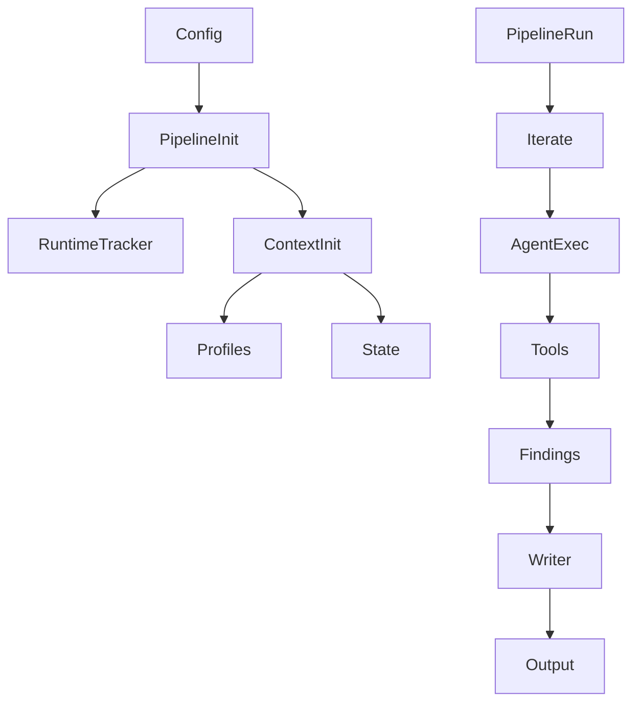

# 项目概览

> 说明：代码片段为源码关键行摘录（保持原样但非全文，可能包含英文注释），以下"解读/流程说明"为中文讲解。


## 流程解释（文字优先）
- 当实例化任一 Pipeline 时，会先执行 BasePipeline.__init__：解析配置并创建 RuntimeTracker（pipelines/base.py:22-101）。
- 当 Context(["profiles", "states"]) 被创建时，会加载 Profile 并生成 ConversationState（contextagent/context/context.py:41-48）。
- 当 pipeline.run 开始时，通常先把 query 写入 state（pipelines/data_scientist.py:68-69）。
- 当进入迭代循环时，iterate 负责创建/结束 iteration（pipelines/base.py:438-477）。
- 当 Agent 执行时，优先使用 runtime_template 注入 state；若无模板则回退到 format_context_prompt（contextagent/agent/agent.py:156-213、contextagent/context/conversation.py:243-267）。
- 当 tool agent 执行时，Runner 会带着 data_store 上下文运行（contextagent/agent/executor.py:65-67）。
- 当 writer 汇总结果时，常以 findings_text 作为输入并在 pipeline 末尾输出（pipelines/data_scientist.py:95-104、contextagent/context/conversation.py:234-236）。


## 流程图（简化）


## 事件清单（当…就会…）
- 当 BasePipeline 初始化时，就会解析配置并创建 RuntimeTracker（pipelines/base.py:22-101）。
- 当 Context 初始化为 ["profiles", "states"] 时，就会加载 Profile 并创建 ConversationState（contextagent/context/context.py:41-48）。
- 当 pipeline.run 开始时，就会把 query 写入 state（pipelines/data_scientist.py:68-69）。
- 当进入迭代循环时，就会创建/结束 iteration 记录（pipelines/base.py:438-477）。
- 当 ContextAgent 执行时，就会优先使用 runtime_template 注入 state（contextagent/agent/agent.py:156-213）。
- 当工具输出被汇总时，就会进入 findings_text 供最终写作使用（contextagent/context/conversation.py:234-236）。

## 前置条件/状态变化/下一步去向
- 前置条件：config 或 config_path 已准备，Context 可初始化 profiles 与 state。
- 状态变化：state.query 与 iterations 逐步更新，findings 逐步累积。
- 下一步去向：进入 Agent 执行与工具调用链，最终由 writer 汇总输出。

## 项目定位
ContextAgent 主张以“上下文为中心”的多智能体框架设计，Pipeline 负责编排，Agent 负责执行，Context 负责统一状态。

```text
# 文件：README.md | 行：16-26 | 描述：官方 README 中的项目定位与特性
ContextAgent is a lightweight, context-central multi-agent systems framework designed for easy context engineering. It focuses on efficiently managing the context of each agent and binds all agents through simplified, centralized context operations. Unlike traditional multi-agent frameworks, ContextAgent treats agents simply as LLMs with different contexts, eliminating unnecessary complexity. Built with a PyTorch-like API, developers can create sophisticated multi-agent systems with minimal code.


## 🌟 Features

- **📋 Context = Template + State**: Dynamic context management based on [Anthropic's blog](https://www.anthropic.com/engineering/effective-context-engineering-for-ai-agents).
- **🔀 Decoupled Agent Design**: Agent = LLM + Context. All agents are just LLMs with different contexts.
- **🎨 PyTorch-Like Pipeline API**: Inherit `BasePipeline`, define async `run()`, use `@autotracing` for tracing.
- **🌐 Multi-LLM Support**: Works with OpenAI, Claude, Gemini, DeepSeek, and more.
- **🧩 Modular Architecture**: Built on OpenAI Agents SDK with clear separation: context, agents, pipeline.
- **⚡ Easy to Use & Customize**: Reuse pipelines with just a query; create new ones with familiar patterns.
```

**解读**
- 作用：官方 README 中的项目定位与特性。
- 片段范围：关键行摘录（与源码一致，但非完整段落）。
- 位置：README.md（项目说明）。
- 关键对象：文档原文片段。
- 关键输入：原文段落（保持原样）。
- 关键输出/副作用：作为定位/特性说明供阅读参考。

**流程说明**
- 触发/流向：该片段位于调用链中，入口以本章流程解释与相邻调用处为准。

## 技术栈与依赖（已验证）
核心依赖来自 `pyproject.toml`，包含 LLM SDK、数据科学栈、Web 工具与前端组件。

```toml
# 文件：pyproject.toml | 行：5-47 | 描述：项目元信息与依赖列表
[project]
name = "contextagent"
version = "0.1.1"
description = "A Context-Central Multi-Agent System Platform"
readme = "README.md"
requires-python = ">=3.11"
license = {text = "MIT"}
authors = [
    {name = "Zhimeng Guo", email = "gzjz07@outlook.com"}
]
keywords = ["agent", "multi-agent", "ai", "llm", "research", "machine-learning", "autonomous-agents"]
classifiers = [
    "Development Status :: 3 - Alpha",
    "Intended Audience :: Developers",
```

**解读**
- 作用：项目元信息与依赖列表。
- 片段范围：关键行摘录（与源码一致，但非完整段落）。
- 位置：pyproject.toml（通用模块）。
- 关键对象：未在片段首部发现定义。
- 关键输入：见函数签名或调用处。
- 关键输出/副作用：结果以日志/状态变更/外部调用为主（见实现）。

**流程说明**
- 触发/流向：该片段位于调用链中，入口以本章流程解释与相邻调用处为准。

## 目录结构（按深度 2 展示）
```text
ContextAgent/
├── .github/
│   └── workflows/
│       └── deploy-docs.yml
├── assets/
│   ├── controller_speed.gif
│   ├── DS.gif
│   ├── WEB.gif
│   └── wechat.jpg
├── contextagent/
│   ├── agent/
│   │   ├── __init__.py
│   │   ├── agent.py
│   │   ├── executor.py
│   │   └── tracker.py
│   ├── artifacts/
│   │   ├── __init__.py
│   │   ├── artifact_writer.py
│   │   ├── reporter.py
│   │   └── terminal_writer.py
│   ├── context/
│   │   ├── __init__.py
│   │   ├── context.py
│   │   ├── conversation.py
│   │   └── data_store.py
│   ├── llm/
│   │   └── llm_setup.py
│   ├── mcp/
│   │   ├── servers/
│   │   ├── manager.py
│   │   └── patches.py
│   ├── profiles/
│   │   ├── data/
│   │   ├── debug/
│   │   ├── manager/
│   │   ├── mcp/
│   │   ├── web/
│   │   └── base.py
│   ├── tools/
│   │   ├── data_tools/
│   │   ├── web_tools/
│   │   └── __init__.py
│   ├── utils/
│   │   ├── __init__.py
│   │   ├── config.py
│   │   ├── helpers.py
│   │   ├── parsers.py
│   │   └── printer.py
│   └── __init__.py
├── contextagent.egg-info/
│   ├── dependency_links.txt
│   ├── PKG-INFO
│   ├── requires.txt
│   ├── SOURCES.txt
│   └── top_level.txt
├── data/
│   ├── banana_quality.csv
│   ├── Crop_Yield_Prediction.csv
│   └── ecommerceDataset.csv
├── docs/
│   ├── assets/
│   │   ├── images/
│   │   └── logo.svg
│   ├── concepts/
│   │   ├── agent-lifecycle.md
│   │   ├── architecture.md
│   │   ├── context-engine.md
│   │   └── tooling.md
│   ├── examples/
│   │   └── index.md
│   ├── guides/
│   │   ├── custom-tool.md
│   │   ├── deployment.md
│   │   └── pipeline-orchestration.md
│   ├── includes/
│   │   ├── cta.md
│   │   ├── feature-grid.md
│   │   └── hero.md
│   ├── reference/
│   │   ├── cli.md
│   │   ├── configuration.md
│   │   └── python.md
│   ├── stylesheets/
│   │   └── extra.css
│   ├── tutorials/
│   │   └── support-assistant.md
│   ├── .nojekyll
│   ├── changelog.md
│   ├── faq.md
│   ├── index.md
│   └── quickstart.md
├── examples/
│   ├── data_science.py
│   └── web_researcher.py
├── frontend/
│   ├── static/
│   │   ├── css/
│   │   └── js/
│   ├── templates/
│   │   └── index.html
│   ├── app.py
│   └── streaming_printer.py
├── pipelines/
│   ├── configs/
│   │   ├── data_science.yaml
│   │   ├── data_science_memory.yaml
│   │   ├── simple.yaml
│   │   ├── simple_browser.yaml
│   │   ├── simple_chrome.yaml
│   │   ├── simple_notion.yaml
│   │   ├── vanilla_chat.yaml
│   │   └── web_searcher.yaml
│   ├── __init__.py
│   ├── base.py
│   ├── browser_mcp.py
│   ├── data_scientist.py
│   ├── vanilla_chat.py
│   └── web_researcher.py
├── .env.example
├── .gitignore
├── .python-version
├── LICENSE
├── mkdocs.yml
├── pyproject.toml
├── README.md
├── test.py
└── uv.lock
```

## 核心模块速览
- `pipelines/`：Pipeline 编排与运行生命周期。
- `contextagent/agent/`：ContextAgent、运行追踪与 span 生命周期。
- `contextagent/context/`：ConversationState 与迭代记录。
- `contextagent/profiles/`：各类 Profile（管理、数据、Web、MCP、调试）。
- `contextagent/tools/`：function_tool 封装的数据与 Web 工具。
- `contextagent/mcp/`：MCP 服务器注册与 Browser MCP 补丁。
- `frontend/`：Flask UI 与 StreamingPrinter。
- `examples/`：运行示例脚本。

### BasePipeline：统一运行入口
```python
# 文件：pipelines/base.py | 行：22-101 | 描述：BasePipeline 初始化与配置解析
    def __init__(self, config: Union[str, Path, Mapping[str, Any], BaseConfig]):
        """Initialize the pipeline using a single configuration input.

        Args:
            spec: Configuration specification:
                - str/Path: Load YAML/JSON file
                - dict with 'config_path': Load file, then deep-merge dict on top (dict wins)
                - dict without 'config_path': Use as-is
                - BaseConfig: Use as-is
            strict: Whether to strictly validate configuration (default: True).

        Examples:
            # Load from file
            BasePipeline("pipelines/configs/data_science.yaml")
```

**解读**
- 作用：BasePipeline 初始化与配置解析。
- 片段范围：关键行摘录（与源码一致，但非完整段落）。
- 位置：pipelines/base.py（Pipeline 层）。
- 关键对象：__init__。
- 关键输入：config。
- 关键输出/副作用：主要通过修改实例或上下文状态产生效果。

**流程说明**
- 触发/流向：该片段位于调用链中，入口以本章流程解释与相邻调用处为准。

### ContextAgent：Profile 驱动的 Agent
```python
# 文件：contextagent/agent/agent.py | 行：43-105 | 描述：ContextAgent profile 绑定与 output_schema 处理
    def __init__(
        self,
        context: Any,
        *,
        profile: str,
        llm: str,
        **agent_kwargs: Any,
    ) -> None:
        """Initialize ContextAgent with context and profile identifier.

        Args:
            context: Context object containing profiles and state
            profile: Profile identifier for lookup in context.profiles
            llm: LLM model name (e.g., "gpt-4", "claude-3-5-sonnet")
```

**解读**
- 作用：ContextAgent profile 绑定与 output_schema 处理。
- 片段范围：关键行摘录（与源码一致，但非完整段落）。
- 位置：contextagent/agent/agent.py（Agent 运行层）。
- 关键对象：__init__。
- 关键输入：context、profile、llm、agent_kwargs。
- 关键输出/副作用：主要通过修改实例或上下文状态产生效果。

**流程说明**
- 触发/流向：该片段位于调用链中，入口以本章流程解释与相邻调用处为准。

### ConversationState：迭代与上下文
```python
# 文件：contextagent/context/conversation.py | 行：243-267 | 描述：format_context_prompt 拼装上下文提示
    def format_context_prompt(self, current_input: Optional[str] = None) -> str:
        """Format a comprehensive context prompt including query, history, and current input.

        Args:
            current_input: The current input/payload for this agent call

        Returns:
            Formatted context prompt string
        """
        sections = []

        # Add original query if available
        if self.query:
            sections.append(f"[ORIGINAL QUERY]\n{self.query}")
```

**解读**
- 作用：format_context_prompt 拼装上下文提示。
- 片段范围：关键行摘录（与源码一致，但非完整段落）。
- 位置：contextagent/context/conversation.py（上下文/状态层）。
- 关键对象：format_context_prompt。
- 关键输入：current_input。
- 关键输出/副作用：返回值由代码中的 return 语句给出。

**流程说明**
- 触发/流向：该片段位于调用链中，入口以本章流程解释与相邻调用处为准。

### Profile：指令模板与工具绑定
```python
# 文件：contextagent/profiles/base.py | 行：12-68 | 描述：Profile 与 ToolAgentOutput 基础定义
class Profile(BaseModel):
    instructions: str = Field(description="The agent's system prompt/instructions that define its behavior")
    runtime_template: str = Field(description="The runtime template for the agent's behavior")
    model: Optional[str] = Field(default=None, description="Model override for this profile (e.g., 'gpt-4', 'claude-3-5-sonnet')")
    output_schema: Optional[Type[BaseModel]] = Field(default=None, description="Pydantic model class for structured output validation")
    tools: Optional[List[Any]] = Field(default=None, description="List of tool objects (e.g., FunctionTool instances) to use for this profile")
    mcp_servers: Optional[List[Any]] = Field(default=None, description="List of MCP server specs (e.g., MCPServerStdio instances) for MCP tool integration")
    description: Optional[str] = Field(default=None, description="Optional one-sentence description for agent capabilities (auto-extracted from instructions if not provided)")

    class Config:
        arbitrary_types_allowed = True

    def get_description(self) -> str:
        """Get description for this profile.
```

**解读**
- 作用：Profile 与 ToolAgentOutput 基础定义。
- 片段范围：关键行摘录（与源码一致，但非完整段落）。
- 位置：contextagent/profiles/base.py（Profile 配置层）。
- 关键对象：Profile / Config / get_description。
- 关键输入：见函数签名或调用处。
- 关键输出/副作用：返回值由代码中的 return 语句给出。

**流程说明**
- 触发/流向：该片段位于调用链中，入口以本章流程解释与相邻调用处为准。

### RuntimeTracker 与 Reporter
```python
# 文件：contextagent/agent/tracker.py | 行：127-183 | 描述：RuntimeTracker 启动 agent step 并写 reporter
    def start_agent_step(
        self,
        *,
        agent: Any,
        span_name: Optional[str],
        span_factory,
        span_kwargs: Optional[Dict[str, Any]] = None,
        printer_key: Optional[str] = None,
        printer_title: Optional[str] = None,
        printer_border_style: Optional[str] = None,
    ) -> AgentStepHandle:
        """Initialize tracker artifacts for an agent step."""
        agent_name, resolved_span_name, resolved_printer_key, resolved_printer_title = _derive_agent_metadata(
            agent,
```

**解读**
- 作用：RuntimeTracker 启动 agent step 并写 reporter。
- 片段范围：关键行摘录（与源码一致，但非完整段落）。
- 位置：contextagent/agent/tracker.py（Agent 运行层）。
- 关键对象：start_agent_step。
- 关键输入：agent、span_name、span_factory、span_kwargs、printer_key、printer_title、printer_border_style。
- 关键输出/副作用：返回值由代码中的 return 语句给出。

**流程说明**
- 触发/流向：该片段位于调用链中，入口以本章流程解释与相邻调用处为准。

```python
# 文件：contextagent/artifacts/reporter.py | 行：43-223 | 描述：RunReporter 记录运行信息
class RunReporter:
    """Facade combining terminal display and artifact persistence."""

    def __init__(
        self,
        *,
        base_dir: Path,
        pipeline_slug: str,
        workflow_name: str,
        experiment_id: str,
        console: Optional[Console] = None,
    ) -> None:
        self.base_dir = base_dir
        self.pipeline_slug = pipeline_slug
```

**解读**
- 作用：RunReporter 记录运行信息。
- 片段范围：关键行摘录（与源码一致，但非完整段落）。
- 位置：contextagent/artifacts/reporter.py（产物/报告层）。
- 关键对象：RunReporter / __init__ / start。
- 关键输入：base_dir、pipeline_slug、workflow_name、experiment_id、console。
- 关键输出/副作用：主要通过修改实例或上下文状态产生效果。

**流程说明**
- 触发/流向：该片段位于调用链中，入口以本章流程解释与相邻调用处为准。

## 配置与环境变量
配置通过 `resolve_config` 统一解析，并支持 `${ENV}` 替换。

```python
# 文件：contextagent/utils/config.py | 行：471-607 | 描述：resolve_config 配置解析与 LLMConfig 构建
def resolve_config(spec: Union[str, Path, Mapping[str, Any], BaseConfig]) -> BaseConfig:
    """Resolve configuration from various input formats.

    Args:
        spec: Configuration specification:
            - str/Path: Load YAML/JSON file
            - dict with 'config_path': Load file, then deep-merge dict on top
            - dict without 'config_path': Use as-is
            - BaseConfig: Use as-is

    Returns:
        BaseConfig instance with all fields resolved and validated.

    Examples:
```

**解读**
- 作用：resolve_config 配置解析与 LLMConfig 构建。
- 片段范围：关键行摘录（与源码一致，但非完整段落）。
- 位置：contextagent/utils/config.py（配置/工具层）。
- 关键对象：resolve_config。
- 关键输入：spec。
- 关键输出/副作用：返回值由代码中的 return 语句给出。

**流程说明**
- 触发/流向：该片段位于调用链中，入口以本章流程解释与相邻调用处为准。

```bash
# 文件：.env.example | 行：1-47 | 描述：环境变量配置示例
# ContextAgent Environment Configuration
# Copy this file to .env and fill in your actual API keys

# ============================================================================
# LLM Provider API Keys
# ============================================================================

# OpenAI API Key (for GPT models)
# Get your key from: https://platform.openai.com/account/api-keys
OPENAI_API_KEY=your_openai_api_key_here

# Google Gemini API Key (for Gemini models)
# Get your key from: https://ai.google.dev/
GEMINI_API_KEY=your_gemini_api_key_here
```

**解读**
- 作用：环境变量配置示例。
- 片段范围：关键行摘录（与源码一致，但非完整段落）。
- 位置：.env.example（环境变量示例）。
- 关键对象：未在片段首部发现定义。
- 关键命令：OPENAI_API_KEY=your_openai_api_key_here；GEMINI_API_KEY=your_gemini_api_key_here；ANTHROPIC_API_KEY=your_anthropic_api_key_here。
- 关键输出/副作用：执行结果依赖命令输出与运行环境。

**流程说明**
- 触发/流向：该片段位于调用链中，入口以本章流程解释与相邻调用处为准。

## 输出与产物
RunReporter 组合 ArtifactWriter 与 TerminalWriter，将运行过程写入 `outputs/<pipeline>/<experiment_id>/`。

```python
# 文件：contextagent/artifacts/artifact_writer.py | 行：273-289 | 描述：ArtifactWriter.finalize 写入产物
    def finalize(self) -> None:
        """Persist markdown + HTML artefacts."""
        if self._start_time is None or self._finished_at_iso is not None:
            return
        self._finished_at_iso = _utc_timestamp()
        duration = round(time.time() - self._start_time, 3)

        terminal_sections = self._build_terminal_sections()
        terminal_md = self._render_terminal_markdown(duration, terminal_sections)
        terminal_html = self._render_terminal_html(duration, terminal_sections)

        self.terminal_md_path.write_text(terminal_md, encoding="utf-8")
        self.terminal_html_path.write_text(terminal_html, encoding="utf-8")

```

**解读**
- 作用：ArtifactWriter.finalize 写入产物。
- 片段范围：关键行摘录（与源码一致，但非完整段落）。
- 位置：contextagent/artifacts/artifact_writer.py（产物/报告层）。
- 关键对象：finalize。
- 关键输入：见函数签名或调用处。
- 关键输出/副作用：返回值由代码中的 return 语句给出。

**流程说明**
- 触发/流向：该片段位于调用链中，入口以本章流程解释与相邻调用处为准。

## 前端与流式输出
frontend 通过 StreamingPrinter 将运行进度发送到 SSE。

```python
# 文件：frontend/streaming_printer.py | 行：17-130 | 描述：StreamingPrinter SSE 事件队列
class StreamingPrinter(Printer):
    """Printer that captures updates for streaming to the frontend."""

    def __init__(self, console: Console):
        super().__init__(console)
        self.update_queue: queue.Queue = queue.Queue()
        self.is_streaming = True

    def _emit_update(self, event_type: str, data: Dict[str, Any]) -> None:
        if not self.is_streaming:
            return
        try:
            self.update_queue.put({"type": event_type, "data": data}, block=False)
        except queue.Full:
```

**解读**
- 作用：StreamingPrinter SSE 事件队列。
- 片段范围：关键行摘录（与源码一致，但非完整段落）。
- 位置：frontend/streaming_printer.py（前端展示层）。
- 关键对象：StreamingPrinter / __init__ / _emit_update。
- 关键输入：console。
- 关键输出/副作用：返回值由代码中的 return 语句给出。

**流程说明**
- 触发/流向：该片段位于调用链中，入口以本章流程解释与相邻调用处为准。

## MCP 集成入口
BrowserMCP 使用 stdio + npx 启动，并带有补丁修复递归 close。

```python
# 文件：contextagent/mcp/servers/browser/server.py | 行：19-38 | 描述：BrowserMCP stdio server
def BrowserMCP() -> MCPServer:
    """Return a configured Browser MCP server (stdio over npx).

    Uses `npx -y @browsermcp/mcp@latest` to execute the server binary from npm.
    """
    # Best-effort patch for the Browser MCP CLI close handler (safe if unavailable)
    try:
        apply_browsermcp_close_patch()
    except Exception:
        # Non-fatal: if patching fails we still try to start the server
        pass

    return MCPServerStdio(
        cache_tools_list=True,
```

**解读**
- 作用：BrowserMCP stdio server。
- 片段范围：关键行摘录（与源码一致，但非完整段落）。
- 位置：contextagent/mcp/servers/browser/server.py（MCP 集成层）。
- 关键对象：BrowserMCP。
- 关键输入：见函数签名或调用处。
- 关键输出/副作用：返回值由代码中的 return 语句给出。

**流程说明**
- 触发/流向：该片段位于调用链中，入口以本章流程解释与相邻调用处为准。

## 已识别的差异（待确认）
- 多个 YAML 配置引用的 profile 名称在当前 `profiles/` 目录中未找到（如 `routing_agent_simple`、`browser_agent`、`code_generation_agent`）。
- `frontend/app.py` 中 `SimplePipeline` 映射尚未在 `pipelines/` 中找到同名实现。
- `ContextAgent.get_context_with_wrapper` 调用 `Context.get_with_wrapper`，但 `Context` 当前未实现该方法。
- `vanilla_chat_profile` 使用 `input_schema` 字段，但 `Profile` 基类未定义该字段。

这些项在后续文档均标记为 **待确认**。
