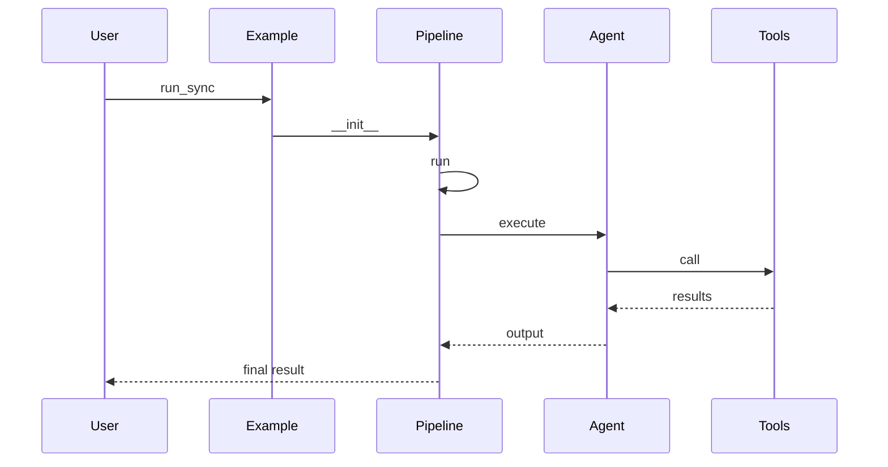

# 快速开始

> 说明：代码片段为源码关键行摘录（保持原样但非全文，可能包含英文注释），以下"解读/流程说明"为中文讲解。


## 流程解释（文字优先）
- 当运行 examples/data_science.py 时，会创建 DataScientistPipeline 并调用 run_sync（examples/data_science.py:4-11）。
- run_sync 会直接调用 pipeline.run（pipelines/base.py:483-485）。
- DataScientistPipeline.run：set_query → iterate → observe/evaluate/routing → 并发 tool agents → writer（pipelines/data_scientist.py:68-104）。
- 当运行 examples/web_researcher.py 时，会创建 WebSearcherPipeline 并执行 observe/evaluate/planning → tool agents → writer（examples/web_researcher.py:5-13；pipelines/web_researcher.py:66-111）。
- 当设置 SEARCH_PROVIDER 时，web_search 工具会选择对应搜索客户端并执行查询（contextagent/tools/web_tools/search.py:275-307）。
- 当启动前端时，前端会基于 examples 自动发现可用 pipeline 列表（frontend/app.py:172-189）。


## 流程图（简化）


## 事件清单（当…就会…）
- 当运行 examples/data_science.py 时，就会创建 DataScientistPipeline 并调用 run_sync（examples/data_science.py:4-11）。
- 当 run_sync 触发时，就会执行异步 run（pipelines/base.py:483-485）。
- 当 DataScientistPipeline.run 进入迭代时，就会依次执行 observe/evaluate/routing/tools/writer（pipelines/data_scientist.py:68-104）。
- 当运行 web_researcher 示例时，就会执行 observe/evaluate/planning → tool agents → writer（pipelines/web_researcher.py:66-111）。
- 当设置 SEARCH_PROVIDER 时，就会选择对应搜索客户端（contextagent/tools/web_tools/search.py:275-307）。

## 前置条件/状态变化/下一步去向
- 前置条件：示例脚本可访问配置文件与环境变量。
- 状态变化：state.query 写入，iteration 累积，findings 汇总。
- 下一步去向：进入 writer 汇总输出，结果返回调用方。

## 1. 环境准备
推荐使用 README 中的 uv 安装方式：

```bash
# 文件：README.md | 行：100-108 | 描述：README quickstart 命令（摘录）
uv run python -m examples.data_science
uv run python -m examples.web_researcher
```

**解读**
- 作用：README quickstart 命令（摘录）。
- 片段范围：关键行摘录（与源码一致，但非完整段落）。
- 位置：README.md（项目说明）。
- 关键对象：未在片段首部发现定义。
- 关键命令：uv run python -m examples.data_science；uv run python -m examples.web_researcher。
- 关键输出/副作用：执行结果依赖命令输出与运行环境。

**流程说明**
- 触发/流向：该片段位于调用链中，入口以本章流程解释与相邻调用处为准。

## 2. 配置 API Key
复制 `.env.example` 并填写实际密钥：

```bash
# 文件：.env.example | 行：1-47 | 描述：环境变量配置示例
# ContextAgent Environment Configuration
# Copy this file to .env and fill in your actual API keys

# ============================================================================
# LLM Provider API Keys
# ============================================================================

# OpenAI API Key (for GPT models)
# Get your key from: https://platform.openai.com/account/api-keys
OPENAI_API_KEY=your_openai_api_key_here

# Google Gemini API Key (for Gemini models)
# Get your key from: https://ai.google.dev/
GEMINI_API_KEY=your_gemini_api_key_here
```

**解读**
- 作用：环境变量配置示例。
- 片段范围：关键行摘录（与源码一致，但非完整段落）。
- 位置：.env.example（环境变量示例）。
- 关键对象：未在片段首部发现定义。
- 关键命令：OPENAI_API_KEY=your_openai_api_key_here；GEMINI_API_KEY=your_gemini_api_key_here；ANTHROPIC_API_KEY=your_anthropic_api_key_here。
- 关键输出/副作用：执行结果依赖命令输出与运行环境。

**流程说明**
- 触发/流向：该片段位于调用链中，入口以本章流程解释与相邻调用处为准。

## 3. 运行示例（推荐从 examples/ 开始）
数据科学示例：

```python
# 文件：examples/data_science.py | 行：1-11 | 描述：数据科学示例脚本
from pipelines.data_scientist import DataScientistPipeline, DataScienceQuery

# Load the default configuration file and start the pipeline using the one-parameter API.
pipe = DataScientistPipeline("pipelines/configs/data_science.yaml")

query = DataScienceQuery(
    prompt="Analyze the dataset and build a predictive model",
    data_path="data/banana_quality.csv"
)

pipe.run_sync(query)
```

**解读**
- 作用：数据科学示例脚本。
- 片段范围：关键行摘录（与源码一致，但非完整段落）。
- 位置：examples/data_science.py（示例入口）。
- 关键对象：未在片段首部发现定义。
- 关键输入：见函数签名或调用处。
- 关键输出/副作用：结果以日志/状态变更/外部调用为主（见实现）。

**流程说明**
- 触发/流向：该片段位于调用链中，入口以本章流程解释与相邻调用处为准。

```python
# 文件：examples/web_researcher.py | 行：1-13 | 描述：Web 研究示例脚本
from datetime import datetime
from pipelines.web_researcher import WebSearcherPipeline, WebSearchQuery

# Load the default configuration file and start the pipeline using the one-parameter API.
pipe = WebSearcherPipeline("pipelines/configs/web_searcher.yaml")

current_time = datetime.now().strftime("%Y-%m-%d %H:%M:%S")
query = WebSearchQuery(
    # prompt=f"Current time: {current_time}. Find the outstanding papers of ACL 2025, extract their title, author list, keywords, abstract, url in one sentence."
    prompt=f"Current time: {current_time}. Check website https://www.sqlite.org/cli.html and list some features, for each features, ."
)

pipe.run_sync(query)
```

**解读**
- 作用：Web 研究示例脚本。
- 片段范围：关键行摘录（与源码一致，但非完整段落）。
- 位置：examples/web_researcher.py（示例入口）。
- 关键对象：未在片段首部发现定义。
- 关键输入：见函数签名或调用处。
- 关键输出/副作用：结果以日志/状态变更/外部调用为主（见实现）。

**流程说明**
- 触发/流向：该片段位于调用链中，入口以本章流程解释与相邻调用处为准。

## 4. 运行前端 UI（可视化进度）
```bash
uv run python frontend/app.py --host localhost --port 9090 --debug
```

访问 `http://localhost:9090` 查看流式结果。

## 5. 选择搜索后端（Serper 或 SearchXNG）
Web 搜索工具通过 `SEARCH_PROVIDER` 决定使用哪种搜索客户端：

```python
# 文件：contextagent/tools/web_tools/search.py | 行：275-309 | 描述：SEARCH_PROVIDER 选择与 web_search
# ------- INITIALIZE SEARCH CLIENT AND DEFINE TOOL -------

# Get search provider from environment (default to serper)
SEARCH_PROVIDER = os.getenv("SEARCH_PROVIDER", "serper")

# Initialize the search client based on provider
if SEARCH_PROVIDER == "serper":
    _search_client = SerperClient()
elif SEARCH_PROVIDER == "searchxng":
    _search_client = SearchXNGClient()
else:
    raise ValueError(f"Invalid search provider: {SEARCH_PROVIDER}. Must be 'serper' or 'searchxng'")


```

**解读**
- 作用：SEARCH_PROVIDER 选择与 web_search。
- 片段范围：关键行摘录（与源码一致，但非完整段落）。
- 位置：contextagent/tools/web_tools/search.py（工具层）。
- 关键对象：web_search。
- 关键输入：query。
- 关键输出/副作用：返回值由代码中的 return 语句给出。

**流程说明**
- 触发/流向：该片段位于调用链中，入口以本章流程解释与相邻调用处为准。

## 6. 自定义配置的最小模式
BasePipeline 支持直接传入 config_path 或 dict：

```python
# 文件：pipelines/base.py | 行：22-101 | 描述：BasePipeline 初始化与配置解析
    def __init__(self, config: Union[str, Path, Mapping[str, Any], BaseConfig]):
        """Initialize the pipeline using a single configuration input.

        Args:
            spec: Configuration specification:
                - str/Path: Load YAML/JSON file
                - dict with 'config_path': Load file, then deep-merge dict on top (dict wins)
                - dict without 'config_path': Use as-is
                - BaseConfig: Use as-is
            strict: Whether to strictly validate configuration (default: True).

        Examples:
            # Load from file
            BasePipeline("pipelines/configs/data_science.yaml")
```

**解读**
- 作用：BasePipeline 初始化与配置解析。
- 片段范围：关键行摘录（与源码一致，但非完整段落）。
- 位置：pipelines/base.py（Pipeline 层）。
- 关键对象：__init__。
- 关键输入：config。
- 关键输出/副作用：主要通过修改实例或上下文状态产生效果。

**流程说明**
- 触发/流向：该片段位于调用链中，入口以本章流程解释与相邻调用处为准。

## 7. 常见问题提示
- 如果 Web 搜索报错，检查 `SERPER_API_KEY` 或 `SEARCHXNG_HOST` 是否填写。
- 如果 DataTools 报错找不到数据文件，确保 `data.path` 指向存在的文件。
- 如果前端列表为空，说明 `examples/` 未发现可用 pipeline 示例。
