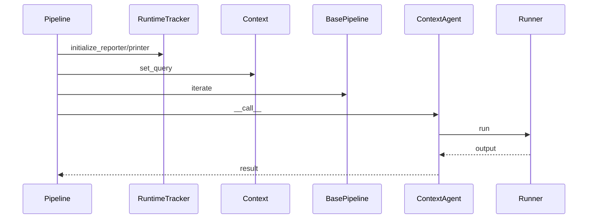
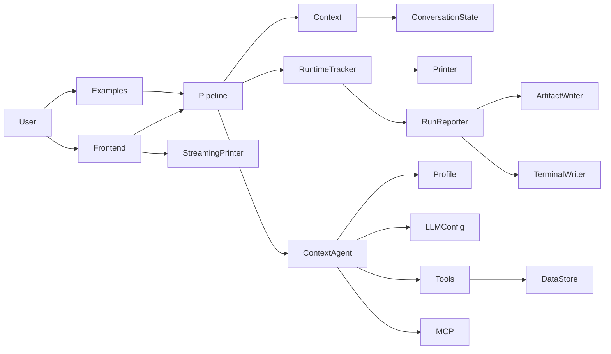

# 架构设计

> 说明：代码片段为源码关键行摘录（保持原样但非全文，可能包含英文注释），以下"解读/流程说明"为中文讲解。


## 流程解释（文字优先）
- 当 Pipeline 初始化时，resolve_config 被调用并创建 RuntimeTracker（pipelines/base.py:22-101、pipelines/base.py:93-101）。
- 当 Pipeline 赋值 context 时，会把 max_time_minutes 写入 state 并同步 tracker（pipelines/base.py:103-109）。
- 当进入 run_context/_initialize_run 时，会按需启动 reporter、printer 与 tracing（pipelines/base.py:217-285）。
- 当进入迭代循环时，iterate 负责创建/结束 iteration 记录（pipelines/base.py:438-477）。
- 当执行 agent_step 时，RuntimeTracker 创建 span，并通过 Runner 运行 Agent（contextagent/agent/executor.py:47-67）。
- 当生成历史时，history_block 把 observation/payloads/findings 结构化为上下文（contextagent/context/conversation.py:34-57）。
- 当最终输出生成时，pipeline 会把结果交给 reporter（例如 pipelines/data_scientist.py:95-104）。


## 流程图（简化）


## 事件清单（当…就会…）
- 当 Pipeline 初始化时，就会解析配置并创建 RuntimeTracker（pipelines/base.py:22-101）。
- 当 Pipeline 赋值 context 时，就会同步 state.max_time_minutes 并设置 tracker（pipelines/base.py:103-109）。
- 当进入 _initialize_run 时，就会按需启动 reporter/printer/tracing（pipelines/base.py:217-285）。
- 当 agent_step 执行时，就会创建 span 并通过 Runner 调用 Agent（contextagent/agent/executor.py:47-67）。
- 当 history_block 生成时，就会把 observation/payloads/findings 结构化（contextagent/context/conversation.py:34-57）。

## 前置条件/状态变化/下一步去向
- 前置条件：Pipeline 已构建 context 与 agents。
- 状态变化：tracker/printer/reporting 状态被初始化，iteration 状态更新。
- 下一步去向：进入 Agent 执行链并汇总结果。

## 组件关系图


## 核心设计动机与收益
- **上下文集中管理**：ConversationState 统一记录 query、history、findings，避免各 agent 自行拼接上下文。
- **Pipeline 负责生命周期**：BasePipeline 管理 tracer/printer/reporter 的初始化与释放，减少重复样板代码。
- **Profile 驱动行为**：Profile 只定义 instructions + runtime_template + tools，ContextAgent 通过 profile 构建行为。
- **工具/数据解耦**：DataStore 缓存 DataFrame、模型、预处理结果，工具之间无需重复 I/O。

## BasePipeline：运行生命周期与迭代
```python
# 文件：pipelines/base.py | 行：215-387 | 描述：运行上下文生命周期（printer/report/tracing）
    def _initialize_run(
        self,
        additional_logging: Optional[Callable] = None,
        enable_reporter: bool = True,
        outputs_dir: Optional[Union[str, Path]] = None,
        enable_printer: bool = True,
        workflow_name: Optional[str] = None,
        trace_metadata: Optional[Dict[str, Any]] = None,
    ):
        """Initialize a pipeline run with logging, printer, and tracing.

        Args:
            additional_logging: Optional callable for pipeline-specific logging
            enable_reporter: Whether to create/start the RunReporter
```

**解读**
- 作用：运行上下文生命周期（printer/report/tracing）。
- 片段范围：关键行摘录（与源码一致，但非完整段落）。
- 位置：pipelines/base.py（Pipeline 层）。
- 关键对象：_initialize_run / _setup_tracing / trace_context。
- 关键输入：additional_logging、enable_reporter、outputs_dir、enable_printer、workflow_name、trace_metadata。
- 关键输出/副作用：返回值由代码中的 return 语句给出。

**流程说明**
- 触发/流向：该片段位于调用链中，入口以本章流程解释与相邻调用处为准。

```python
# 文件：pipelines/base.py | 行：393-477 | 描述：迭代与分组管理
    def begin_iteration(
        self,
        title: Optional[str] = None,
        border_style: str = "white"
    ) -> Any:
        """Begin a new iteration with its associated group.

        Combines context.begin_iteration() + start_group() into a single call.
        Automatically manages the group_id internally.

        Args:
            title: Optional custom title (default: "Iteration {index}")
            border_style: Border style for the group (default: "white")

```

**解读**
- 作用：迭代与分组管理。
- 片段范围：关键行摘录（与源码一致，但非完整段落）。
- 位置：pipelines/base.py（Pipeline 层）。
- 关键对象：begin_iteration / end_iteration / iterate。
- 关键输入：title、border_style。
- 关键输出/副作用：返回值由代码中的 return 语句给出。

**流程说明**
- 触发/流向：该片段位于调用链中，入口以本章流程解释与相邻调用处为准。

## ContextAgent：上下文注入 + Profile 绑定
```python
# 文件：contextagent/agent/agent.py | 行：43-105 | 描述：ContextAgent profile 绑定与 output_schema 处理
    def __init__(
        self,
        context: Any,
        *,
        profile: str,
        llm: str,
        **agent_kwargs: Any,
    ) -> None:
        """Initialize ContextAgent with context and profile identifier.

        Args:
            context: Context object containing profiles and state
            profile: Profile identifier for lookup in context.profiles
            llm: LLM model name (e.g., "gpt-4", "claude-3-5-sonnet")
```

**解读**
- 作用：ContextAgent profile 绑定与 output_schema 处理。
- 片段范围：关键行摘录（与源码一致，但非完整段落）。
- 位置：contextagent/agent/agent.py（Agent 运行层）。
- 关键对象：__init__。
- 关键输入：context、profile、llm、agent_kwargs。
- 关键输出/副作用：主要通过修改实例或上下文状态产生效果。

**流程说明**
- 触发/流向：该片段位于调用链中，入口以本章流程解释与相邻调用处为准。

```python
# 文件：contextagent/agent/agent.py | 行：133-213 | 描述：运行时模板渲染与上下文注入
    def build_contextual_instructions(self, payload: Any = None) -> str:
        """Build instructions with automatic context injection from pipeline state.

        This method compiles instructions that include:
        - Runtime template rendering with placeholders filled from state (if profile has runtime_template)
        - Original query from pipeline.context.state.query
        - Previous iteration history from pipeline.context.state.iteration_history()
        - Current input payload

        Args:
            payload: Current input data for the agent

        Returns:
            Formatted instructions string with full context
```

**解读**
- 作用：运行时模板渲染与上下文注入。
- 片段范围：关键行摘录（与源码一致，但非完整段落）。
- 位置：contextagent/agent/agent.py（Agent 运行层）。
- 关键对象：build_contextual_instructions。
- 关键输入：payload。
- 关键输出/副作用：返回值由代码中的 return 语句给出。

**流程说明**
- 触发/流向：该片段位于调用链中，入口以本章流程解释与相邻调用处为准。

## Context / ConversationState：上下文结构化
```python
# 文件：contextagent/context/conversation.py | 行：14-57 | 描述：迭代记录的 history_block 格式化
class BaseIterationRecord(BaseModel):
    """State captured for a single iteration of the research loop."""

    index: int
    observation: Optional[str] = None
    tools: List[ToolAgentOutput] = Field(default_factory=list)
    payloads: List[Any] = Field(default_factory=list)
    status: str = Field(default="pending", description="Iteration status: pending or complete")
    summarized: bool = Field(default=False, description="Whether this iteration has been summarised")
    _output_union: ClassVar[Optional[Type[BaseModel]]] = None  # type: ignore[var-annotated]

    def mark_complete(self) -> None:
        self.status = "complete"

```

**解读**
- 作用：迭代记录的 history_block 格式化。
- 片段范围：关键行摘录（与源码一致，但非完整段落）。
- 位置：contextagent/context/conversation.py（上下文/状态层）。
- 关键对象：BaseIterationRecord / mark_complete / is_complete。
- 关键输入：见函数签名或调用处。
- 关键输出/副作用：返回值由代码中的 return 语句给出。

**流程说明**
- 触发/流向：该片段位于调用链中，入口以本章流程解释与相邻调用处为准。

```python
# 文件：contextagent/context/conversation.py | 行：243-267 | 描述：format_context_prompt 拼装上下文提示
    def format_context_prompt(self, current_input: Optional[str] = None) -> str:
        """Format a comprehensive context prompt including query, history, and current input.

        Args:
            current_input: The current input/payload for this agent call

        Returns:
            Formatted context prompt string
        """
        sections = []

        # Add original query if available
        if self.query:
            sections.append(f"[ORIGINAL QUERY]\n{self.query}")
```

**解读**
- 作用：format_context_prompt 拼装上下文提示。
- 片段范围：关键行摘录（与源码一致，但非完整段落）。
- 位置：contextagent/context/conversation.py（上下文/状态层）。
- 关键对象：format_context_prompt。
- 关键输入：current_input。
- 关键输出/副作用：返回值由代码中的 return 语句给出。

**流程说明**
- 触发/流向：该片段位于调用链中，入口以本章流程解释与相邻调用处为准。

## RuntimeTracker：执行追踪与可视化
```python
# 文件：contextagent/agent/tracker.py | 行：127-183 | 描述：RuntimeTracker 启动 agent step 并写 reporter
    def start_agent_step(
        self,
        *,
        agent: Any,
        span_name: Optional[str],
        span_factory,
        span_kwargs: Optional[Dict[str, Any]] = None,
        printer_key: Optional[str] = None,
        printer_title: Optional[str] = None,
        printer_border_style: Optional[str] = None,
    ) -> AgentStepHandle:
        """Initialize tracker artifacts for an agent step."""
        agent_name, resolved_span_name, resolved_printer_key, resolved_printer_title = _derive_agent_metadata(
            agent,
```

**解读**
- 作用：RuntimeTracker 启动 agent step 并写 reporter。
- 片段范围：关键行摘录（与源码一致，但非完整段落）。
- 位置：contextagent/agent/tracker.py（Agent 运行层）。
- 关键对象：start_agent_step。
- 关键输入：agent、span_name、span_factory、span_kwargs、printer_key、printer_title、printer_border_style。
- 关键输出/副作用：返回值由代码中的 return 语句给出。

**流程说明**
- 触发/流向：该片段位于调用链中，入口以本章流程解释与相邻调用处为准。

```python
# 文件：contextagent/agent/tracker.py | 行：348-393 | 描述：RuntimeTracker.update_printer 状态更新
    def update_printer(
        self,
        key: str,
        message: str,
        is_done: bool = False,
        hide_checkmark: bool = False,
        title: Optional[str] = None,
        border_style: Optional[str] = None,
        group_id: Optional[str] = None,
    ) -> None:
        """Update printer status if printer is active.

        Args:
            key: Status key to update
```

**解读**
- 作用：RuntimeTracker.update_printer 状态更新。
- 片段范围：关键行摘录（与源码一致，但非完整段落）。
- 位置：contextagent/agent/tracker.py（Agent 运行层）。
- 关键对象：update_printer。
- 关键输入：key、message、is_done、hide_checkmark、title、border_style、group_id。
- 关键输出/副作用：主要通过修改实例或上下文状态产生效果。

**流程说明**
- 触发/流向：该片段位于调用链中，入口以本章流程解释与相邻调用处为准。

## Profile 与工具绑定
```python
# 文件：contextagent/profiles/base.py | 行：12-68 | 描述：Profile 与 ToolAgentOutput 基础定义
class Profile(BaseModel):
    instructions: str = Field(description="The agent's system prompt/instructions that define its behavior")
    runtime_template: str = Field(description="The runtime template for the agent's behavior")
    model: Optional[str] = Field(default=None, description="Model override for this profile (e.g., 'gpt-4', 'claude-3-5-sonnet')")
    output_schema: Optional[Type[BaseModel]] = Field(default=None, description="Pydantic model class for structured output validation")
    tools: Optional[List[Any]] = Field(default=None, description="List of tool objects (e.g., FunctionTool instances) to use for this profile")
    mcp_servers: Optional[List[Any]] = Field(default=None, description="List of MCP server specs (e.g., MCPServerStdio instances) for MCP tool integration")
    description: Optional[str] = Field(default=None, description="Optional one-sentence description for agent capabilities (auto-extracted from instructions if not provided)")

    class Config:
        arbitrary_types_allowed = True

    def get_description(self) -> str:
        """Get description for this profile.
```

**解读**
- 作用：Profile 与 ToolAgentOutput 基础定义。
- 片段范围：关键行摘录（与源码一致，但非完整段落）。
- 位置：contextagent/profiles/base.py（Profile 配置层）。
- 关键对象：Profile / Config / get_description。
- 关键输入：见函数签名或调用处。
- 关键输出/副作用：返回值由代码中的 return 语句给出。

**流程说明**
- 触发/流向：该片段位于调用链中，入口以本章流程解释与相邻调用处为准。

## 工具与 DataStore
```python
# 文件：contextagent/context/data_store.py | 行：13-107 | 描述：DataStoreEntry 与 DataStore 基础操作
@dataclass
class DataStoreEntry:
    """Single entry in the pipeline data store with metadata."""
    key: str
    value: Any
    timestamp: datetime
    data_type: str
    metadata: Dict[str, Any]

    def size_mb(self) -> float:
        """Estimate size in MB (rough approximation)."""
        import sys
        return sys.getsizeof(self.value) / 1024 / 1024

```

**解读**
- 作用：DataStoreEntry 与 DataStore 基础操作。
- 片段范围：关键行摘录（与源码一致，但非完整段落）。
- 位置：contextagent/context/data_store.py（上下文/状态层）。
- 关键对象：DataStoreEntry / size_mb / DataStore。
- 关键输入：见函数签名或调用处。
- 关键输出/副作用：返回值由代码中的 return 语句给出。

**流程说明**
- 触发/流向：该片段位于调用链中，入口以本章流程解释与相邻调用处为准。

```python
# 文件：contextagent/tools/data_tools/data_loading.py | 行：12-88 | 描述：load_dataset 工具与缓存逻辑
@function_tool
async def load_dataset(ctx: RunContextWrapper[DataStore], file_path: str) -> Union[Dict[str, Any], str]:
    """Loads a dataset and provides comprehensive inspection information.

    This tool caches the loaded DataFrame in the pipeline data store so other
    tools can reuse it without reloading from disk.

    Args:
        ctx: Pipeline context wrapper for accessing the data store
        file_path: Path to the dataset file (CSV, JSON, Excel, etc.)

    Returns:
        Dictionary containing:
            - shape: Tuple of (rows, columns)
```

**解读**
- 作用：load_dataset 工具与缓存逻辑。
- 片段范围：关键行摘录（与源码一致，但非完整段落）。
- 位置：contextagent/tools/data_tools/data_loading.py（工具层）。
- 关键对象：load_dataset。
- 关键输入：ctx、file_path。
- 关键输出/副作用：返回值由代码中的 return 语句给出。

**流程说明**
- 触发/流向：该片段位于调用链中，入口以本章流程解释与相邻调用处为准。

## LLM 适配层
```python
# 文件：contextagent/llm/llm_setup.py | 行：11-143 | 描述：LLMConfig 与 Provider 配置
# Provider configurations - use OpenAIResponsesModel for most providers
PROVIDER_CONFIGS = {
    "openai": {
        "base_url": "https://api.deepseek.com/v1",
        "model_class": OpenAIChatCompletionsModel,
    },
    "deepseek": {
        "base_url": "https://api.deepseek.com/v1",
        "model_class": OpenAIResponsesModel,
    },
    "openrouter": {
        "base_url": "https://openrouter.ai/api/v1",
        "model_class": OpenAIResponsesModel,
    },
```

**解读**
- 作用：LLMConfig 与 Provider 配置。
- 片段范围：关键行摘录（与源码一致，但非完整段落）。
- 位置：contextagent/llm/llm_setup.py（LLM 适配层）。
- 关键对象：LLMConfig / __init__ / _get_default_model。
- 关键输入：config、full_config。
- 关键输出/副作用：返回值由代码中的 return 语句给出。

**流程说明**
- 触发/流向：该片段位于调用链中，入口以本章流程解释与相邻调用处为准。

## MCP 集成
```python
# 文件：contextagent/mcp/manager.py | 行：27-169 | 描述：MCPRegistry 与 MCPManagerSession
class MCPRegistry:
    """Registry responsible for storing MCP server specifications."""

    def __init__(self, specs: Optional[Dict[str, MCPServerSpec]] = None) -> None:
        self._specs = specs or {}

    @classmethod
    def from_config(cls, config: Optional[Mapping[str, Any]]) -> "MCPRegistry":
        """Create a registry from configuration mapping.

        Accepts two shapes:
        - {"servers": {"name": {"type": "stdio", "params": {...}}}}
        - {"mcpServers": {"name": {"command": "npx", "args": ["@pkg"]}}}
          (the latter is normalized to stdio with params)
```

**解读**
- 作用：MCPRegistry 与 MCPManagerSession。
- 片段范围：关键行摘录（与源码一致，但非完整段落）。
- 位置：contextagent/mcp/manager.py（MCP 集成层）。
- 关键对象：MCPRegistry / __init__ / from_config。
- 关键输入：specs。
- 关键输出/副作用：返回值由代码中的 return 语句给出。

**流程说明**
- 触发/流向：该片段位于调用链中，入口以本章流程解释与相邻调用处为准。

```python
# 文件：contextagent/mcp/servers/browser/server.py | 行：19-38 | 描述：BrowserMCP stdio server
def BrowserMCP() -> MCPServer:
    """Return a configured Browser MCP server (stdio over npx).

    Uses `npx -y @browsermcp/mcp@latest` to execute the server binary from npm.
    """
    # Best-effort patch for the Browser MCP CLI close handler (safe if unavailable)
    try:
        apply_browsermcp_close_patch()
    except Exception:
        # Non-fatal: if patching fails we still try to start the server
        pass

    return MCPServerStdio(
        cache_tools_list=True,
```

**解读**
- 作用：BrowserMCP stdio server。
- 片段范围：关键行摘录（与源码一致，但非完整段落）。
- 位置：contextagent/mcp/servers/browser/server.py（MCP 集成层）。
- 关键对象：BrowserMCP。
- 关键输入：见函数签名或调用处。
- 关键输出/副作用：返回值由代码中的 return 语句给出。

**流程说明**
- 触发/流向：该片段位于调用链中，入口以本章流程解释与相邻调用处为准。

## 前端 UI 与流式日志
```python
# 文件：frontend/app.py | 行：68-189 | 描述：前端扫描 examples 生成可运行管道列表
def discover_example_pipelines() -> Dict[str, Dict[str, Any]]:
    """Discover available pipelines by scanning example scripts for pipeline imports.

    - Parses Python files in `examples/` without importing them (avoids executing code)
    - Detects which pipeline classes they reference (e.g., DataScientistPipeline)
    - Builds pipeline entries only for those with a corresponding example
    - Attaches `example_module` dynamically to preserve runtime behavior
    """
    root_dir = Path(__file__).resolve().parent.parent
    examples_dir = root_dir / "examples"

    # Map imported pipeline class name -> example module path
    class_to_example: Dict[str, str] = {}
    if examples_dir.exists():
```

**解读**
- 作用：前端扫描 examples 生成可运行管道列表。
- 片段范围：关键行摘录（与源码一致，但非完整段落）。
- 位置：frontend/app.py（前端展示层）。
- 关键对象：discover_example_pipelines。
- 关键输入：见函数签名或调用处。
- 关键输出/副作用：返回值由代码中的 return 语句给出。

**流程说明**
- 触发/流向：该片段位于调用链中，入口以本章流程解释与相邻调用处为准。

```python
# 文件：frontend/streaming_printer.py | 行：17-130 | 描述：StreamingPrinter SSE 事件队列
class StreamingPrinter(Printer):
    """Printer that captures updates for streaming to the frontend."""

    def __init__(self, console: Console):
        super().__init__(console)
        self.update_queue: queue.Queue = queue.Queue()
        self.is_streaming = True

    def _emit_update(self, event_type: str, data: Dict[str, Any]) -> None:
        if not self.is_streaming:
            return
        try:
            self.update_queue.put({"type": event_type, "data": data}, block=False)
        except queue.Full:
```

**解读**
- 作用：StreamingPrinter SSE 事件队列。
- 片段范围：关键行摘录（与源码一致，但非完整段落）。
- 位置：frontend/streaming_printer.py（前端展示层）。
- 关键对象：StreamingPrinter / __init__ / _emit_update。
- 关键输入：console。
- 关键输出/副作用：返回值由代码中的 return 语句给出。

**流程说明**
- 触发/流向：该片段位于调用链中，入口以本章流程解释与相邻调用处为准。

## 产物输出
```python
# 文件：contextagent/artifacts/reporter.py | 行：43-223 | 描述：RunReporter 记录运行信息
class RunReporter:
    """Facade combining terminal display and artifact persistence."""

    def __init__(
        self,
        *,
        base_dir: Path,
        pipeline_slug: str,
        workflow_name: str,
        experiment_id: str,
        console: Optional[Console] = None,
    ) -> None:
        self.base_dir = base_dir
        self.pipeline_slug = pipeline_slug
```

**解读**
- 作用：RunReporter 记录运行信息。
- 片段范围：关键行摘录（与源码一致，但非完整段落）。
- 位置：contextagent/artifacts/reporter.py（产物/报告层）。
- 关键对象：RunReporter / __init__ / start。
- 关键输入：base_dir、pipeline_slug、workflow_name、experiment_id、console。
- 关键输出/副作用：主要通过修改实例或上下文状态产生效果。

**流程说明**
- 触发/流向：该片段位于调用链中，入口以本章流程解释与相邻调用处为准。
