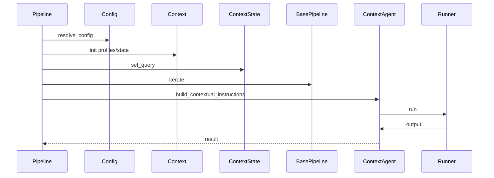

# 核心工作机制

> 说明：代码片段为源码关键行摘录（保持原样但非全文，可能包含英文注释），以下"解读/流程说明"为中文讲解。


## 流程解释（文字优先）
- 当 BasePipeline.__init__ 传入 config 时，resolve_config 解析配置并构建 LLMConfig（pipelines/base.py:22-53、contextagent/utils/config.py:471-607）。
- 当 Context 初始化为 ["profiles", "states"] 时，自动加载 Profile 并创建 ConversationState（contextagent/context/context.py:41-48）。
- 当 pipeline.run 被调用，通常先 set_query，将 query 写入 state（pipelines/data_scientist.py:68-69；pipelines/web_researcher.py:75-76）。
- 当 iterate 被触发：首轮创建 iteration，后续轮次自动结束上一轮并创建新轮（pipelines/base.py:438-477）。
- 当 Agent 执行：若 Profile 有 runtime_template，则从 state 抽取占位符并 render；否则回退到 format_context_prompt（contextagent/agent/agent.py:156-213、contextagent/context/conversation.py:243-267）。
- 当 routing/planning 产出任务时，pipeline 以并发方式调用 tool agents（pipelines/data_scientist.py:85-93；pipelines/web_researcher.py:91-99）。
- 当 tool agent 执行时，agent_step 将 data_store 作为上下文传入 Runner（contextagent/agent/executor.py:65-67）。
- 当需要汇总输出时，findings_text 会把工具输出合并为报告输入（contextagent/context/conversation.py:234-236；pipelines/data_scientist.py:95-97）。


## 流程图（简化）


## 事件清单（当…就会…）
- 当 resolve_config 执行时，就会解析配置并构建 LLMConfig（contextagent/utils/config.py:471-607）。
- 当 Context 初始化时，就会加载 profiles 并创建 state（contextagent/context/context.py:41-48）。
- 当 iterate 触发时，就会创建/结束 iteration（pipelines/base.py:438-477）。
- 当 Agent 执行时，就会基于 runtime_template 或 fallback 构造上下文（contextagent/agent/agent.py:156-213；contextagent/context/conversation.py:243-267）。
- 当 tool agents 并发执行时，就会产出 findings 供 writer 汇总（pipelines/data_scientist.py:85-97）。

## 前置条件/状态变化/下一步去向
- 前置条件：config 已解析并完成 LLM 初始化。
- 状态变化：state.query、iteration、findings 逐步更新。
- 下一步去向：进入 writer 汇总阶段并输出最终结果。

## 1. 配置解析 → LLM 构建
ContextAgent 统一通过 `resolve_config` 解析 YAML/JSON 或 dict，并构造 `LLMConfig`。

```python
# 文件：contextagent/utils/config.py | 行：471-607 | 描述：resolve_config 配置解析与 LLMConfig 构建
def resolve_config(spec: Union[str, Path, Mapping[str, Any], BaseConfig]) -> BaseConfig:
    """Resolve configuration from various input formats.

    Args:
        spec: Configuration specification:
            - str/Path: Load YAML/JSON file
            - dict with 'config_path': Load file, then deep-merge dict on top
            - dict without 'config_path': Use as-is
            - BaseConfig: Use as-is

    Returns:
        BaseConfig instance with all fields resolved and validated.

    Examples:
```

**解读**
- 作用：resolve_config 配置解析与 LLMConfig 构建。
- 片段范围：关键行摘录（与源码一致，但非完整段落）。
- 位置：contextagent/utils/config.py（配置/工具层）。
- 关键对象：resolve_config。
- 关键输入：spec。
- 关键输出/副作用：返回值由代码中的 return 语句给出。

**流程说明**
- 触发/流向：该片段位于调用链中，入口以本章流程解释与相邻调用处为准。

```python
# 文件：contextagent/llm/llm_setup.py | 行：11-143 | 描述：LLMConfig 与 Provider 配置
# Provider configurations - use OpenAIResponsesModel for most providers
PROVIDER_CONFIGS = {
    "openai": {
        "base_url": "https://api.deepseek.com/v1",
        "model_class": OpenAIChatCompletionsModel,
    },
    "deepseek": {
        "base_url": "https://api.deepseek.com/v1",
        "model_class": OpenAIResponsesModel,
    },
    "openrouter": {
        "base_url": "https://openrouter.ai/api/v1",
        "model_class": OpenAIResponsesModel,
    },
```

**解读**
- 作用：LLMConfig 与 Provider 配置。
- 片段范围：关键行摘录（与源码一致，但非完整段落）。
- 位置：contextagent/llm/llm_setup.py（LLM 适配层）。
- 关键对象：LLMConfig / __init__ / _get_default_model。
- 关键输入：config、full_config。
- 关键输出/副作用：返回值由代码中的 return 语句给出。

**流程说明**
- 触发/流向：该片段位于调用链中，入口以本章流程解释与相邻调用处为准。

### 机制要点
- 支持 `config_path` + override 的深度合并。
- 统一做 `${ENV}` 替换与相对路径解析。
- provider → base_url/model_class 由 `LLMConfig` 决定。

## 2. 上下文注入与运行时模板
ContextAgent 在每次调用时动态解析 runtime_template 占位符。

```python
# 文件：contextagent/agent/agent.py | 行：133-213 | 描述：运行时模板渲染与上下文注入
    def build_contextual_instructions(self, payload: Any = None) -> str:
        """Build instructions with automatic context injection from pipeline state.

        This method compiles instructions that include:
        - Runtime template rendering with placeholders filled from state (if profile has runtime_template)
        - Original query from pipeline.context.state.query
        - Previous iteration history from pipeline.context.state.iteration_history()
        - Current input payload

        Args:
            payload: Current input data for the agent

        Returns:
            Formatted instructions string with full context
```

**解读**
- 作用：运行时模板渲染与上下文注入。
- 片段范围：关键行摘录（与源码一致，但非完整段落）。
- 位置：contextagent/agent/agent.py（Agent 运行层）。
- 关键对象：build_contextual_instructions。
- 关键输入：payload。
- 关键输出/副作用：返回值由代码中的 return 语句给出。

**流程说明**
- 触发/流向：该片段位于调用链中，入口以本章流程解释与相邻调用处为准。

```python
# 文件：contextagent/context/conversation.py | 行：243-267 | 描述：format_context_prompt 拼装上下文提示
    def format_context_prompt(self, current_input: Optional[str] = None) -> str:
        """Format a comprehensive context prompt including query, history, and current input.

        Args:
            current_input: The current input/payload for this agent call

        Returns:
            Formatted context prompt string
        """
        sections = []

        # Add original query if available
        if self.query:
            sections.append(f"[ORIGINAL QUERY]\n{self.query}")
```

**解读**
- 作用：format_context_prompt 拼装上下文提示。
- 片段范围：关键行摘录（与源码一致，但非完整段落）。
- 位置：contextagent/context/conversation.py（上下文/状态层）。
- 关键对象：format_context_prompt。
- 关键输入：current_input。
- 关键输出/副作用：返回值由代码中的 return 语句给出。

**流程说明**
- 触发/流向：该片段位于调用链中，入口以本章流程解释与相邻调用处为准。

## 3. 运行生命周期与迭代管理
BasePipeline.run_context 负责追踪、printer、reporter 的创建与释放。

```python
# 文件：pipelines/base.py | 行：215-387 | 描述：运行上下文生命周期（printer/report/tracing）
    def _initialize_run(
        self,
        additional_logging: Optional[Callable] = None,
        enable_reporter: bool = True,
        outputs_dir: Optional[Union[str, Path]] = None,
        enable_printer: bool = True,
        workflow_name: Optional[str] = None,
        trace_metadata: Optional[Dict[str, Any]] = None,
    ):
        """Initialize a pipeline run with logging, printer, and tracing.

        Args:
            additional_logging: Optional callable for pipeline-specific logging
            enable_reporter: Whether to create/start the RunReporter
```

**解读**
- 作用：运行上下文生命周期（printer/report/tracing）。
- 片段范围：关键行摘录（与源码一致，但非完整段落）。
- 位置：pipelines/base.py（Pipeline 层）。
- 关键对象：_initialize_run / _setup_tracing / trace_context。
- 关键输入：additional_logging、enable_reporter、outputs_dir、enable_printer、workflow_name、trace_metadata。
- 关键输出/副作用：返回值由代码中的 return 语句给出。

**流程说明**
- 触发/流向：该片段位于调用链中，入口以本章流程解释与相邻调用处为准。

```python
# 文件：pipelines/base.py | 行：393-477 | 描述：迭代与分组管理
    def begin_iteration(
        self,
        title: Optional[str] = None,
        border_style: str = "white"
    ) -> Any:
        """Begin a new iteration with its associated group.

        Combines context.begin_iteration() + start_group() into a single call.
        Automatically manages the group_id internally.

        Args:
            title: Optional custom title (default: "Iteration {index}")
            border_style: Border style for the group (default: "white")

```

**解读**
- 作用：迭代与分组管理。
- 片段范围：关键行摘录（与源码一致，但非完整段落）。
- 位置：pipelines/base.py（Pipeline 层）。
- 关键对象：begin_iteration / end_iteration / iterate。
- 关键输入：title、border_style。
- 关键输出/副作用：返回值由代码中的 return 语句给出。

**流程说明**
- 触发/流向：该片段位于调用链中，入口以本章流程解释与相邻调用处为准。

## 4. Agent 执行、Tracing 与输出解析
Agent 调用进入 `agent_step`，由 RuntimeTracker 统一管理 span 与 panel。

```python
# 文件：contextagent/agent/executor.py | 行：14-96 | 描述：agent_step 执行与追踪
async def agent_step(
    tracker: RuntimeTracker,
    agent,
    instructions: str,
    span_name: Optional[str] = None,
    span_type: str = "agent",
    output_model: Optional[type[BaseModel]] = None,
    sync: bool = False,
    printer_key: Optional[str] = None,
    printer_title: Optional[str] = None,
    printer_border_style: Optional[str] = None,
    **span_kwargs
) -> Any:
    """Run an agent with span tracking and optional output parsing.
```

**解读**
- 作用：agent_step 执行与追踪。
- 片段范围：关键行摘录（与源码一致，但非完整段落）。
- 位置：contextagent/agent/executor.py（Agent 运行层）。
- 关键对象：agent_step。
- 关键输入：tracker、agent、instructions、span_name、span_type、output_model、sync、printer_key。
- 关键输出/副作用：返回值由代码中的 return 语句给出。

**流程说明**
- 触发/流向：该片段位于调用链中，入口以本章流程解释与相邻调用处为准。

```python
# 文件：contextagent/agent/agent.py | 行：216-345 | 描述：ContextAgent 执行流程与 MCP 清理
    async def __call__(
        self,
        payload: Any = None,
        *,
        tracker: Optional[Any] = None,
        span_name: Optional[str] = None,
        span_type: Optional[str] = None,
        output_model: Optional[type[BaseModel]] = None,
        printer_key: Optional[str] = None,
        printer_title: Optional[str] = None,
        printer_border_style: Optional[str] = None,
        record_payload: Optional[bool] = None,
        sync: bool = False,
        **span_kwargs: Any,
```

**解读**
- 作用：ContextAgent 执行流程与 MCP 清理。
- 片段范围：关键行摘录（与源码一致，但非完整段落）。
- 位置：contextagent/agent/agent.py（Agent 运行层）。
- 关键对象：__call__。
- 关键输入：payload、tracker、span_name、span_type、output_model、printer_key、printer_title、printer_border_style。
- 关键输出/副作用：返回值由代码中的 return 语句给出。

**流程说明**
- 触发/流向：该片段位于调用链中，入口以本章流程解释与相邻调用处为准。

## 5. 数据工具与 DataStore 共享
DataStore 为工具间共享中间结果提供缓存能力。

```python
# 文件：contextagent/context/data_store.py | 行：13-107 | 描述：DataStoreEntry 与 DataStore 基础操作
@dataclass
class DataStoreEntry:
    """Single entry in the pipeline data store with metadata."""
    key: str
    value: Any
    timestamp: datetime
    data_type: str
    metadata: Dict[str, Any]

    def size_mb(self) -> float:
        """Estimate size in MB (rough approximation)."""
        import sys
        return sys.getsizeof(self.value) / 1024 / 1024

```

**解读**
- 作用：DataStoreEntry 与 DataStore 基础操作。
- 片段范围：关键行摘录（与源码一致，但非完整段落）。
- 位置：contextagent/context/data_store.py（上下文/状态层）。
- 关键对象：DataStoreEntry / size_mb / DataStore。
- 关键输入：见函数签名或调用处。
- 关键输出/副作用：返回值由代码中的 return 语句给出。

**流程说明**
- 触发/流向：该片段位于调用链中，入口以本章流程解释与相邻调用处为准。

```python
# 文件：contextagent/tools/data_tools/data_loading.py | 行：12-88 | 描述：load_dataset 工具与缓存逻辑
@function_tool
async def load_dataset(ctx: RunContextWrapper[DataStore], file_path: str) -> Union[Dict[str, Any], str]:
    """Loads a dataset and provides comprehensive inspection information.

    This tool caches the loaded DataFrame in the pipeline data store so other
    tools can reuse it without reloading from disk.

    Args:
        ctx: Pipeline context wrapper for accessing the data store
        file_path: Path to the dataset file (CSV, JSON, Excel, etc.)

    Returns:
        Dictionary containing:
            - shape: Tuple of (rows, columns)
```

**解读**
- 作用：load_dataset 工具与缓存逻辑。
- 片段范围：关键行摘录（与源码一致，但非完整段落）。
- 位置：contextagent/tools/data_tools/data_loading.py（工具层）。
- 关键对象：load_dataset。
- 关键输入：ctx、file_path。
- 关键输出/副作用：返回值由代码中的 return 语句给出。

**流程说明**
- 触发/流向：该片段位于调用链中，入口以本章流程解释与相邻调用处为准。

```python
# 文件：contextagent/tools/data_tools/helpers.py | 行：1-67 | 描述：load_or_get_dataframe 缓存优先逻辑
"""Helper utilities for data tools to access cached DataFrames."""

from typing import Optional
from pathlib import Path
import pandas as pd
from contextagent.context.data_store import DataStore
from loguru import logger


def get_dataframe(file_path: str, prefer_preprocessed: bool = False, data_store: Optional[DataStore] = None) -> Optional[pd.DataFrame]:
    """Get a DataFrame from cache or load from file.

    Args:
        file_path: Path to the dataset file
```

**解读**
- 作用：load_or_get_dataframe 缓存优先逻辑。
- 片段范围：关键行摘录（与源码一致，但非完整段落）。
- 位置：contextagent/tools/data_tools/helpers.py（工具层）。
- 关键对象：get_dataframe / load_or_get_dataframe。
- 关键输入：file_path、prefer_preprocessed、data_store。
- 关键输出/副作用：返回值由代码中的 return 语句给出。

**流程说明**
- 触发/流向：该片段位于调用链中，入口以本章流程解释与相邻调用处为准。

## 6. 数据科学 Pipeline 工作流
DataScientistPipeline 使用 observe → evaluate → routing → tool agents。

```python
# 文件：pipelines/data_scientist.py | 行：13-105 | 描述：DataScientistPipeline 主循环
class DataScienceQuery(BaseModel):
    """Query model for data science tasks."""
    prompt: str
    data_path: str

    def format(self) -> str:
        """Format data science query."""
        return (
            f"Task: {self.prompt}\n"
            f"Dataset path: {self.data_path}\n"
            "Provide a comprehensive data science workflow"
        )

class DataScientistPipeline(BasePipeline):
```

**解读**
- 作用：DataScientistPipeline 主循环。
- 片段范围：关键行摘录（与源码一致，但非完整段落）。
- 位置：pipelines/data_scientist.py（Pipeline 层）。
- 关键对象：DataScienceQuery / format / DataScientistPipeline。
- 关键输入：config。
- 关键输出/副作用：返回值由代码中的 return 语句给出。

**流程说明**
- 触发/流向：该片段位于调用链中，入口以本章流程解释与相邻调用处为准。

## 7. Web Research Pipeline 工作流
WebSearcherPipeline 使用 web_planning 生成多任务，再并行调用 web_searcher/web_crawler。

```python
# 文件：pipelines/web_researcher.py | 行：14-111 | 描述：WebSearcherPipeline 主循环
class WebSearchQuery(BaseModel):
    """Query model for data science tasks."""
    prompt: str

    def format(self) -> str:
        """Format web search query."""
        return (
            f"Web search query: {self.prompt}\n"
            "Provide a comprehensive web search workflow"
        )


class WebSearcherPipeline(BasePipeline):
    """Web search pipeline using manager-tool pattern with multi-task planning.
```

**解读**
- 作用：WebSearcherPipeline 主循环。
- 片段范围：关键行摘录（与源码一致，但非完整段落）。
- 位置：pipelines/web_researcher.py（Pipeline 层）。
- 关键对象：WebSearchQuery / format / WebSearcherPipeline。
- 关键输入：config。
- 关键输出/副作用：返回值由代码中的 return 语句给出。

**流程说明**
- 触发/流向：该片段位于调用链中，入口以本章流程解释与相邻调用处为准。

```python
# 文件：contextagent/profiles/web/web_planning.py | 行：9-67 | 描述：web_planning_profile 多任务规划
class AgentTask(BaseModel):
    """Task definition for routing to specific agents."""
    agent: str = Field(description="Name of the agent to use")
    query: str = Field(description="Query/task for the agent")
    gap: str = Field(description="The knowledge gap this task addresses")
    entity_website: Optional[str] = Field(description="Optional entity or website context", default=None)


class AgentSelectionPlan(BaseModel):
    """Plan containing multiple agent tasks to address knowledge gaps."""
    tasks: List[AgentTask] = Field(description="List of tasks for different agents", default_factory=list)
    reasoning: str = Field(description="Reasoning for the agent selection", default="")


```

**解读**
- 作用：web_planning_profile 多任务规划。
- 片段范围：关键行摘录（与源码一致，但非完整段落）。
- 位置：contextagent/profiles/web/web_planning.py（Profile 配置层）。
- 关键对象：AgentTask / AgentSelectionPlan。
- 关键输入：见函数签名或调用处。
- 关键输出/副作用：结果以日志/状态变更/外部调用为主（见实现）。

**流程说明**
- 触发/流向：该片段位于调用链中，入口以本章流程解释与相邻调用处为准。

## 8. Web Search / Crawl 机制
搜索工具支持 Serper 与 SearchXNG，两者均在异步 client 中执行。

```python
# 文件：contextagent/tools/web_tools/search.py | 行：275-309 | 描述：SEARCH_PROVIDER 选择与 web_search
# ------- INITIALIZE SEARCH CLIENT AND DEFINE TOOL -------

# Get search provider from environment (default to serper)
SEARCH_PROVIDER = os.getenv("SEARCH_PROVIDER", "serper")

# Initialize the search client based on provider
if SEARCH_PROVIDER == "serper":
    _search_client = SerperClient()
elif SEARCH_PROVIDER == "searchxng":
    _search_client = SearchXNGClient()
else:
    raise ValueError(f"Invalid search provider: {SEARCH_PROVIDER}. Must be 'serper' or 'searchxng'")


```

**解读**
- 作用：SEARCH_PROVIDER 选择与 web_search。
- 片段范围：关键行摘录（与源码一致，但非完整段落）。
- 位置：contextagent/tools/web_tools/search.py（工具层）。
- 关键对象：web_search。
- 关键输入：query。
- 关键输出/副作用：返回值由代码中的 return 语句给出。

**流程说明**
- 触发/流向：该片段位于调用链中，入口以本章流程解释与相邻调用处为准。

```python
# 文件：contextagent/tools/web_tools/crawl.py | 行：9-109 | 描述：crawl_website BFS 抓取
@function_tool
async def crawl_website(starting_url: str) -> Union[List[ScrapeResult], str]:
    """Crawls the pages of a website starting with the starting_url and then descending into the pages linked from there.
    Prioritizes links found in headers/navigation, then body links, then subsequent pages.
    
    Args:
        starting_url: Starting URL to scrape
        
    Returns:
        List of ScrapeResult objects which have the following fields:
            - url: The URL of the web page
            - title: The title of the web page
            - description: The description of the web page
            - text: The text content of the web page
```

**解读**
- 作用：crawl_website BFS 抓取。
- 片段范围：关键行摘录（与源码一致，但非完整段落）。
- 位置：contextagent/tools/web_tools/crawl.py（工具层）。
- 关键对象：crawl_website / extract_links / fetch_page。
- 关键输入：starting_url。
- 关键输出/副作用：返回值由代码中的 return 语句给出。

**流程说明**
- 触发/流向：该片段位于调用链中，入口以本章流程解释与相邻调用处为准。

## 9. MCP 连接与清理
ContextAgent 会在调用前连接 mcp_servers，并在结束后 cleanup。

```python
# 文件：contextagent/agent/agent.py | 行：216-345 | 描述：ContextAgent 执行流程与 MCP 清理
    async def __call__(
        self,
        payload: Any = None,
        *,
        tracker: Optional[Any] = None,
        span_name: Optional[str] = None,
        span_type: Optional[str] = None,
        output_model: Optional[type[BaseModel]] = None,
        printer_key: Optional[str] = None,
        printer_title: Optional[str] = None,
        printer_border_style: Optional[str] = None,
        record_payload: Optional[bool] = None,
        sync: bool = False,
        **span_kwargs: Any,
```

**解读**
- 作用：ContextAgent 执行流程与 MCP 清理。
- 片段范围：关键行摘录（与源码一致，但非完整段落）。
- 位置：contextagent/agent/agent.py（Agent 运行层）。
- 关键对象：__call__。
- 关键输入：payload、tracker、span_name、span_type、output_model、printer_key、printer_title、printer_border_style。
- 关键输出/副作用：返回值由代码中的 return 语句给出。

**流程说明**
- 触发/流向：该片段位于调用链中，入口以本章流程解释与相邻调用处为准。

```python
# 文件：contextagent/mcp/servers/browser/server.py | 行：19-38 | 描述：BrowserMCP stdio server
def BrowserMCP() -> MCPServer:
    """Return a configured Browser MCP server (stdio over npx).

    Uses `npx -y @browsermcp/mcp@latest` to execute the server binary from npm.
    """
    # Best-effort patch for the Browser MCP CLI close handler (safe if unavailable)
    try:
        apply_browsermcp_close_patch()
    except Exception:
        # Non-fatal: if patching fails we still try to start the server
        pass

    return MCPServerStdio(
        cache_tools_list=True,
```

**解读**
- 作用：BrowserMCP stdio server。
- 片段范围：关键行摘录（与源码一致，但非完整段落）。
- 位置：contextagent/mcp/servers/browser/server.py（MCP 集成层）。
- 关键对象：BrowserMCP。
- 关键输入：见函数签名或调用处。
- 关键输出/副作用：返回值由代码中的 return 语句给出。

**流程说明**
- 触发/流向：该片段位于调用链中，入口以本章流程解释与相邻调用处为准。

```python
# 文件：contextagent/mcp/patches.py | 行：58-86 | 描述：Browser MCP 关闭补丁
def apply_browsermcp_close_patch() -> None:
    """Patch the Browser MCP CLI to avoid recursive `server.close` calls."""
    cache_root = Path.home() / ".npm" / "_npx"
    candidate_paths = list(_candidate_paths(cache_root))
    if not candidate_paths:
        if not _prime_browsermcp_cache():
            return
        candidate_paths = list(_candidate_paths(cache_root))

    for path in candidate_paths:
        try:
            original = path.read_text(encoding="utf-8")
        except OSError as exc:
            logger.warning("Failed to read %s while applying Browser MCP patch: %s", path, exc)
```

**解读**
- 作用：Browser MCP 关闭补丁。
- 片段范围：关键行摘录（与源码一致，但非完整段落）。
- 位置：contextagent/mcp/patches.py（MCP 集成层）。
- 关键对象：apply_browsermcp_close_patch。
- 关键输入：见函数签名或调用处。
- 关键输出/副作用：返回值由代码中的 return 语句给出。

**流程说明**
- 触发/流向：该片段位于调用链中，入口以本章流程解释与相邻调用处为准。

## 10. 产物输出与终端渲染
RunReporter 聚合 ArtifactWriter + TerminalWriter，实现终端回放与文件产出。

```python
# 文件：contextagent/artifacts/reporter.py | 行：43-223 | 描述：RunReporter 记录运行信息
class RunReporter:
    """Facade combining terminal display and artifact persistence."""

    def __init__(
        self,
        *,
        base_dir: Path,
        pipeline_slug: str,
        workflow_name: str,
        experiment_id: str,
        console: Optional[Console] = None,
    ) -> None:
        self.base_dir = base_dir
        self.pipeline_slug = pipeline_slug
```

**解读**
- 作用：RunReporter 记录运行信息。
- 片段范围：关键行摘录（与源码一致，但非完整段落）。
- 位置：contextagent/artifacts/reporter.py（产物/报告层）。
- 关键对象：RunReporter / __init__ / start。
- 关键输入：base_dir、pipeline_slug、workflow_name、experiment_id、console。
- 关键输出/副作用：主要通过修改实例或上下文状态产生效果。

**流程说明**
- 触发/流向：该片段位于调用链中，入口以本章流程解释与相邻调用处为准。

```python
# 文件：contextagent/artifacts/artifact_writer.py | 行：273-289 | 描述：ArtifactWriter.finalize 写入产物
    def finalize(self) -> None:
        """Persist markdown + HTML artefacts."""
        if self._start_time is None or self._finished_at_iso is not None:
            return
        self._finished_at_iso = _utc_timestamp()
        duration = round(time.time() - self._start_time, 3)

        terminal_sections = self._build_terminal_sections()
        terminal_md = self._render_terminal_markdown(duration, terminal_sections)
        terminal_html = self._render_terminal_html(duration, terminal_sections)

        self.terminal_md_path.write_text(terminal_md, encoding="utf-8")
        self.terminal_html_path.write_text(terminal_html, encoding="utf-8")

```

**解读**
- 作用：ArtifactWriter.finalize 写入产物。
- 片段范围：关键行摘录（与源码一致，但非完整段落）。
- 位置：contextagent/artifacts/artifact_writer.py（产物/报告层）。
- 关键对象：finalize。
- 关键输入：见函数签名或调用处。
- 关键输出/副作用：返回值由代码中的 return 语句给出。

**流程说明**
- 触发/流向：该片段位于调用链中，入口以本章流程解释与相邻调用处为准。

## 11. 前端流式输出
StreamingPrinter 将 update_item/log_panel 转换为 SSE 事件。

```python
# 文件：frontend/streaming_printer.py | 行：17-130 | 描述：StreamingPrinter SSE 事件队列
class StreamingPrinter(Printer):
    """Printer that captures updates for streaming to the frontend."""

    def __init__(self, console: Console):
        super().__init__(console)
        self.update_queue: queue.Queue = queue.Queue()
        self.is_streaming = True

    def _emit_update(self, event_type: str, data: Dict[str, Any]) -> None:
        if not self.is_streaming:
            return
        try:
            self.update_queue.put({"type": event_type, "data": data}, block=False)
        except queue.Full:
```

**解读**
- 作用：StreamingPrinter SSE 事件队列。
- 片段范围：关键行摘录（与源码一致，但非完整段落）。
- 位置：frontend/streaming_printer.py（前端展示层）。
- 关键对象：StreamingPrinter / __init__ / _emit_update。
- 关键输入：console。
- 关键输出/副作用：返回值由代码中的 return 语句给出。

**流程说明**
- 触发/流向：该片段位于调用链中，入口以本章流程解释与相邻调用处为准。

```python
# 文件：frontend/app.py | 行：506-555 | 描述：SSE 流式输出
@app.route("/api/runs/<run_id>/stream", methods=["GET"])
def stream_run(run_id: str):
    """Stream updates for a specific run via Server-Sent Events."""
    run_entry = pipeline_runs.get(run_id)
    if not run_entry:
        return jsonify({"error": "Run not found"}), 404

    printer: StreamingPrinter = run_entry["printer"]

    def event_stream():
        while True:
            if run_id not in pipeline_runs:
                break

```

**解读**
- 作用：SSE 流式输出。
- 片段范围：关键行摘录（与源码一致，但非完整段落）。
- 位置：frontend/app.py（前端展示层）。
- 关键对象：stream_run / event_stream。
- 关键输入：run_id。
- 关键输出/副作用：返回值由代码中的 return 语句给出。

**流程说明**
- 触发/流向：该片段位于调用链中，入口以本章流程解释与相邻调用处为准。

## 12. 已识别的待确认项
- Profile/Config 命名不一致：见 `12-pipeline-configs.md`。
- `Context.get_with_wrapper` 未在 `contextagent/context/context.py` 实现，但 `ContextAgent.get_context_with_wrapper` 调用它。
- `vanilla_chat_profile` 使用 `input_schema`，但 `Profile` 基类未声明该字段。
- `LLMConfig` 中 `openai` provider base_url 指向 deepseek 域名，可能为配置复用或误配（待确认）。
