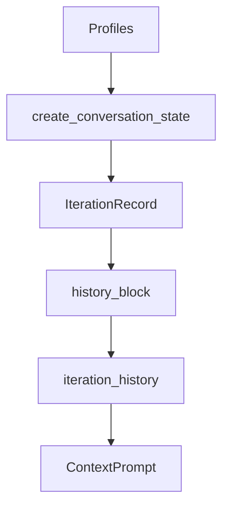

# 数据模型

> 说明：代码片段为源码关键行摘录（保持原样但非全文，可能包含英文注释），以下"解读/流程说明"为中文讲解。


## 流程解释（文字优先）
- 当创建 ConversationState 时，create_conversation_state 会基于所有 Profile 的 output_schema 生成 payload 联合类型（contextagent/context/conversation.py:270-304）。
- 当工具输出被记录时，BaseIterationRecord.tools 持有 ToolAgentOutput，history_block 统一渲染 findings（contextagent/context/conversation.py:19-55）。
- 当需要上下文历史时，iteration_history 基于 history_block 组合（contextagent/context/conversation.py:189-200）。
- 当 pipeline 需要最终结果输入时，findings_text 汇总全部工具输出（contextagent/context/conversation.py:228-236）。


## 流程图（简化）


## 事件清单（当…就会…）
- 当 create_conversation_state 执行时，就会基于各 Profile 的 output_schema 构造联合类型（contextagent/context/conversation.py:270-304）。
- 当 iteration.history_block 被调用时，就会输出标准化的 thought/payloads/findings 结构（contextagent/context/conversation.py:34-57）。
- 当 iteration_history 被调用时，就会汇总历史块（contextagent/context/conversation.py:189-200）。
- 当 findings_text 被调用时，就会合并所有工具输出（contextagent/context/conversation.py:234-236）。

## 前置条件/状态变化/下一步去向
- 前置条件：profiles 已加载，state 已创建。
- 状态变化：iteration.payloads、iteration.tools、summary 等字段更新。
- 下一步去向：将 history/findings 作为上下文输入给 Agent 或 writer。

## 1. Profile 与 ToolAgentOutput
```python
# 文件：contextagent/profiles/base.py | 行：12-68 | 描述：Profile 与 ToolAgentOutput 基础定义
class Profile(BaseModel):
    instructions: str = Field(description="The agent's system prompt/instructions that define its behavior")
    runtime_template: str = Field(description="The runtime template for the agent's behavior")
    model: Optional[str] = Field(default=None, description="Model override for this profile (e.g., 'gpt-4', 'claude-3-5-sonnet')")
    output_schema: Optional[Type[BaseModel]] = Field(default=None, description="Pydantic model class for structured output validation")
    tools: Optional[List[Any]] = Field(default=None, description="List of tool objects (e.g., FunctionTool instances) to use for this profile")
    mcp_servers: Optional[List[Any]] = Field(default=None, description="List of MCP server specs (e.g., MCPServerStdio instances) for MCP tool integration")
    description: Optional[str] = Field(default=None, description="Optional one-sentence description for agent capabilities (auto-extracted from instructions if not provided)")

    class Config:
        arbitrary_types_allowed = True

    def get_description(self) -> str:
        """Get description for this profile.
```

**解读**
- 作用：Profile 与 ToolAgentOutput 基础定义。
- 片段范围：关键行摘录（与源码一致，但非完整段落）。
- 位置：contextagent/profiles/base.py（Profile 配置层）。
- 关键对象：Profile / Config / get_description。
- 关键输入：见函数签名或调用处。
- 关键输出/副作用：返回值由代码中的 return 语句给出。

**流程说明**
- 触发/流向：该片段位于调用链中，入口以本章流程解释与相邻调用处为准。

## 2. ConversationState 与 IterationRecord
```python
# 文件：contextagent/context/conversation.py | 行：14-57 | 描述：迭代记录的 history_block 格式化
class BaseIterationRecord(BaseModel):
    """State captured for a single iteration of the research loop."""

    index: int
    observation: Optional[str] = None
    tools: List[ToolAgentOutput] = Field(default_factory=list)
    payloads: List[Any] = Field(default_factory=list)
    status: str = Field(default="pending", description="Iteration status: pending or complete")
    summarized: bool = Field(default=False, description="Whether this iteration has been summarised")
    _output_union: ClassVar[Optional[Type[BaseModel]]] = None  # type: ignore[var-annotated]

    def mark_complete(self) -> None:
        self.status = "complete"

```

**解读**
- 作用：迭代记录的 history_block 格式化。
- 片段范围：关键行摘录（与源码一致，但非完整段落）。
- 位置：contextagent/context/conversation.py（上下文/状态层）。
- 关键对象：BaseIterationRecord / mark_complete / is_complete。
- 关键输入：见函数签名或调用处。
- 关键输出/副作用：返回值由代码中的 return 语句给出。

**流程说明**
- 触发/流向：该片段位于调用链中，入口以本章流程解释与相邻调用处为准。

```python
# 文件：contextagent/context/conversation.py | 行：270-304 | 描述：create_conversation_state 动态 union 输出模型
def create_conversation_state(profiles: Dict[str, Profile]) -> "ConversationState":
    models: List[Type[BaseModel]] = []
    seen: Set[str] = set()

    for profile in profiles.values():
        model = getattr(profile, "output_schema", None)
        if model is not None and isinstance(model, type) and issubclass(model, BaseModel):
            key = f"{model.__module__}.{model.__qualname__}"
            if key not in seen:
                seen.add(key)
                models.append(model)

    if not models:
        models = [ToolAgentOutput]
```

**解读**
- 作用：create_conversation_state 动态 union 输出模型。
- 片段范围：关键行摘录（与源码一致，但非完整段落）。
- 位置：contextagent/context/conversation.py（上下文/状态层）。
- 关键对象：create_conversation_state。
- 关键输入：profiles。
- 关键输出/副作用：返回值由代码中的 return 语句给出。

**流程说明**
- 触发/流向：该片段位于调用链中，入口以本章流程解释与相邻调用处为准。

## 3. DataStoreEntry
```python
# 文件：contextagent/context/data_store.py | 行：13-107 | 描述：DataStoreEntry 与 DataStore 基础操作
@dataclass
class DataStoreEntry:
    """Single entry in the pipeline data store with metadata."""
    key: str
    value: Any
    timestamp: datetime
    data_type: str
    metadata: Dict[str, Any]

    def size_mb(self) -> float:
        """Estimate size in MB (rough approximation)."""
        import sys
        return sys.getsizeof(self.value) / 1024 / 1024

```

**解读**
- 作用：DataStoreEntry 与 DataStore 基础操作。
- 片段范围：关键行摘录（与源码一致，但非完整段落）。
- 位置：contextagent/context/data_store.py（上下文/状态层）。
- 关键对象：DataStoreEntry / size_mb / DataStore。
- 关键输入：见函数签名或调用处。
- 关键输出/副作用：返回值由代码中的 return 语句给出。

**流程说明**
- 触发/流向：该片段位于调用链中，入口以本章流程解释与相邻调用处为准。

## 4. 管理类输出结构
### EvaluateOutput
```python
# 文件：contextagent/profiles/manager/evaluate.py | 行：9-38 | 描述：evaluate_profile 结构化输出
class EvaluateOutput(BaseModel):
    """Output schema for evaluate agent."""
    research_complete: bool = Field(description="Boolean indicating if research is done")
    outstanding_gaps: List[str] = Field(description="List of specific gaps that still need addressing", default_factory=list)
    reasoning: str = Field(description="Clear explanation of the evaluation")


# Profile instance for evaluate agent
evaluate_profile = Profile(
    instructions="""You are a research evaluation agent. Analyze research progress and determine if goals have been met.

Your responsibilities:
1. Assess whether the research task has been completed
2. Identify any remaining knowledge gaps
```

**解读**
- 作用：evaluate_profile 结构化输出。
- 片段范围：关键行摘录（与源码一致，但非完整段落）。
- 位置：contextagent/profiles/manager/evaluate.py（Profile 配置层）。
- 关键对象：EvaluateOutput。
- 关键输入：见函数签名或调用处。
- 关键输出/副作用：结果以日志/状态变更/外部调用为主（见实现）。

**流程说明**
- 触发/流向：该片段位于调用链中，入口以本章流程解释与相邻调用处为准。

### AgentTask / AgentSelectionPlan（routing & web_planning）
```python
# 文件：contextagent/profiles/manager/routing.py | 行：9-75 | 描述：routing_profile 与 AgentSelectionPlan
class AgentTask(BaseModel):
    """Task definition for routing to specific agents."""
    agent: str = Field(description="Name of the agent to use")
    query: str = Field(description="Query/task for the agent")
    gap: str = Field(description="The knowledge gap this task addresses")
    entity_website: Optional[str] = Field(description="Optional entity or website context", default=None)


class AgentSelectionPlan(BaseModel):
    """Plan containing multiple agent tasks to address knowledge gaps."""
    tasks: List[AgentTask] = Field(description="List of tasks for different agents", default_factory=list)
    reasoning: str = Field(description="Reasoning for the agent selection", default="")


```

**解读**
- 作用：routing_profile 与 AgentSelectionPlan。
- 片段范围：关键行摘录（与源码一致，但非完整段落）。
- 位置：contextagent/profiles/manager/routing.py（Profile 配置层）。
- 关键对象：AgentTask / AgentSelectionPlan。
- 关键输入：见函数签名或调用处。
- 关键输出/副作用：结果以日志/状态变更/外部调用为主（见实现）。

**流程说明**
- 触发/流向：该片段位于调用链中，入口以本章流程解释与相邻调用处为准。

```python
# 文件：contextagent/profiles/web/web_planning.py | 行：9-67 | 描述：web_planning_profile 多任务规划
class AgentTask(BaseModel):
    """Task definition for routing to specific agents."""
    agent: str = Field(description="Name of the agent to use")
    query: str = Field(description="Query/task for the agent")
    gap: str = Field(description="The knowledge gap this task addresses")
    entity_website: Optional[str] = Field(description="Optional entity or website context", default=None)


class AgentSelectionPlan(BaseModel):
    """Plan containing multiple agent tasks to address knowledge gaps."""
    tasks: List[AgentTask] = Field(description="List of tasks for different agents", default_factory=list)
    reasoning: str = Field(description="Reasoning for the agent selection", default="")


```

**解读**
- 作用：web_planning_profile 多任务规划。
- 片段范围：关键行摘录（与源码一致，但非完整段落）。
- 位置：contextagent/profiles/web/web_planning.py（Profile 配置层）。
- 关键对象：AgentTask / AgentSelectionPlan。
- 关键输入：见函数签名或调用处。
- 关键输出/副作用：结果以日志/状态变更/外部调用为主（见实现）。

**流程说明**
- 触发/流向：该片段位于调用链中，入口以本章流程解释与相邻调用处为准。

## 5. Pipeline Query 模型
```python
# 文件：pipelines/data_scientist.py | 行：13-105 | 描述：DataScientistPipeline 主循环
class DataScienceQuery(BaseModel):
    """Query model for data science tasks."""
    prompt: str
    data_path: str

    def format(self) -> str:
        """Format data science query."""
        return (
            f"Task: {self.prompt}\n"
            f"Dataset path: {self.data_path}\n"
            "Provide a comprehensive data science workflow"
        )

class DataScientistPipeline(BasePipeline):
```

**解读**
- 作用：DataScientistPipeline 主循环。
- 片段范围：关键行摘录（与源码一致，但非完整段落）。
- 位置：pipelines/data_scientist.py（Pipeline 层）。
- 关键对象：DataScienceQuery / format / DataScientistPipeline。
- 关键输入：config。
- 关键输出/副作用：返回值由代码中的 return 语句给出。

**流程说明**
- 触发/流向：该片段位于调用链中，入口以本章流程解释与相邻调用处为准。

```python
# 文件：pipelines/web_researcher.py | 行：14-111 | 描述：WebSearcherPipeline 主循环
class WebSearchQuery(BaseModel):
    """Query model for data science tasks."""
    prompt: str

    def format(self) -> str:
        """Format web search query."""
        return (
            f"Web search query: {self.prompt}\n"
            "Provide a comprehensive web search workflow"
        )


class WebSearcherPipeline(BasePipeline):
    """Web search pipeline using manager-tool pattern with multi-task planning.
```

**解读**
- 作用：WebSearcherPipeline 主循环。
- 片段范围：关键行摘录（与源码一致，但非完整段落）。
- 位置：pipelines/web_researcher.py（Pipeline 层）。
- 关键对象：WebSearchQuery / format / WebSearcherPipeline。
- 关键输入：config。
- 关键输出/副作用：返回值由代码中的 return 语句给出。

**流程说明**
- 触发/流向：该片段位于调用链中，入口以本章流程解释与相邻调用处为准。

```python
# 文件：pipelines/vanilla_chat.py | 行：12-62 | 描述：VanillaChatPipeline 单轮对话
class ChatQuery(BaseModel):
    """Lightweight query model for vanilla chat."""
    message: str

    def format(self) -> str:
        return self.message


class VanillaChatPipeline(BasePipeline):
    """Minimal chat pipeline using a single vanilla_chat agent profile."""

    def __init__(self, config):
        super().__init__(config)

```

**解读**
- 作用：VanillaChatPipeline 单轮对话。
- 片段范围：关键行摘录（与源码一致，但非完整段落）。
- 位置：pipelines/vanilla_chat.py（Pipeline 层）。
- 关键对象：ChatQuery / format / VanillaChatPipeline。
- 关键输入：config。
- 关键输出/副作用：返回值由代码中的 return 语句给出。

**流程说明**
- 触发/流向：该片段位于调用链中，入口以本章流程解释与相邻调用处为准。

```python
# 文件：pipelines/browser_mcp.py | 行：12-63 | 描述：BrowserMCPPipeline MCP 调用
class BrowserTask(BaseModel):
    """Lightweight query model for Browser MCP tasks."""
    prompt: str

    def format(self) -> str:
        # Pass the user prompt straight through to the agent
        return self.prompt


class BrowserMCPPipeline(BasePipeline):
    """Simple pipeline that exercises the Browser MCP server via the browser profile."""

    def __init__(self, config):
        super().__init__(config)
```

**解读**
- 作用：BrowserMCPPipeline MCP 调用。
- 片段范围：关键行摘录（与源码一致，但非完整段落）。
- 位置：pipelines/browser_mcp.py（Pipeline 层）。
- 关键对象：BrowserTask / format / BrowserMCPPipeline。
- 关键输入：config。
- 关键输出/副作用：返回值由代码中的 return 语句给出。

**流程说明**
- 触发/流向：该片段位于调用链中，入口以本章流程解释与相邻调用处为准。

## 6. Web 工具结构化输出
```python
# 文件：contextagent/tools/web_tools/search.py | 行：42-84 | 描述：SerperClient 查询流程
class SerperClient:
    """A client for the Serper API to perform Google searches."""

    def __init__(self, api_key: str = None):
        self.api_key = api_key or os.getenv("SERPER_API_KEY")
        if not self.api_key:
            raise ValueError(
                "No API key provided. Set SERPER_API_KEY environment variable."
            )

        self.url = "https://google.serper.dev/search"
        self.headers = {"X-API-KEY": self.api_key, "Content-Type": "application/json"}

    async def search(
```

**解读**
- 作用：SerperClient 查询流程。
- 片段范围：关键行摘录（与源码一致，但非完整段落）。
- 位置：contextagent/tools/web_tools/search.py（工具层）。
- 关键对象：SerperClient / __init__ / search。
- 关键输入：api_key。
- 关键输出/副作用：返回值由代码中的 return 语句给出。

**流程说明**
- 触发/流向：该片段位于调用链中，入口以本章流程解释与相邻调用处为准。

## 7. 运行报告模型
```python
# 文件：contextagent/artifacts/reporter.py | 行：43-223 | 描述：RunReporter 记录运行信息
class RunReporter:
    """Facade combining terminal display and artifact persistence."""

    def __init__(
        self,
        *,
        base_dir: Path,
        pipeline_slug: str,
        workflow_name: str,
        experiment_id: str,
        console: Optional[Console] = None,
    ) -> None:
        self.base_dir = base_dir
        self.pipeline_slug = pipeline_slug
```

**解读**
- 作用：RunReporter 记录运行信息。
- 片段范围：关键行摘录（与源码一致，但非完整段落）。
- 位置：contextagent/artifacts/reporter.py（产物/报告层）。
- 关键对象：RunReporter / __init__ / start。
- 关键输入：base_dir、pipeline_slug、workflow_name、experiment_id、console。
- 关键输出/副作用：主要通过修改实例或上下文状态产生效果。

**流程说明**
- 触发/流向：该片段位于调用链中，入口以本章流程解释与相邻调用处为准。
