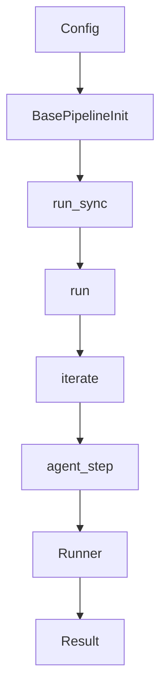

# API 参考

> 说明：代码片段为源码关键行摘录（保持原样但非全文，可能包含英文注释），以下"解读/流程说明"为中文讲解。


## 流程解释（文字优先）
- 当构造 Pipeline 时，会解析配置并创建 RuntimeTracker（pipelines/base.py:22-101）。
- 当调用 run_sync 时，会直接执行异步 run（pipelines/base.py:483-485）。
- 当进入迭代时，iterate 统一创建/结束 iteration（pipelines/base.py:438-477）。
- 当执行 Agent 时，由 agent_step 管理 span 并调用 Runner（contextagent/agent/executor.py:47-67）。
- 当结果需要结构化输出时，ContextAgent 会根据 output_schema 决定解析路径（contextagent/agent/agent.py:81-85）。


## 流程图（简化）


## 事件清单（当…就会…）
- 当 BasePipeline 初始化时，就会解析 config 并创建 RuntimeTracker（pipelines/base.py:22-101）。
- 当 run_sync 被调用时，就会执行 async run（pipelines/base.py:483-485）。
- 当 iterate 被调用时，就会创建/结束 iteration（pipelines/base.py:438-477）。
- 当 agent_step 运行时，就会创建 span 并调用 Runner 执行 Agent（contextagent/agent/executor.py:47-67）。
- 当 output_schema 存在时，就会按模型能力选择解析路径（contextagent/agent/agent.py:81-85）。

## 前置条件/状态变化/下一步去向
- 前置条件：pipeline 已完成配置解析与 context 初始化。
- 状态变化：iteration 计数与 state.history 更新。
- 下一步去向：进入 writer 汇总或返回调用方。

## Pipeline API
- `BasePipeline.__init__`: 解析 config 并建立 RuntimeTracker。
- `BasePipeline.run_context`: 运行生命周期管理。
- `BasePipeline.iterate`: 迭代与 group 管理。

```python
# 文件：pipelines/base.py | 行：22-101 | 描述：BasePipeline 初始化与配置解析
    def __init__(self, config: Union[str, Path, Mapping[str, Any], BaseConfig]):
        """Initialize the pipeline using a single configuration input.

        Args:
            spec: Configuration specification:
                - str/Path: Load YAML/JSON file
                - dict with 'config_path': Load file, then deep-merge dict on top (dict wins)
                - dict without 'config_path': Use as-is
                - BaseConfig: Use as-is
            strict: Whether to strictly validate configuration (default: True).

        Examples:
            # Load from file
            BasePipeline("pipelines/configs/data_science.yaml")
```

**解读**
- 作用：BasePipeline 初始化与配置解析。
- 片段范围：关键行摘录（与源码一致，但非完整段落）。
- 位置：pipelines/base.py（Pipeline 层）。
- 关键对象：__init__。
- 关键输入：config。
- 关键输出/副作用：主要通过修改实例或上下文状态产生效果。

**流程说明**
- 触发/流向：该片段位于调用链中，入口以本章流程解释与相邻调用处为准。

```python
# 文件：pipelines/base.py | 行：215-387 | 描述：运行上下文生命周期（printer/report/tracing）
    def _initialize_run(
        self,
        additional_logging: Optional[Callable] = None,
        enable_reporter: bool = True,
        outputs_dir: Optional[Union[str, Path]] = None,
        enable_printer: bool = True,
        workflow_name: Optional[str] = None,
        trace_metadata: Optional[Dict[str, Any]] = None,
    ):
        """Initialize a pipeline run with logging, printer, and tracing.

        Args:
            additional_logging: Optional callable for pipeline-specific logging
            enable_reporter: Whether to create/start the RunReporter
```

**解读**
- 作用：运行上下文生命周期（printer/report/tracing）。
- 片段范围：关键行摘录（与源码一致，但非完整段落）。
- 位置：pipelines/base.py（Pipeline 层）。
- 关键对象：_initialize_run / _setup_tracing / trace_context。
- 关键输入：additional_logging、enable_reporter、outputs_dir、enable_printer、workflow_name、trace_metadata。
- 关键输出/副作用：返回值由代码中的 return 语句给出。

**流程说明**
- 触发/流向：该片段位于调用链中，入口以本章流程解释与相邻调用处为准。

## Agent API
- `ContextAgent`: 基于 Profile 的 Agent 封装。
- `agent_step`: 带 tracing 和 output parsing 的执行入口。

```python
# 文件：contextagent/agent/agent.py | 行：43-105 | 描述：ContextAgent profile 绑定与 output_schema 处理
    def __init__(
        self,
        context: Any,
        *,
        profile: str,
        llm: str,
        **agent_kwargs: Any,
    ) -> None:
        """Initialize ContextAgent with context and profile identifier.

        Args:
            context: Context object containing profiles and state
            profile: Profile identifier for lookup in context.profiles
            llm: LLM model name (e.g., "gpt-4", "claude-3-5-sonnet")
```

**解读**
- 作用：ContextAgent profile 绑定与 output_schema 处理。
- 片段范围：关键行摘录（与源码一致，但非完整段落）。
- 位置：contextagent/agent/agent.py（Agent 运行层）。
- 关键对象：__init__。
- 关键输入：context、profile、llm、agent_kwargs。
- 关键输出/副作用：主要通过修改实例或上下文状态产生效果。

**流程说明**
- 触发/流向：该片段位于调用链中，入口以本章流程解释与相邻调用处为准。

```python
# 文件：contextagent/agent/executor.py | 行：14-96 | 描述：agent_step 执行与追踪
async def agent_step(
    tracker: RuntimeTracker,
    agent,
    instructions: str,
    span_name: Optional[str] = None,
    span_type: str = "agent",
    output_model: Optional[type[BaseModel]] = None,
    sync: bool = False,
    printer_key: Optional[str] = None,
    printer_title: Optional[str] = None,
    printer_border_style: Optional[str] = None,
    **span_kwargs
) -> Any:
    """Run an agent with span tracking and optional output parsing.
```

**解读**
- 作用：agent_step 执行与追踪。
- 片段范围：关键行摘录（与源码一致，但非完整段落）。
- 位置：contextagent/agent/executor.py（Agent 运行层）。
- 关键对象：agent_step。
- 关键输入：tracker、agent、instructions、span_name、span_type、output_model、sync、printer_key。
- 关键输出/副作用：返回值由代码中的 return 语句给出。

**流程说明**
- 触发/流向：该片段位于调用链中，入口以本章流程解释与相邻调用处为准。

## Context API
- `ConversationState.format_context_prompt`: 拼装 prompt。
- `create_conversation_state`: 动态 union output_schema。

```python
# 文件：contextagent/context/conversation.py | 行：243-267 | 描述：format_context_prompt 拼装上下文提示
    def format_context_prompt(self, current_input: Optional[str] = None) -> str:
        """Format a comprehensive context prompt including query, history, and current input.

        Args:
            current_input: The current input/payload for this agent call

        Returns:
            Formatted context prompt string
        """
        sections = []

        # Add original query if available
        if self.query:
            sections.append(f"[ORIGINAL QUERY]\n{self.query}")
```

**解读**
- 作用：format_context_prompt 拼装上下文提示。
- 片段范围：关键行摘录（与源码一致，但非完整段落）。
- 位置：contextagent/context/conversation.py（上下文/状态层）。
- 关键对象：format_context_prompt。
- 关键输入：current_input。
- 关键输出/副作用：返回值由代码中的 return 语句给出。

**流程说明**
- 触发/流向：该片段位于调用链中，入口以本章流程解释与相邻调用处为准。

```python
# 文件：contextagent/context/conversation.py | 行：270-304 | 描述：create_conversation_state 动态 union 输出模型
def create_conversation_state(profiles: Dict[str, Profile]) -> "ConversationState":
    models: List[Type[BaseModel]] = []
    seen: Set[str] = set()

    for profile in profiles.values():
        model = getattr(profile, "output_schema", None)
        if model is not None and isinstance(model, type) and issubclass(model, BaseModel):
            key = f"{model.__module__}.{model.__qualname__}"
            if key not in seen:
                seen.add(key)
                models.append(model)

    if not models:
        models = [ToolAgentOutput]
```

**解读**
- 作用：create_conversation_state 动态 union 输出模型。
- 片段范围：关键行摘录（与源码一致，但非完整段落）。
- 位置：contextagent/context/conversation.py（上下文/状态层）。
- 关键对象：create_conversation_state。
- 关键输入：profiles。
- 关键输出/副作用：返回值由代码中的 return 语句给出。

**流程说明**
- 触发/流向：该片段位于调用链中，入口以本章流程解释与相邻调用处为准。

## 工具 API
- 数据工具：load_dataset/analyze_data/preprocess_data/train_model/evaluate_model/create_visualization
- Web 工具：web_search/crawl_website
- 多模态工具：image_qa/video_qa

```python
# 文件：contextagent/tools/data_tools/data_loading.py | 行：12-88 | 描述：load_dataset 工具与缓存逻辑
@function_tool
async def load_dataset(ctx: RunContextWrapper[DataStore], file_path: str) -> Union[Dict[str, Any], str]:
    """Loads a dataset and provides comprehensive inspection information.

    This tool caches the loaded DataFrame in the pipeline data store so other
    tools can reuse it without reloading from disk.

    Args:
        ctx: Pipeline context wrapper for accessing the data store
        file_path: Path to the dataset file (CSV, JSON, Excel, etc.)

    Returns:
        Dictionary containing:
            - shape: Tuple of (rows, columns)
```

**解读**
- 作用：load_dataset 工具与缓存逻辑。
- 片段范围：关键行摘录（与源码一致，但非完整段落）。
- 位置：contextagent/tools/data_tools/data_loading.py（工具层）。
- 关键对象：load_dataset。
- 关键输入：ctx、file_path。
- 关键输出/副作用：返回值由代码中的 return 语句给出。

**流程说明**
- 触发/流向：该片段位于调用链中，入口以本章流程解释与相邻调用处为准。

```python
# 文件：contextagent/tools/web_tools/search.py | 行：275-309 | 描述：SEARCH_PROVIDER 选择与 web_search
# ------- INITIALIZE SEARCH CLIENT AND DEFINE TOOL -------

# Get search provider from environment (default to serper)
SEARCH_PROVIDER = os.getenv("SEARCH_PROVIDER", "serper")

# Initialize the search client based on provider
if SEARCH_PROVIDER == "serper":
    _search_client = SerperClient()
elif SEARCH_PROVIDER == "searchxng":
    _search_client = SearchXNGClient()
else:
    raise ValueError(f"Invalid search provider: {SEARCH_PROVIDER}. Must be 'serper' or 'searchxng'")


```

**解读**
- 作用：SEARCH_PROVIDER 选择与 web_search。
- 片段范围：关键行摘录（与源码一致，但非完整段落）。
- 位置：contextagent/tools/web_tools/search.py（工具层）。
- 关键对象：web_search。
- 关键输入：query。
- 关键输出/副作用：返回值由代码中的 return 语句给出。

**流程说明**
- 触发/流向：该片段位于调用链中，入口以本章流程解释与相邻调用处为准。

```python
# 文件：contextagent/tools/data_tools/image.py | 行：70-142 | 描述：image_qa 使用 Gemini
@function_tool
async def image_qa(
    ctx: RunContextWrapper[DataStore],
    image_path: str,
    question: Optional[str] = None
) -> Union[str, Dict[str, Any]]:
    """Analyzes an image and answers questions about it using AI vision capabilities.

    This tool uses Google's Gemini model to analyze image content. If no question
    is provided, it generates a detailed description of the image. If a question
    is provided, it answers the specific question about the image.

    Args:
        ctx: Pipeline context wrapper for accessing the data store
```

**解读**
- 作用：image_qa 使用 Gemini。
- 片段范围：关键行摘录（与源码一致，但非完整段落）。
- 位置：contextagent/tools/data_tools/image.py（工具层）。
- 关键对象：image_qa。
- 关键输入：ctx、image_path、question。
- 关键输出/副作用：返回值由代码中的 return 语句给出。

**流程说明**
- 触发/流向：该片段位于调用链中，入口以本章流程解释与相邻调用处为准。

## MCP API
```python
# 文件：contextagent/mcp/manager.py | 行：27-169 | 描述：MCPRegistry 与 MCPManagerSession
class MCPRegistry:
    """Registry responsible for storing MCP server specifications."""

    def __init__(self, specs: Optional[Dict[str, MCPServerSpec]] = None) -> None:
        self._specs = specs or {}

    @classmethod
    def from_config(cls, config: Optional[Mapping[str, Any]]) -> "MCPRegistry":
        """Create a registry from configuration mapping.

        Accepts two shapes:
        - {"servers": {"name": {"type": "stdio", "params": {...}}}}
        - {"mcpServers": {"name": {"command": "npx", "args": ["@pkg"]}}}
          (the latter is normalized to stdio with params)
```

**解读**
- 作用：MCPRegistry 与 MCPManagerSession。
- 片段范围：关键行摘录（与源码一致，但非完整段落）。
- 位置：contextagent/mcp/manager.py（MCP 集成层）。
- 关键对象：MCPRegistry / __init__ / from_config。
- 关键输入：specs。
- 关键输出/副作用：返回值由代码中的 return 语句给出。

**流程说明**
- 触发/流向：该片段位于调用链中，入口以本章流程解释与相邻调用处为准。

## 前端 API
- `/api/pipelines` 获取可用 pipeline 列表
- `/api/runs` 创建与查询任务
- `/api/runs/<id>/stream` SSE 流

```python
# 文件：frontend/app.py | 行：506-555 | 描述：SSE 流式输出
@app.route("/api/runs/<run_id>/stream", methods=["GET"])
def stream_run(run_id: str):
    """Stream updates for a specific run via Server-Sent Events."""
    run_entry = pipeline_runs.get(run_id)
    if not run_entry:
        return jsonify({"error": "Run not found"}), 404

    printer: StreamingPrinter = run_entry["printer"]

    def event_stream():
        while True:
            if run_id not in pipeline_runs:
                break

```

**解读**
- 作用：SSE 流式输出。
- 片段范围：关键行摘录（与源码一致，但非完整段落）。
- 位置：frontend/app.py（前端展示层）。
- 关键对象：stream_run / event_stream。
- 关键输入：run_id。
- 关键输出/副作用：返回值由代码中的 return 语句给出。

**流程说明**
- 触发/流向：该片段位于调用链中，入口以本章流程解释与相邻调用处为准。
