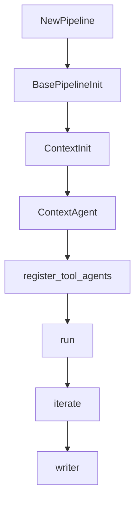

# 开发指南

> 说明：代码片段为源码关键行摘录（保持原样但非全文，可能包含英文注释），以下"解读/流程说明"为中文讲解。


## 流程解释（文字优先）
- 当新增 Pipeline 时，__init__ 中通常：super().__init__ → Context(["profiles", "states"]) → 构建 ContextAgent（pipelines/data_scientist.py:34-59）。
- 当需要路由/工具能力时，调用 register_tool_agents 把工具能力写入 state（contextagent/context/conversation.py:209-221）。
- 当 run 执行时：set_query → iterate → observe/evaluate/(routing/planning) → tools → writer（pipelines/data_scientist.py:68-104；pipelines/web_researcher.py:66-111）。


## 流程图（简化）


## 事件清单（当…就会…）
- 当新增 Pipeline 时，就会先执行 BasePipeline.__init__（pipelines/data_scientist.py:34-36）。
- 当 Context 初始化时，就会加载 profiles 并创建 state（pipelines/data_scientist.py:38-40）。
- 当 register_tool_agents 执行时，就会把工具描述写入 state（contextagent/context/conversation.py:209-221）。
- 当 run 执行时，就会依次 set_query → iterate → agents → writer（pipelines/data_scientist.py:68-104）。

## 前置条件/状态变化/下一步去向
- 前置条件：Profile 与 Context 已定义并可加载。
- 状态变化：state.available_agents/iterations/findings 更新。
- 下一步去向：进入具体业务流程的 Agent 执行链。

## 1. 新增 Pipeline
建议参考现有 DataScientistPipeline / WebSearcherPipeline。

```python
# 文件：pipelines/data_scientist.py | 行：13-105 | 描述：DataScientistPipeline 主循环
class DataScienceQuery(BaseModel):
    """Query model for data science tasks."""
    prompt: str
    data_path: str

    def format(self) -> str:
        """Format data science query."""
        return (
            f"Task: {self.prompt}\n"
            f"Dataset path: {self.data_path}\n"
            "Provide a comprehensive data science workflow"
        )

class DataScientistPipeline(BasePipeline):
```

**解读**
- 作用：DataScientistPipeline 主循环。
- 片段范围：关键行摘录（与源码一致，但非完整段落）。
- 位置：pipelines/data_scientist.py（Pipeline 层）。
- 关键对象：DataScienceQuery / format / DataScientistPipeline。
- 关键输入：config。
- 关键输出/副作用：返回值由代码中的 return 语句给出。

**流程说明**
- 触发/流向：该片段位于调用链中，入口以本章流程解释与相邻调用处为准。

## 2. 绑定 Context 与 Agent
Context + ContextAgent 是最小可用组合。

```python
# 文件：contextagent/agent/agent.py | 行：43-105 | 描述：ContextAgent profile 绑定与 output_schema 处理
    def __init__(
        self,
        context: Any,
        *,
        profile: str,
        llm: str,
        **agent_kwargs: Any,
    ) -> None:
        """Initialize ContextAgent with context and profile identifier.

        Args:
            context: Context object containing profiles and state
            profile: Profile identifier for lookup in context.profiles
            llm: LLM model name (e.g., "gpt-4", "claude-3-5-sonnet")
```

**解读**
- 作用：ContextAgent profile 绑定与 output_schema 处理。
- 片段范围：关键行摘录（与源码一致，但非完整段落）。
- 位置：contextagent/agent/agent.py（Agent 运行层）。
- 关键对象：__init__。
- 关键输入：context、profile、llm、agent_kwargs。
- 关键输出/副作用：主要通过修改实例或上下文状态产生效果。

**流程说明**
- 触发/流向：该片段位于调用链中，入口以本章流程解释与相邻调用处为准。

## 3. 复用 @autotracing
减少 run() 内部样板逻辑。

```python
# 文件：pipelines/base.py | 行：509-536 | 描述：@autotracing 装饰器入口
def autotracing(
    additional_logging: Optional[Callable] = None,
    start_timer: bool = True,
    enable_reporter: bool = True,
    outputs_dir: Optional[Union[str, Path]] = None,
    enable_printer: bool = True,
    workflow_name: Optional[str] = None,
    trace_metadata: Optional[Dict[str, Any]] = None,
):
    """Decorator factory that wraps async methods with run_context lifecycle management.

    This decorator provides automatic initialization and cleanup of pipeline resources
    (reporter, printer, tracing) without requiring explicit `with self.run_context():` usage.

```

**解读**
- 作用：@autotracing 装饰器入口。
- 片段范围：关键行摘录（与源码一致，但非完整段落）。
- 位置：pipelines/base.py（Pipeline 层）。
- 关键对象：autotracing。
- 关键输入：additional_logging、start_timer、enable_reporter、outputs_dir、enable_printer、workflow_name、trace_metadata。
- 关键输出/副作用：主要通过修改实例或上下文状态产生效果。

**流程说明**
- 触发/流向：该片段位于调用链中，入口以本章流程解释与相邻调用处为准。

## 4. 新增 Profile
在 `contextagent/profiles/` 新建文件并定义 Profile 实例即可自动加载。

```python
# 文件：contextagent/profiles/base.py | 行：71-105 | 描述：load_all_profiles 自动加载逻辑
def load_all_profiles():
    """Load all Profile instances from the profiles package.

    Returns:
        Dict with shortened keys (e.g., "observe" instead of "observe_profile")
        Each profile has a _key attribute added for automatic name derivation
    """
    import importlib
    import inspect
    from pathlib import Path

    profiles = {}
    package_path = Path(__file__).parent

```

**解读**
- 作用：load_all_profiles 自动加载逻辑。
- 片段范围：关键行摘录（与源码一致，但非完整段落）。
- 位置：contextagent/profiles/base.py（Profile 配置层）。
- 关键对象：load_all_profiles。
- 关键输入：见函数签名或调用处。
- 关键输出/副作用：结果以日志/状态变更/外部调用为主（见实现）。

**流程说明**
- 触发/流向：该片段位于调用链中，入口以本章流程解释与相邻调用处为准。

## 5. 新增工具（function_tool）
工具建议使用 DataStore 作为 ctx.context。

```python
# 文件：contextagent/tools/data_tools/data_loading.py | 行：12-88 | 描述：load_dataset 工具与缓存逻辑
@function_tool
async def load_dataset(ctx: RunContextWrapper[DataStore], file_path: str) -> Union[Dict[str, Any], str]:
    """Loads a dataset and provides comprehensive inspection information.

    This tool caches the loaded DataFrame in the pipeline data store so other
    tools can reuse it without reloading from disk.

    Args:
        ctx: Pipeline context wrapper for accessing the data store
        file_path: Path to the dataset file (CSV, JSON, Excel, etc.)

    Returns:
        Dictionary containing:
            - shape: Tuple of (rows, columns)
```

**解读**
- 作用：load_dataset 工具与缓存逻辑。
- 片段范围：关键行摘录（与源码一致，但非完整段落）。
- 位置：contextagent/tools/data_tools/data_loading.py（工具层）。
- 关键对象：load_dataset。
- 关键输入：ctx、file_path。
- 关键输出/副作用：返回值由代码中的 return 语句给出。

**流程说明**
- 触发/流向：该片段位于调用链中，入口以本章流程解释与相邻调用处为准。

## 6. 更新配置文件
新增 pipeline 时同步新增 YAML 配置，并确保 profile 名称与代码一致。

```yaml
# 文件：pipelines/configs/data_science.yaml | 行：3-49 | 描述：data_science.yaml 配置
# Provider configuration
provider: "deepseek"
model: "deepseek-chat"
api_key: "${DEEPSEEK_API_KEY}"

# Loads from environment variable

# Dataset defaults
data:
  path: "data/banana_quality.csv"
  prompt: |
    Build a model to classify banana quality as good or bad based on their information. We have uploaded the entire dataset for you here in the banana_quality.csv file.

# Pipeline settings
```

**解读**
- 作用：data_science.yaml 配置。
- 片段范围：关键行摘录（与源码一致，但非完整段落）。
- 位置：pipelines/configs/data_science.yaml（Pipeline 配置）。
- 关键对象：配置键集合。
- 关键字段：provider、model、api_key、data、pipeline、agents。
- 关键输出/副作用：该配置会影响 pipeline/provider/agents 行为（以键为准）。

**流程说明**
- 触发/流向：该片段位于调用链中，入口以本章流程解释与相邻调用处为准。

## 7. 扩展前端
frontend 通过扫描 `examples/` 生成 pipeline 列表。新增 pipeline 时要补充示例脚本。

```python
# 文件：frontend/app.py | 行：68-189 | 描述：前端扫描 examples 生成可运行管道列表
def discover_example_pipelines() -> Dict[str, Dict[str, Any]]:
    """Discover available pipelines by scanning example scripts for pipeline imports.

    - Parses Python files in `examples/` without importing them (avoids executing code)
    - Detects which pipeline classes they reference (e.g., DataScientistPipeline)
    - Builds pipeline entries only for those with a corresponding example
    - Attaches `example_module` dynamically to preserve runtime behavior
    """
    root_dir = Path(__file__).resolve().parent.parent
    examples_dir = root_dir / "examples"

    # Map imported pipeline class name -> example module path
    class_to_example: Dict[str, str] = {}
    if examples_dir.exists():
```

**解读**
- 作用：前端扫描 examples 生成可运行管道列表。
- 片段范围：关键行摘录（与源码一致，但非完整段落）。
- 位置：frontend/app.py（前端展示层）。
- 关键对象：discover_example_pipelines。
- 关键输入：见函数签名或调用处。
- 关键输出/副作用：返回值由代码中的 return 语句给出。

**流程说明**
- 触发/流向：该片段位于调用链中，入口以本章流程解释与相邻调用处为准。
