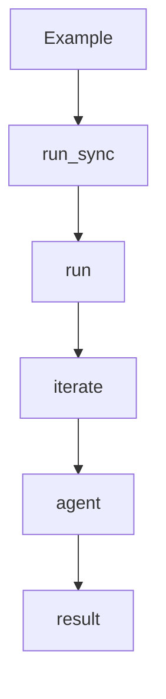

# 测试策略与现状

> 说明：代码片段为源码关键行摘录（保持原样但非全文，可能包含英文注释），以下"解读/流程说明"为中文讲解。


## 流程解释（文字优先）
- 当你修改 Pipeline/Agent 逻辑时，可用 examples 作为冒烟入口：data_science 与 web_researcher（examples/data_science.py:4-11；examples/web_researcher.py:5-13）。
- 当运行 examples 时，实际会走 run_sync → run → 迭代循环的完整路径（pipelines/base.py:483-485；pipelines/data_scientist.py:68-104）。
- 若需要验证工具链，可结合 web_search 工具选择 SEARCH_PROVIDER（contextagent/tools/web_tools/search.py:275-307）。


## 流程图（简化）


## 事件清单（当…就会…）
- 当运行 examples/data_science.py 时，就会进入 run_sync → run（examples/data_science.py:4-11；pipelines/base.py:483-485）。
- 当 run 执行时，就会进入迭代循环并调用 agents（pipelines/data_scientist.py:68-104）。
- 当工具链需要验证时，可通过 SEARCH_PROVIDER 切换搜索后端（contextagent/tools/web_tools/search.py:275-307）。

## 前置条件/状态变化/下一步去向
- 前置条件：示例配置与环境变量准备就绪。
- 状态变化：iteration 产生并累积 findings。
- 下一步去向：返回最终输出并观察控制台/报告。

## 当前测试现状
仓库内仅包含一个基础脚本 `test.py` 用于输出 Python 环境信息。

```python
# 文件：test.py | 行：1-3 | 描述：当前唯一测试脚本
import sys, site
print("executable:", sys.executable)
print("version:", sys.version)
```

**解读**
- 作用：当前唯一测试脚本。
- 片段范围：关键行摘录（与源码一致，但非完整段落）。
- 位置：test.py（通用模块）。
- 关键对象：未在片段首部发现定义。
- 关键输入：见函数签名或调用处。
- 关键输出/副作用：结果以日志/状态变更/外部调用为主（见实现）。

**流程说明**
- 触发/流向：该片段位于调用链中，入口以本章流程解释与相邻调用处为准。

## 建议的最小手动验证
1. `uv run python -m examples.data_science`
2. `uv run python -m examples.web_researcher`
3. `uv run python frontend/app.py --host localhost --port 9090`
4. 检查 `outputs/` 是否生成运行产物。

## 风险提示
- Web 搜索依赖外部 API，需确保 `SERPER_API_KEY` 或 `SEARCHXNG_HOST`。
- 数据工具依赖本地数据文件路径。
