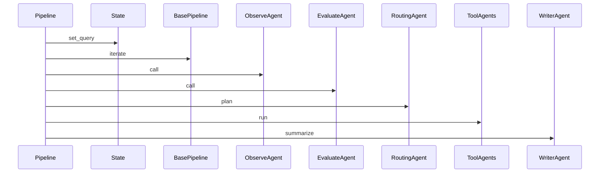
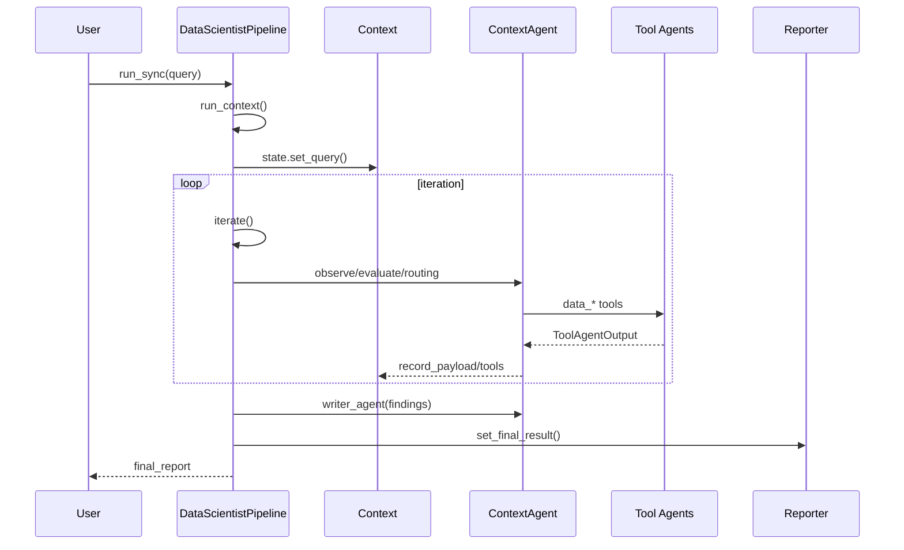
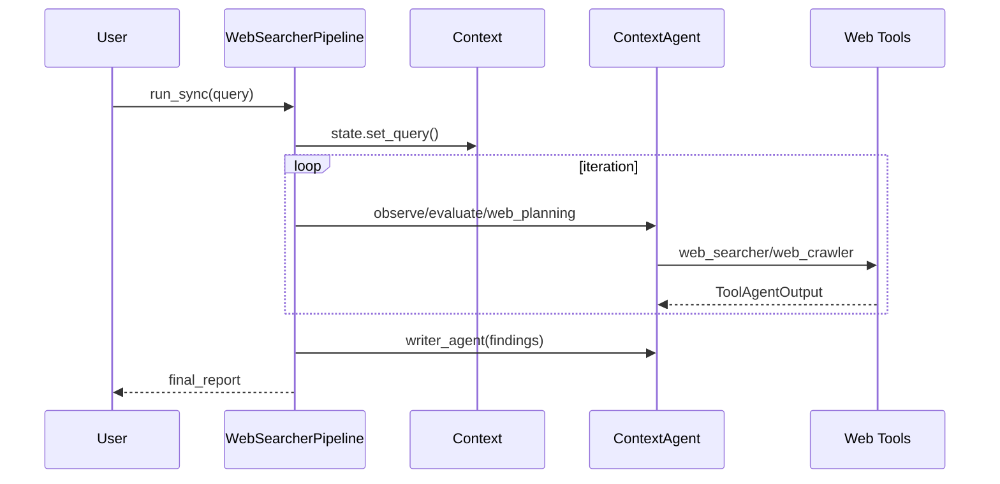

# 端到端流程

> 说明：代码片段为源码关键行摘录（保持原样但非全文，可能包含英文注释），以下"解读/流程说明"为中文讲解。


## 流程解释（文字优先）
- 当 pipeline.run 开始时，先 set_query 写入 state（pipelines/data_scientist.py:68-69）。
- 当 iterate 触发时，创建/结束 iteration 记录（pipelines/base.py:438-477）。
- 当 observe/evaluate 完成且未 complete 时，routing/planning 产出任务（pipelines/data_scientist.py:80-88；pipelines/web_researcher.py:88-95）。
- 当 tool agents 执行时，以 data_store 作为上下文运行 Runner（contextagent/agent/executor.py:65-67）。
- 当 writer 汇总结果时，以 findings_text 作为输入并生成最终输出（pipelines/data_scientist.py:95-104；contextagent/context/conversation.py:234-236）。


## 流程图（简化）


## 事件清单（当…就会…）
- 当 pipeline.run 开始时，就会 set_query 写入 state（pipelines/data_scientist.py:68-69）。
- 当 iterate 执行时，就会创建/结束 iteration（pipelines/base.py:438-477）。
- 当 observe/evaluate 完成且未 complete 时，就会触发 routing/planning（pipelines/data_scientist.py:80-88；pipelines/web_researcher.py:88-95）。
- 当 tool agents 并发执行时，就会产出 findings 供 writer 汇总（pipelines/data_scientist.py:85-97）。

## 前置条件/状态变化/下一步去向
- 前置条件：Context 与 agents 已初始化完毕。
- 状态变化：iteration.history 与 findings 持续更新。
- 下一步去向：进入 writer 汇总并输出结果。

## DataScientistPipeline 端到端流程


```python
# 文件：pipelines/data_scientist.py | 行：13-105 | 描述：DataScientistPipeline 主循环
class DataScienceQuery(BaseModel):
    """Query model for data science tasks."""
    prompt: str
    data_path: str

    def format(self) -> str:
        """Format data science query."""
        return (
            f"Task: {self.prompt}\n"
            f"Dataset path: {self.data_path}\n"
            "Provide a comprehensive data science workflow"
        )

class DataScientistPipeline(BasePipeline):
```

**解读**
- 作用：DataScientistPipeline 主循环。
- 片段范围：关键行摘录（与源码一致，但非完整段落）。
- 位置：pipelines/data_scientist.py（Pipeline 层）。
- 关键对象：DataScienceQuery / format / DataScientistPipeline。
- 关键输入：config。
- 关键输出/副作用：返回值由代码中的 return 语句给出。

**流程说明**
- 触发/流向：该片段位于调用链中，入口以本章流程解释与相邻调用处为准。

## WebSearcherPipeline 端到端流程


```python
# 文件：pipelines/web_researcher.py | 行：14-111 | 描述：WebSearcherPipeline 主循环
class WebSearchQuery(BaseModel):
    """Query model for data science tasks."""
    prompt: str

    def format(self) -> str:
        """Format web search query."""
        return (
            f"Web search query: {self.prompt}\n"
            "Provide a comprehensive web search workflow"
        )


class WebSearcherPipeline(BasePipeline):
    """Web search pipeline using manager-tool pattern with multi-task planning.
```

**解读**
- 作用：WebSearcherPipeline 主循环。
- 片段范围：关键行摘录（与源码一致，但非完整段落）。
- 位置：pipelines/web_researcher.py（Pipeline 层）。
- 关键对象：WebSearchQuery / format / WebSearcherPipeline。
- 关键输入：config。
- 关键输出/副作用：返回值由代码中的 return 语句给出。

**流程说明**
- 触发/流向：该片段位于调用链中，入口以本章流程解释与相邻调用处为准。

## VanillaChatPipeline
```python
# 文件：pipelines/vanilla_chat.py | 行：12-62 | 描述：VanillaChatPipeline 单轮对话
class ChatQuery(BaseModel):
    """Lightweight query model for vanilla chat."""
    message: str

    def format(self) -> str:
        return self.message


class VanillaChatPipeline(BasePipeline):
    """Minimal chat pipeline using a single vanilla_chat agent profile."""

    def __init__(self, config):
        super().__init__(config)

```

**解读**
- 作用：VanillaChatPipeline 单轮对话。
- 片段范围：关键行摘录（与源码一致，但非完整段落）。
- 位置：pipelines/vanilla_chat.py（Pipeline 层）。
- 关键对象：ChatQuery / format / VanillaChatPipeline。
- 关键输入：config。
- 关键输出/副作用：返回值由代码中的 return 语句给出。

**流程说明**
- 触发/流向：该片段位于调用链中，入口以本章流程解释与相邻调用处为准。

## BrowserMCPPipeline
```python
# 文件：pipelines/browser_mcp.py | 行：12-63 | 描述：BrowserMCPPipeline MCP 调用
class BrowserTask(BaseModel):
    """Lightweight query model for Browser MCP tasks."""
    prompt: str

    def format(self) -> str:
        # Pass the user prompt straight through to the agent
        return self.prompt


class BrowserMCPPipeline(BasePipeline):
    """Simple pipeline that exercises the Browser MCP server via the browser profile."""

    def __init__(self, config):
        super().__init__(config)
```

**解读**
- 作用：BrowserMCPPipeline MCP 调用。
- 片段范围：关键行摘录（与源码一致，但非完整段落）。
- 位置：pipelines/browser_mcp.py（Pipeline 层）。
- 关键对象：BrowserTask / format / BrowserMCPPipeline。
- 关键输入：config。
- 关键输出/副作用：返回值由代码中的 return 语句给出。

**流程说明**
- 触发/流向：该片段位于调用链中，入口以本章流程解释与相邻调用处为准。
