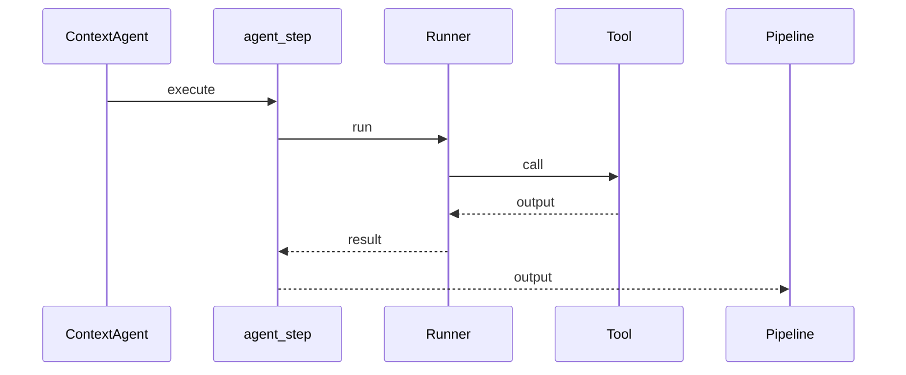

# 工具设计

> 说明：代码片段为源码关键行摘录（保持原样但非全文，可能包含英文注释），以下"解读/流程说明"为中文讲解。


## 流程解释（文字优先）
- 当工具以 @function_tool 暴露后，Runner 可以把它作为 Agent 的可调用能力（contextagent/tools/web_tools/search.py:289）。
- 当 agent_step 执行时，会把 tracker.data_store 作为上下文传入 Runner（contextagent/agent/executor.py:65-67）。
- 当工具产出结果时，通常会被记录为 ToolAgentOutput 并写入 iteration.tools（contextagent/profiles/base.py:6-9；contextagent/context/conversation.py:19）。


## 流程图（简化）


## 事件清单（当…就会…）
- 当工具以 @function_tool 暴露时，就会成为 Agent 可调用能力（contextagent/tools/web_tools/search.py:289）。
- 当 agent_step 运行时，就会将 data_store 作为上下文传给 Runner（contextagent/agent/executor.py:65-67）。
- 当工具输出被记录时，就会进入 iteration.tools 并用于 findings 汇总（contextagent/context/conversation.py:19、234-236）。

## 前置条件/状态变化/下一步去向
- 前置条件：工具已注册到 Profile.tools 并被 Agent 选择。
- 状态变化：DataStore/iteration.tools 累积工具输出。
- 下一步去向：进入 findings_text 与 writer 汇总阶段。

## 1. function_tool 统一封装
所有工具以 `@function_tool` 暴露给 Agent，运行时由 Runner 注入 DataStore。

```python
# 文件：contextagent/agent/executor.py | 行：14-96 | 描述：agent_step 执行与追踪
async def agent_step(
    tracker: RuntimeTracker,
    agent,
    instructions: str,
    span_name: Optional[str] = None,
    span_type: str = "agent",
    output_model: Optional[type[BaseModel]] = None,
    sync: bool = False,
    printer_key: Optional[str] = None,
    printer_title: Optional[str] = None,
    printer_border_style: Optional[str] = None,
    **span_kwargs
) -> Any:
    """Run an agent with span tracking and optional output parsing.
```

**解读**
- 作用：agent_step 执行与追踪。
- 片段范围：关键行摘录（与源码一致，但非完整段落）。
- 位置：contextagent/agent/executor.py（Agent 运行层）。
- 关键对象：agent_step。
- 关键输入：tracker、agent、instructions、span_name、span_type、output_model、sync、printer_key。
- 关键输出/副作用：返回值由代码中的 return 语句给出。

**流程说明**
- 触发/流向：该片段位于调用链中，入口以本章流程解释与相邻调用处为准。

## 2. DataStore 缓存策略
```python
# 文件：contextagent/context/data_store.py | 行：13-107 | 描述：DataStoreEntry 与 DataStore 基础操作
@dataclass
class DataStoreEntry:
    """Single entry in the pipeline data store with metadata."""
    key: str
    value: Any
    timestamp: datetime
    data_type: str
    metadata: Dict[str, Any]

    def size_mb(self) -> float:
        """Estimate size in MB (rough approximation)."""
        import sys
        return sys.getsizeof(self.value) / 1024 / 1024

```

**解读**
- 作用：DataStoreEntry 与 DataStore 基础操作。
- 片段范围：关键行摘录（与源码一致，但非完整段落）。
- 位置：contextagent/context/data_store.py（上下文/状态层）。
- 关键对象：DataStoreEntry / size_mb / DataStore。
- 关键输入：见函数签名或调用处。
- 关键输出/副作用：返回值由代码中的 return 语句给出。

**流程说明**
- 触发/流向：该片段位于调用链中，入口以本章流程解释与相邻调用处为准。

## 3. 数据工具
### load_dataset
```python
# 文件：contextagent/tools/data_tools/data_loading.py | 行：12-88 | 描述：load_dataset 工具与缓存逻辑
@function_tool
async def load_dataset(ctx: RunContextWrapper[DataStore], file_path: str) -> Union[Dict[str, Any], str]:
    """Loads a dataset and provides comprehensive inspection information.

    This tool caches the loaded DataFrame in the pipeline data store so other
    tools can reuse it without reloading from disk.

    Args:
        ctx: Pipeline context wrapper for accessing the data store
        file_path: Path to the dataset file (CSV, JSON, Excel, etc.)

    Returns:
        Dictionary containing:
            - shape: Tuple of (rows, columns)
```

**解读**
- 作用：load_dataset 工具与缓存逻辑。
- 片段范围：关键行摘录（与源码一致，但非完整段落）。
- 位置：contextagent/tools/data_tools/data_loading.py（工具层）。
- 关键对象：load_dataset。
- 关键输入：ctx、file_path。
- 关键输出/副作用：返回值由代码中的 return 语句给出。

**流程说明**
- 触发/流向：该片段位于调用链中，入口以本章流程解释与相邻调用处为准。

### analyze_data
```python
# 文件：contextagent/tools/data_tools/data_analysis.py | 行：12-66 | 描述：analyze_data 使用 current_dataset


@function_tool
async def analyze_data(ctx: RunContextWrapper[DataStore], file_path: Optional[str] = None, target_column: str = None) -> Union[Dict[str, Any], str]:
    """Performs comprehensive exploratory data analysis on a dataset.

    This tool automatically uses the current dataset from the pipeline context.
    A file_path can optionally be provided to analyze a different dataset.

    Args:
        ctx: Pipeline context wrapper for accessing the data store
        file_path: Optional path to dataset file. If not provided, uses current dataset.
        target_column: Optional target column for correlation analysis

```

**解读**
- 作用：analyze_data 使用 current_dataset。
- 片段范围：关键行摘录（与源码一致，但非完整段落）。
- 位置：contextagent/tools/data_tools/data_analysis.py（工具层）。
- 关键对象：analyze_data。
- 关键输入：ctx、file_path、target_column。
- 关键输出/副作用：返回值由代码中的 return 语句给出。

**流程说明**
- 触发/流向：该片段位于调用链中，入口以本章流程解释与相邻调用处为准。

### preprocess_data
```python
# 文件：contextagent/tools/data_tools/preprocessing.py | 行：12-72 | 描述：preprocess_data 操作列表
from loguru import logger


@function_tool
async def preprocess_data(
    ctx: RunContextWrapper[DataStore],
    operations: List[str],
    file_path: Optional[str] = None,
    target_column: Optional[str] = None,
    output_path: Optional[str] = None
) -> Union[Dict[str, Any], str]:
    """Performs data preprocessing operations on a dataset.

    This tool automatically uses the current dataset from the pipeline context.
```

**解读**
- 作用：preprocess_data 操作列表。
- 片段范围：关键行摘录（与源码一致，但非完整段落）。
- 位置：contextagent/tools/data_tools/preprocessing.py（工具层）。
- 关键对象：preprocess_data。
- 关键输入：ctx、operations、file_path、target_column、output_path。
- 关键输出/副作用：返回值由代码中的 return 语句给出。

**流程说明**
- 触发/流向：该片段位于调用链中，入口以本章流程解释与相邻调用处为准。

```python
# 文件：contextagent/tools/data_tools/preprocessing.py | 行：153-206 | 描述：preprocess_data 缓存预处理结果
            operations_applied.append("remove_outliers")

        # Feature engineering
        if "feature_engineering" in operations:
            numerical_cols = df.select_dtypes(include=['number']).columns.tolist()

            # Exclude target column
            if target_column and target_column in numerical_cols:
                numerical_cols.remove(target_column)

            # Create polynomial features for first 3 numerical columns (to avoid explosion)
            if len(numerical_cols) >= 2:
                for i, col1 in enumerate(numerical_cols[:3]):
                    for col2 in numerical_cols[i+1:3]:
```

**解读**
- 作用：preprocess_data 缓存预处理结果。
- 片段范围：关键行摘录（与源码一致，但非完整段落）。
- 位置：contextagent/tools/data_tools/preprocessing.py（工具层）。
- 关键对象：未在片段首部发现定义。
- 关键输入：见函数签名或调用处。
- 关键输出/副作用：返回值由代码中的 return 语句给出。

**流程说明**
- 触发/流向：该片段位于调用链中，入口以本章流程解释与相邻调用处为准。

### train_model
```python
# 文件：contextagent/tools/data_tools/model_training.py | 行：12-78 | 描述：train_model 训练入口
from agents import function_tool
from agents.run_context import RunContextWrapper
from contextagent.context.data_store import DataStore
from .helpers import load_or_get_dataframe, cache_object
from loguru import logger


@function_tool
async def train_model(
    ctx: RunContextWrapper[DataStore],
    target_column: str,
    file_path: Optional[str] = None,
    model_type: str = "auto",
    test_size: float = 0.2,
```

**解读**
- 作用：train_model 训练入口。
- 片段范围：关键行摘录（与源码一致，但非完整段落）。
- 位置：contextagent/tools/data_tools/model_training.py（工具层）。
- 关键对象：train_model。
- 关键输入：ctx、target_column、file_path、model_type、test_size、random_state。
- 关键输出/副作用：返回值由代码中的 return 语句给出。

**流程说明**
- 触发/流向：该片段位于调用链中，入口以本章流程解释与相邻调用处为准。

```python
# 文件：contextagent/tools/data_tools/model_training.py | 行：124-154 | 描述：train_model 缓存模型

        # Train model
        model.fit(X_train, y_train)

        # Evaluate
        train_pred = model.predict(X_train)
        test_pred = model.predict(X_test)

        if is_classification:
            train_score = accuracy_score(y_train, train_pred)
            test_score = accuracy_score(y_test, test_pred)
            metric_name = "accuracy"
        else:
            train_score = r2_score(y_train, train_pred)
```

**解读**
- 作用：train_model 缓存模型。
- 片段范围：关键行摘录（与源码一致，但非完整段落）。
- 位置：contextagent/tools/data_tools/model_training.py（工具层）。
- 关键对象：未在片段首部发现定义。
- 关键输入：见函数签名或调用处。
- 关键输出/副作用：结果以日志/状态变更/外部调用为主（见实现）。

**流程说明**
- 触发/流向：该片段位于调用链中，入口以本章流程解释与相邻调用处为准。

### evaluate_model
```python
# 文件：contextagent/tools/data_tools/evaluation.py | 行：12-71 | 描述：evaluate_model 评估入口
    mean_squared_error, mean_absolute_error, r2_score
)
from agents import function_tool
from agents.run_context import RunContextWrapper
from contextagent.context.data_store import DataStore
from .helpers import load_or_get_dataframe
from loguru import logger


@function_tool
async def evaluate_model(
    ctx: RunContextWrapper[DataStore],
    target_column: str,
    file_path: Optional[str] = None,
```

**解读**
- 作用：evaluate_model 评估入口。
- 片段范围：关键行摘录（与源码一致，但非完整段落）。
- 位置：contextagent/tools/data_tools/evaluation.py（工具层）。
- 关键对象：evaluate_model。
- 关键输入：ctx、target_column、file_path、model_type、test_size、random_state。
- 关键输出/副作用：返回值由代码中的 return 语句给出。

**流程说明**
- 触发/流向：该片段位于调用链中，入口以本章流程解释与相邻调用处为准。

### create_visualization
```python
# 文件：contextagent/tools/data_tools/visualization.py | 行：12-68 | 描述：create_visualization 可选图表类型
from agents.run_context import RunContextWrapper
from contextagent.context.data_store import DataStore
from .helpers import load_or_get_dataframe
from loguru import logger


@function_tool
async def create_visualization(
    ctx: RunContextWrapper[DataStore],
    plot_type: str,
    file_path: Optional[str] = None,
    columns: Optional[List[str]] = None,
    target_column: Optional[str] = None,
    output_path: Optional[str] = None
```

**解读**
- 作用：create_visualization 可选图表类型。
- 片段范围：关键行摘录（与源码一致，但非完整段落）。
- 位置：contextagent/tools/data_tools/visualization.py（工具层）。
- 关键对象：create_visualization。
- 关键输入：ctx、plot_type、file_path、columns、target_column、output_path。
- 关键输出/副作用：返回值由代码中的 return 语句给出。

**流程说明**
- 触发/流向：该片段位于调用链中，入口以本章流程解释与相邻调用处为准。

## 4. Web 工具
### web_search
```python
# 文件：contextagent/tools/web_tools/search.py | 行：275-309 | 描述：SEARCH_PROVIDER 选择与 web_search
# ------- INITIALIZE SEARCH CLIENT AND DEFINE TOOL -------

# Get search provider from environment (default to serper)
SEARCH_PROVIDER = os.getenv("SEARCH_PROVIDER", "serper")

# Initialize the search client based on provider
if SEARCH_PROVIDER == "serper":
    _search_client = SerperClient()
elif SEARCH_PROVIDER == "searchxng":
    _search_client = SearchXNGClient()
else:
    raise ValueError(f"Invalid search provider: {SEARCH_PROVIDER}. Must be 'serper' or 'searchxng'")


```

**解读**
- 作用：SEARCH_PROVIDER 选择与 web_search。
- 片段范围：关键行摘录（与源码一致，但非完整段落）。
- 位置：contextagent/tools/web_tools/search.py（工具层）。
- 关键对象：web_search。
- 关键输入：query。
- 关键输出/副作用：返回值由代码中的 return 语句给出。

**流程说明**
- 触发/流向：该片段位于调用链中，入口以本章流程解释与相邻调用处为准。

### crawl_website
```python
# 文件：contextagent/tools/web_tools/crawl.py | 行：9-109 | 描述：crawl_website BFS 抓取
@function_tool
async def crawl_website(starting_url: str) -> Union[List[ScrapeResult], str]:
    """Crawls the pages of a website starting with the starting_url and then descending into the pages linked from there.
    Prioritizes links found in headers/navigation, then body links, then subsequent pages.
    
    Args:
        starting_url: Starting URL to scrape
        
    Returns:
        List of ScrapeResult objects which have the following fields:
            - url: The URL of the web page
            - title: The title of the web page
            - description: The description of the web page
            - text: The text content of the web page
```

**解读**
- 作用：crawl_website BFS 抓取。
- 片段范围：关键行摘录（与源码一致，但非完整段落）。
- 位置：contextagent/tools/web_tools/crawl.py（工具层）。
- 关键对象：crawl_website / extract_links / fetch_page。
- 关键输入：starting_url。
- 关键输出/副作用：返回值由代码中的 return 语句给出。

**流程说明**
- 触发/流向：该片段位于调用链中，入口以本章流程解释与相邻调用处为准。

## 5. 多模态工具
### image_qa
```python
# 文件：contextagent/tools/data_tools/image.py | 行：70-142 | 描述：image_qa 使用 Gemini
@function_tool
async def image_qa(
    ctx: RunContextWrapper[DataStore],
    image_path: str,
    question: Optional[str] = None
) -> Union[str, Dict[str, Any]]:
    """Analyzes an image and answers questions about it using AI vision capabilities.

    This tool uses Google's Gemini model to analyze image content. If no question
    is provided, it generates a detailed description of the image. If a question
    is provided, it answers the specific question about the image.

    Args:
        ctx: Pipeline context wrapper for accessing the data store
```

**解读**
- 作用：image_qa 使用 Gemini。
- 片段范围：关键行摘录（与源码一致，但非完整段落）。
- 位置：contextagent/tools/data_tools/image.py（工具层）。
- 关键对象：image_qa。
- 关键输入：ctx、image_path、question。
- 关键输出/副作用：返回值由代码中的 return 语句给出。

**流程说明**
- 触发/流向：该片段位于调用链中，入口以本章流程解释与相邻调用处为准。

### video_qa
```python
# 文件：contextagent/tools/data_tools/video.py | 行：13-99 | 描述：video_qa 使用 Gemini
@function_tool
async def video_qa(
    ctx: RunContextWrapper[DataStore],
    video_url: str,
    question: str
) -> Union[str, Dict[str, Any]]:
    """Asks a question about a video using AI vision capabilities.

    This tool uses Google's Gemini model to analyze video content and answer
    questions about it. The video can be provided as either a local file path
    or a URL.

    Args:
        ctx: Pipeline context wrapper for accessing the data store
```

**解读**
- 作用：video_qa 使用 Gemini。
- 片段范围：关键行摘录（与源码一致，但非完整段落）。
- 位置：contextagent/tools/data_tools/video.py（工具层）。
- 关键对象：video_qa。
- 关键输入：ctx、video_url、question。
- 关键输出/副作用：返回值由代码中的 return 语句给出。

**流程说明**
- 触发/流向：该片段位于调用链中，入口以本章流程解释与相邻调用处为准。
