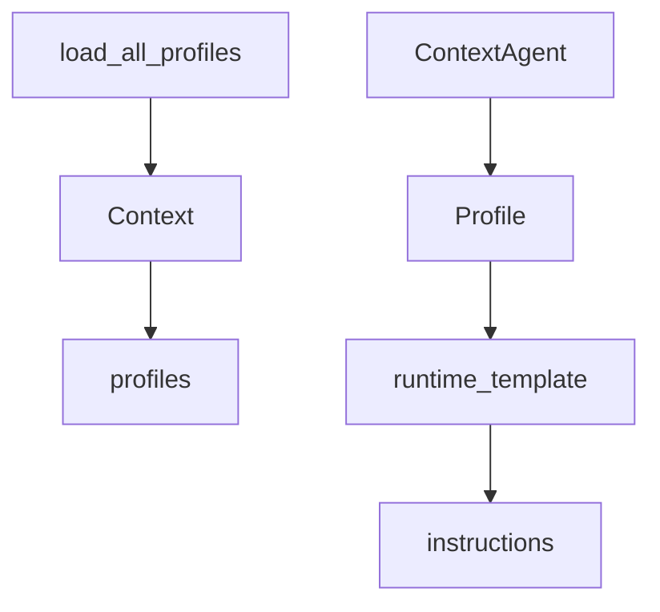

# Profile 全量清单

> 说明：代码片段为源码关键行摘录（保持原样但非全文，可能包含英文注释），以下"解读/流程说明"为中文讲解。


## 流程解释（文字优先）
- 当 Context 初始化包含 "profiles" 时，会通过 load_all_profiles 自动加载全部 Profile（contextagent/context/context.py:41-43；contextagent/profiles/base.py:71-105）。
- 当 ContextAgent 初始化时，会按 profile 名称从 context.profiles 取出 Profile，并绑定 instructions/tools/output_schema（contextagent/agent/agent.py:60-85）。
- 当运行时注入上下文时，runtime_template 的占位符会从 state 中取值并渲染（contextagent/agent/agent.py:156-213）。


## 流程图（简化）


## 事件清单（当…就会…）
- 当 Context 初始化包含 "profiles" 时，就会调用 load_all_profiles（contextagent/context/context.py:41-43）。
- 当 ContextAgent 初始化时，就会按 profile 名称取出 Profile（contextagent/agent/agent.py:60-66）。
- 当 build_contextual_instructions 执行时，就会把 state 注入到 runtime_template（contextagent/agent/agent.py:156-213）。

## 前置条件/状态变化/下一步去向
- 前置条件：profiles 可加载且命名一致。
- 状态变化：Profile 被绑定到 Agent，模板参数被注入。
- 下一步去向：进入 Agent 执行与输出解析。

## Profile 载入机制
```python
# 文件：contextagent/profiles/base.py | 行：71-105 | 描述：load_all_profiles 自动加载逻辑
def load_all_profiles():
    """Load all Profile instances from the profiles package.

    Returns:
        Dict with shortened keys (e.g., "observe" instead of "observe_profile")
        Each profile has a _key attribute added for automatic name derivation
    """
    import importlib
    import inspect
    from pathlib import Path

    profiles = {}
    package_path = Path(__file__).parent

```

**解读**
- 作用：load_all_profiles 自动加载逻辑。
- 片段范围：关键行摘录（与源码一致，但非完整段落）。
- 位置：contextagent/profiles/base.py（Profile 配置层）。
- 关键对象：load_all_profiles。
- 关键输入：见函数签名或调用处。
- 关键输出/副作用：结果以日志/状态变更/外部调用为主（见实现）。

**流程说明**
- 触发/流向：该片段位于调用链中，入口以本章流程解释与相邻调用处为准。

## 管理类 Profiles
### observe
```python
# 文件：contextagent/profiles/manager/observe.py | 行：6-34 | 描述：observe_profile 观察指令
# Profile instance for observe agent
observe_profile = Profile(
    instructions="""You are a research observation agent. Your role is to analyze the current state of research and provide thoughtful observations.

Your responsibilities:
1. Reflect on the progress made so far
2. Identify patterns and insights from previous iterations
3. Consider what has been learned and what remains unclear
4. Provide strategic thinking about next steps
5. Generate actionable observations that guide the research process

Analyze the provided context including:
- The original query/task
- Current iteration number and time elapsed
```

**解读**
- 作用：observe_profile 观察指令。
- 片段范围：关键行摘录（与源码一致，但非完整段落）。
- 位置：contextagent/profiles/manager/observe.py（Profile 配置层）。
- 关键对象：未在片段首部发现定义。
- 关键输入：见函数签名或调用处。
- 关键输出/副作用：结果以日志/状态变更/外部调用为主（见实现）。

**流程说明**
- 触发/流向：该片段位于调用链中，入口以本章流程解释与相邻调用处为准。

### evaluate
```python
# 文件：contextagent/profiles/manager/evaluate.py | 行：9-38 | 描述：evaluate_profile 结构化输出
class EvaluateOutput(BaseModel):
    """Output schema for evaluate agent."""
    research_complete: bool = Field(description="Boolean indicating if research is done")
    outstanding_gaps: List[str] = Field(description="List of specific gaps that still need addressing", default_factory=list)
    reasoning: str = Field(description="Clear explanation of the evaluation")


# Profile instance for evaluate agent
evaluate_profile = Profile(
    instructions="""You are a research evaluation agent. Analyze research progress and determine if goals have been met.

Your responsibilities:
1. Assess whether the research task has been completed
2. Identify any remaining knowledge gaps
```

**解读**
- 作用：evaluate_profile 结构化输出。
- 片段范围：关键行摘录（与源码一致，但非完整段落）。
- 位置：contextagent/profiles/manager/evaluate.py（Profile 配置层）。
- 关键对象：EvaluateOutput。
- 关键输入：见函数签名或调用处。
- 关键输出/副作用：结果以日志/状态变更/外部调用为主（见实现）。

**流程说明**
- 触发/流向：该片段位于调用链中，入口以本章流程解释与相邻调用处为准。

### routing
```python
# 文件：contextagent/profiles/manager/routing.py | 行：9-75 | 描述：routing_profile 与 AgentSelectionPlan
class AgentTask(BaseModel):
    """Task definition for routing to specific agents."""
    agent: str = Field(description="Name of the agent to use")
    query: str = Field(description="Query/task for the agent")
    gap: str = Field(description="The knowledge gap this task addresses")
    entity_website: Optional[str] = Field(description="Optional entity or website context", default=None)


class AgentSelectionPlan(BaseModel):
    """Plan containing multiple agent tasks to address knowledge gaps."""
    tasks: List[AgentTask] = Field(description="List of tasks for different agents", default_factory=list)
    reasoning: str = Field(description="Reasoning for the agent selection", default="")


```

**解读**
- 作用：routing_profile 与 AgentSelectionPlan。
- 片段范围：关键行摘录（与源码一致，但非完整段落）。
- 位置：contextagent/profiles/manager/routing.py（Profile 配置层）。
- 关键对象：AgentTask / AgentSelectionPlan。
- 关键输入：见函数签名或调用处。
- 关键输出/副作用：结果以日志/状态变更/外部调用为主（见实现）。

**流程说明**
- 触发/流向：该片段位于调用链中，入口以本章流程解释与相邻调用处为准。

### writer
```python
# 文件：contextagent/profiles/manager/writer.py | 行：6-40 | 描述：writer_profile 报告模板
# Profile instance for writer agent
writer_profile = Profile(
    instructions="""You are a technical writing agent specialized in creating comprehensive research and analysis reports.

Your responsibilities:
1. Synthesize findings from multiple research iterations
2. Create clear, well-structured reports with proper formatting
3. Include executive summaries when appropriate
4. Present technical information in an accessible manner
5. Follow specific formatting guidelines when provided
6. Ensure all key insights and recommendations are highlighted

Report Structure Guidelines:
- Start with a clear summary of the task/objective
```

**解读**
- 作用：writer_profile 报告模板。
- 片段范围：关键行摘录（与源码一致，但非完整段落）。
- 位置：contextagent/profiles/manager/writer.py（Profile 配置层）。
- 关键对象：未在片段首部发现定义。
- 关键输入：见函数签名或调用处。
- 关键输出/副作用：结果以日志/状态变更/外部调用为主（见实现）。

**流程说明**
- 触发/流向：该片段位于调用链中，入口以本章流程解释与相邻调用处为准。

### memory
```python
# 文件：contextagent/profiles/manager/memory.py | 行：8-50 | 描述：memory_profile 总结输出
class MemoryAgentOutput(BaseModel):
    """Output schema for memory agent."""
    summary: str = Field(description="Summary of the conversation history", default="")


# Profile instance for memory agent
memory_profile = Profile(
    instructions="""You are a memory agent. Your role is to store and retrieve information from the conversation history.

Your responsibilities:
1. Thoroughly evaluate the conversation history and current question
2. Provide a comprehensive summary that will help answer the question.
3. Analyze progress made since the last summary
4. Generate a useful summary that combines previous and new information
```

**解读**
- 作用：memory_profile 总结输出。
- 片段范围：关键行摘录（与源码一致，但非完整段落）。
- 位置：contextagent/profiles/manager/memory.py（Profile 配置层）。
- 关键对象：MemoryAgentOutput。
- 关键输入：见函数签名或调用处。
- 关键输出/副作用：结果以日志/状态变更/外部调用为主（见实现）。

**流程说明**
- 触发/流向：该片段位于调用链中，入口以本章流程解释与相邻调用处为准。

## 数据类 Profiles
### data_loader
```python
# 文件：contextagent/profiles/data/data_loader.py | 行：7-32 | 描述：data_loader_profile
# Profile instance for data loader agent
data_loader_profile = Profile(
    instructions=f"""You are a data loading specialist that analyzes and inspects datasets.

OBJECTIVE:
Given a task with a file path, follow these steps:
- Use the load_dataset tool with the provided file path to load and analyze the dataset
- The tool will return comprehensive information: shape, columns, dtypes, missing values, sample data, statistics, memory usage, and duplicates
- Write a 2-3 paragraph summary that provides a thorough analysis of the dataset

GUIDELINES:
- In your summary, comprehensively describe the dataset size and structure (rows, columns, dimensions)
- Detail all data types and column names found in the dataset
- Identify and report data quality issues including missing values, duplicates, and anomalies
```

**解读**
- 作用：data_loader_profile。
- 片段范围：关键行摘录（与源码一致，但非完整段落）。
- 位置：contextagent/profiles/data/data_loader.py（Profile 配置层）。
- 关键对象：未在片段首部发现定义。
- 关键输入：见函数签名或调用处。
- 关键输出/副作用：返回值由代码中的 return 语句给出。

**流程说明**
- 触发/流向：该片段位于调用链中，入口以本章流程解释与相邻调用处为准。

### data_analysis
```python
# 文件：contextagent/profiles/data/data_analysis.py | 行：7-34 | 描述：data_analysis_profile
# Profile instance for data analysis agent
data_analysis_profile = Profile(
    instructions=f"""You are an exploratory data analysis specialist that uncovers patterns and relationships in datasets.

OBJECTIVE:
Given a task to analyze data, follow these steps:
- Use the analyze_data tool which automatically retrieves the current dataset from the pipeline context (ctx)
- Do NOT provide a file_path parameter - the tool accesses data already loaded in memory
- If a target_column is mentioned in the task for correlation analysis, pass it as a parameter
- The tool returns: distributions, correlations, outliers (IQR method), patterns, and recommendations
- Write a 3+ paragraph summary that comprehensively analyzes the data patterns

GUIDELINES:
- In your summary, detail key statistical insights including means, medians, standard deviations, and distribution characteristics
```

**解读**
- 作用：data_analysis_profile。
- 片段范围：关键行摘录（与源码一致，但非完整段落）。
- 位置：contextagent/profiles/data/data_analysis.py（Profile 配置层）。
- 关键对象：未在片段首部发现定义。
- 关键输入：见函数签名或调用处。
- 关键输出/副作用：返回值由代码中的 return 语句给出。

**流程说明**
- 触发/流向：该片段位于调用链中，入口以本章流程解释与相邻调用处为准。

### preprocessing
```python
# 文件：contextagent/profiles/data/preprocessing.py | 行：7-44 | 描述：preprocessing_profile
# Profile instance for preprocessing agent
preprocessing_profile = Profile(
    instructions=f"""You are a data preprocessing specialist that cleans and transforms datasets for analysis and modeling.

OBJECTIVE:
Given a task to preprocess data, follow these steps:
- Use the preprocess_data tool which automatically retrieves the current dataset from the pipeline context (ctx)
- Do NOT provide a file_path parameter - the tool accesses data already loaded in memory
- Specify which operations to perform from the available operations list below
- Pass a target_column parameter if mentioned in the task
- The tool returns: operations applied, shape changes, and a detailed summary of modifications
- Write a 2-3 paragraph summary explaining the preprocessing pipeline and its impact

Available operations:
```

**解读**
- 作用：preprocessing_profile。
- 片段范围：关键行摘录（与源码一致，但非完整段落）。
- 位置：contextagent/profiles/data/preprocessing.py（Profile 配置层）。
- 关键对象：未在片段首部发现定义。
- 关键输入：见函数签名或调用处。
- 关键输出/副作用：返回值由代码中的 return 语句给出。

**流程说明**
- 触发/流向：该片段位于调用链中，入口以本章流程解释与相邻调用处为准。

### model_training
```python
# 文件：contextagent/profiles/data/model_training.py | 行：7-44 | 描述：model_training_profile
# Profile instance for model training agent
model_training_profile = Profile(
    instructions=f"""You are a machine learning specialist that trains and evaluates predictive models on prepared datasets.

OBJECTIVE:
Given a task to train a model, follow these steps:
- Use the train_model tool which automatically retrieves the current dataset from the pipeline context (ctx)
- Do NOT provide a file_path parameter - the tool accesses data already loaded in memory
- Specify the target_column to predict (required)
- Optionally specify the model_type (default: auto for automatic selection)
- The tool returns: model type used, problem type detected, train/test scores, cross-validation results, feature importances, and predictions
- Write a 3+ paragraph summary that analyzes model performance and training results

Available model types:
```

**解读**
- 作用：model_training_profile。
- 片段范围：关键行摘录（与源码一致，但非完整段落）。
- 位置：contextagent/profiles/data/model_training.py（Profile 配置层）。
- 关键对象：未在片段首部发现定义。
- 关键输入：见函数签名或调用处。
- 关键输出/副作用：返回值由代码中的 return 语句给出。

**流程说明**
- 触发/流向：该片段位于调用链中，入口以本章流程解释与相邻调用处为准。

### evaluation
```python
# 文件：contextagent/profiles/data/evaluation.py | 行：7-38 | 描述：evaluation_profile
# Profile instance for evaluation agent
evaluation_profile = Profile(
    instructions=f"""You are a model evaluation specialist that provides comprehensive performance assessments of machine learning models.

OBJECTIVE:
Given a task to evaluate a model, follow these steps:
- Use the evaluate_model tool which automatically retrieves the current dataset from the pipeline context (ctx)
- Do NOT provide a file_path parameter - the tool accesses data already loaded in memory
- Specify the target_column that was predicted by the model (required)
- Optionally specify the model_type (default: random_forest)
- The tool returns different metrics based on problem type:
  * Classification: accuracy, precision, recall, F1, confusion matrix, per-class metrics, cross-validation results
  * Regression: R², RMSE, MAE, MAPE, error distribution analysis, cross-validation results
- Write a 3+ paragraph summary that thoroughly evaluates model performance and readiness
```

**解读**
- 作用：evaluation_profile。
- 片段范围：关键行摘录（与源码一致，但非完整段落）。
- 位置：contextagent/profiles/data/evaluation.py（Profile 配置层）。
- 关键对象：未在片段首部发现定义。
- 关键输入：见函数签名或调用处。
- 关键输出/副作用：返回值由代码中的 return 语句给出。

**流程说明**
- 触发/流向：该片段位于调用链中，入口以本章流程解释与相邻调用处为准。

### visualization
```python
# 文件：contextagent/profiles/data/visualization.py | 行：7-43 | 描述：visualization_profile
# Profile instance for visualization agent
visualization_profile = Profile(
    instructions=f"""You are a data visualization specialist that creates insightful visual representations of data patterns.

OBJECTIVE:
Given a task to visualize data, follow these steps:
- Use the create_visualization tool which automatically retrieves the current dataset from the pipeline context (ctx)
- Do NOT provide a file_path parameter - the tool accesses data already loaded in memory
- Specify the plot_type to create from the available types listed below
- Optionally specify columns to include or a target_column for coloring/grouping
- The tool returns: plot type, columns plotted, output path, and visual insights
- Write a 2-3 paragraph summary that interprets the visualization and provides actionable insights

Available plot types:
```

**解读**
- 作用：visualization_profile。
- 片段范围：关键行摘录（与源码一致，但非完整段落）。
- 位置：contextagent/profiles/data/visualization.py（Profile 配置层）。
- 关键对象：未在片段首部发现定义。
- 关键输入：见函数签名或调用处。
- 关键输出/副作用：返回值由代码中的 return 语句给出。

**流程说明**
- 触发/流向：该片段位于调用链中，入口以本章流程解释与相邻调用处为准。

## Web Profiles
### web_planning
```python
# 文件：contextagent/profiles/web/web_planning.py | 行：9-67 | 描述：web_planning_profile 多任务规划
class AgentTask(BaseModel):
    """Task definition for routing to specific agents."""
    agent: str = Field(description="Name of the agent to use")
    query: str = Field(description="Query/task for the agent")
    gap: str = Field(description="The knowledge gap this task addresses")
    entity_website: Optional[str] = Field(description="Optional entity or website context", default=None)


class AgentSelectionPlan(BaseModel):
    """Plan containing multiple agent tasks to address knowledge gaps."""
    tasks: List[AgentTask] = Field(description="List of tasks for different agents", default_factory=list)
    reasoning: str = Field(description="Reasoning for the agent selection", default="")


```

**解读**
- 作用：web_planning_profile 多任务规划。
- 片段范围：关键行摘录（与源码一致，但非完整段落）。
- 位置：contextagent/profiles/web/web_planning.py（Profile 配置层）。
- 关键对象：AgentTask / AgentSelectionPlan。
- 关键输入：见函数签名或调用处。
- 关键输出/副作用：结果以日志/状态变更/外部调用为主（见实现）。

**流程说明**
- 触发/流向：该片段位于调用链中，入口以本章流程解释与相邻调用处为准。

### web_searcher
```python
# 文件：contextagent/profiles/web/web_searcher.py | 行：7-31 | 描述：web_searcher_profile
web_searcher_profile = Profile(
    instructions=f"""You are a research assistant that specializes in retrieving and summarizing information from the web.

OBJECTIVE:
Given an AgentTask, follow these steps:
- Convert the 'query' into an optimized SERP search term for Google, limited to 3-5 words
- If an 'entity_website' is provided, make sure to include the domain name in your optimized Google search term
- Enter the optimized search term into the web_search tool
- After using the web_search tool, write a 3+ paragraph summary that captures the main points from the search results

GUIDELINES:
- In your summary, try to comprehensively answer/address the 'gap' provided (which is the objective of the search)
- The summary should always quote detailed facts, figures and numbers where these are available
- If the search results are not relevant to the search term or do not address the 'gap', simply write "No relevant results found"
```

**解读**
- 作用：web_searcher_profile。
- 片段范围：关键行摘录（与源码一致，但非完整段落）。
- 位置：contextagent/profiles/web/web_searcher.py（Profile 配置层）。
- 关键对象：未在片段首部发现定义。
- 关键输入：见函数签名或调用处。
- 关键输出/副作用：结果以日志/状态变更/外部调用为主（见实现）。

**流程说明**
- 触发/流向：该片段位于调用链中，入口以本章流程解释与相邻调用处为准。

### web_crawler
```python
# 文件：contextagent/profiles/web/web_crawler.py | 行：7-43 | 描述：web_crawler_profile
web_crawler_profile = Profile(
    instructions=f"""
You are a web crawling agent that crawls the contents of a website and answers a query based on the crawled contents. Follow these steps exactly:

* From the provided information, use the 'entity_website' as the starting_url for the web crawler
* Crawl the website using the crawl_website tool
* After using the crawl_website tool, write a 3+ paragraph summary that captures the main points from the crawled contents
* In your summary, try to comprehensively answer/address the 'gaps' and 'query' provided (if available)
* If the crawled contents are not relevant to the 'gaps' or 'query', simply write "No relevant results found"
* Use headings and bullets to organize the summary if needed
* Include citations/URLs in brackets next to all associated information in your summary
* Only run the crawler once

CRITICAL JSON FORMATTING REQUIREMENTS:
```

**解读**
- 作用：web_crawler_profile。
- 片段范围：关键行摘录（与源码一致，但非完整段落）。
- 位置：contextagent/profiles/web/web_crawler.py（Profile 配置层）。
- 关键对象：未在片段首部发现定义。
- 关键输入：见函数签名或调用处。
- 关键输出/副作用：返回值由代码中的 return 语句给出。

**流程说明**
- 触发/流向：该片段位于调用链中，入口以本章流程解释与相邻调用处为准。

## MCP Profiles
### browser
```python
# 文件：contextagent/profiles/mcp/browser.py | 行：15-30 | 描述：browser_profile 与 MCP server
# Expose the server factory so orchestrators can easily import alongside profile
browser_mcp_server = BrowserMCP

# Profile instance for browser agent
browser_profile = Profile(
    instructions=(
        "You are a browser agent connected to the Browser MCP server. "
        "Use the available MCP tools to open pages, navigate, click, type, "
        "query content, and return results per the user instructions."
    ),
    runtime_template="{instructions}",
    output_schema=None,
    tools=None,
    # Provide the Browser MCP server so the Agent can auto-discover MCP tools
```

**解读**
- 作用：browser_profile 与 MCP server。
- 片段范围：关键行摘录（与源码一致，但非完整段落）。
- 位置：contextagent/profiles/mcp/browser.py（Profile 配置层）。
- 关键对象：未在片段首部发现定义。
- 关键输入：见函数签名或调用处。
- 关键输出/副作用：返回值由代码中的 return 语句给出。

**流程说明**
- 触发/流向：该片段位于调用链中，入口以本章流程解释与相邻调用处为准。

### chrome
```python
# 文件：contextagent/profiles/mcp/chrome.py | 行：6-13 | 描述：chrome_profile
# Profile instance for chrome agent
chrome_profile = Profile(
    instructions="You are a chrome agent. Your task is to interact with the chrome browser following the instructions provided.",
    runtime_template="{instructions}",
    output_schema=None,
    tools=None,
    model=None
)
```

**解读**
- 作用：chrome_profile。
- 片段范围：关键行摘录（与源码一致，但非完整段落）。
- 位置：contextagent/profiles/mcp/chrome.py（Profile 配置层）。
- 关键对象：未在片段首部发现定义。
- 关键输入：见函数签名或调用处。
- 关键输出/副作用：结果以日志/状态变更/外部调用为主（见实现）。

**流程说明**
- 触发/流向：该片段位于调用链中，入口以本章流程解释与相邻调用处为准。

### notion
```python
# 文件：contextagent/profiles/mcp/notion.py | 行：6-13 | 描述：notion_profile
# Profile instance for notion agent
notion_profile = Profile(
    instructions="You are a notion agent. Your task is to interact with the notion MCP server following the instructions provided.",
    runtime_template="{instructions}",
    output_schema=None,
    tools=None,
    model=None
)
```

**解读**
- 作用：notion_profile。
- 片段范围：关键行摘录（与源码一致，但非完整段落）。
- 位置：contextagent/profiles/mcp/notion.py（Profile 配置层）。
- 关键对象：未在片段首部发现定义。
- 关键输入：见函数签名或调用处。
- 关键输出/副作用：结果以日志/状态变更/外部调用为主（见实现）。

**流程说明**
- 触发/流向：该片段位于调用链中，入口以本章流程解释与相邻调用处为准。

## Debug Profiles
### vanilla_chat
```python
# 文件：contextagent/profiles/debug/vanilla_chat.py | 行：10-36 | 描述：vanilla_chat_profile
class ChatInput(BaseModel):
    """Input schema for chat messages."""
    message: str = Field(description="The user's message")


class ChatOutput(BaseModel):
    """Output schema for chat responses."""
    response: str = Field(description="The assistant's response")


# Profile instance for vanilla chat agent
vanilla_chat_profile = Profile(
    instructions="""You are a helpful AI assistant. Engage in natural conversation with the user.

```

**解读**
- 作用：vanilla_chat_profile。
- 片段范围：关键行摘录（与源码一致，但非完整段落）。
- 位置：contextagent/profiles/debug/vanilla_chat.py（Profile 配置层）。
- 关键对象：ChatInput / ChatOutput。
- 关键输入：见函数签名或调用处。
- 关键输出/副作用：结果以日志/状态变更/外部调用为主（见实现）。

**流程说明**
- 触发/流向：该片段位于调用链中，入口以本章流程解释与相邻调用处为准。
