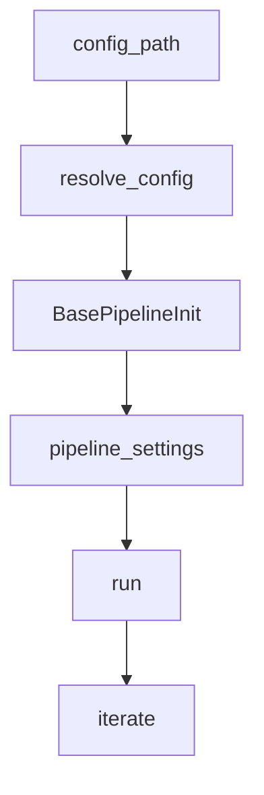

# Pipeline 与配置文件映射

> 说明：代码片段为源码关键行摘录（保持原样但非全文，可能包含英文注释），以下"解读/流程说明"为中文讲解。


## 流程解释（文字优先）
- 当 Pipeline 传入 config_path 时，BasePipeline.__init__ 调用 resolve_config 解析配置并挂到 self.config（pipelines/base.py:22-58）。
- 当 pipeline 运行时，pipeline 设置/使用的 max_iterations 等来自 self.config.pipeline（pipelines/base.py:58-76）。
- 当 pipeline 构建 Agent 时，当前实现使用代码内固定 profile 名称（pipelines/data_scientist.py:42-59；pipelines/web_researcher.py:47-60），因此配置文件中的 agents.* 字段不会直接驱动 Agent 选择（需结合代码实现理解）。


## 流程图（简化）


## 事件清单（当…就会…）
- 当 Pipeline 传入 config_path 时，就会调用 resolve_config 解析配置（pipelines/base.py:22-58）。
- 当 pipeline 运行时，就会使用 config.pipeline 的 max_iterations 等设置（pipelines/base.py:58-76）。
- 当 pipeline 构建 Agent 时，当前实现使用代码内固定 profile 名称（pipelines/data_scientist.py:42-59；pipelines/web_researcher.py:47-60）。

## 前置条件/状态变化/下一步去向
- 前置条件：配置文件路径可读且格式正确。
- 状态变化：self.config 挂载并驱动 pipeline 设置。
- 下一步去向：进入 pipeline.run 的迭代流程。

## Pipeline 实现列表
### DataScientistPipeline
```python
# 文件：pipelines/data_scientist.py | 行：13-105 | 描述：DataScientistPipeline 主循环
class DataScienceQuery(BaseModel):
    """Query model for data science tasks."""
    prompt: str
    data_path: str

    def format(self) -> str:
        """Format data science query."""
        return (
            f"Task: {self.prompt}\n"
            f"Dataset path: {self.data_path}\n"
            "Provide a comprehensive data science workflow"
        )

class DataScientistPipeline(BasePipeline):
```

**解读**
- 作用：DataScientistPipeline 主循环。
- 片段范围：关键行摘录（与源码一致，但非完整段落）。
- 位置：pipelines/data_scientist.py（Pipeline 层）。
- 关键对象：DataScienceQuery / format / DataScientistPipeline。
- 关键输入：config。
- 关键输出/副作用：返回值由代码中的 return 语句给出。

**流程说明**
- 触发/流向：该片段位于调用链中，入口以本章流程解释与相邻调用处为准。

### WebSearcherPipeline
```python
# 文件：pipelines/web_researcher.py | 行：14-111 | 描述：WebSearcherPipeline 主循环
class WebSearchQuery(BaseModel):
    """Query model for data science tasks."""
    prompt: str

    def format(self) -> str:
        """Format web search query."""
        return (
            f"Web search query: {self.prompt}\n"
            "Provide a comprehensive web search workflow"
        )


class WebSearcherPipeline(BasePipeline):
    """Web search pipeline using manager-tool pattern with multi-task planning.
```

**解读**
- 作用：WebSearcherPipeline 主循环。
- 片段范围：关键行摘录（与源码一致，但非完整段落）。
- 位置：pipelines/web_researcher.py（Pipeline 层）。
- 关键对象：WebSearchQuery / format / WebSearcherPipeline。
- 关键输入：config。
- 关键输出/副作用：返回值由代码中的 return 语句给出。

**流程说明**
- 触发/流向：该片段位于调用链中，入口以本章流程解释与相邻调用处为准。

### VanillaChatPipeline
```python
# 文件：pipelines/vanilla_chat.py | 行：12-62 | 描述：VanillaChatPipeline 单轮对话
class ChatQuery(BaseModel):
    """Lightweight query model for vanilla chat."""
    message: str

    def format(self) -> str:
        return self.message


class VanillaChatPipeline(BasePipeline):
    """Minimal chat pipeline using a single vanilla_chat agent profile."""

    def __init__(self, config):
        super().__init__(config)

```

**解读**
- 作用：VanillaChatPipeline 单轮对话。
- 片段范围：关键行摘录（与源码一致，但非完整段落）。
- 位置：pipelines/vanilla_chat.py（Pipeline 层）。
- 关键对象：ChatQuery / format / VanillaChatPipeline。
- 关键输入：config。
- 关键输出/副作用：返回值由代码中的 return 语句给出。

**流程说明**
- 触发/流向：该片段位于调用链中，入口以本章流程解释与相邻调用处为准。

### BrowserMCPPipeline
```python
# 文件：pipelines/browser_mcp.py | 行：12-63 | 描述：BrowserMCPPipeline MCP 调用
class BrowserTask(BaseModel):
    """Lightweight query model for Browser MCP tasks."""
    prompt: str

    def format(self) -> str:
        # Pass the user prompt straight through to the agent
        return self.prompt


class BrowserMCPPipeline(BasePipeline):
    """Simple pipeline that exercises the Browser MCP server via the browser profile."""

    def __init__(self, config):
        super().__init__(config)
```

**解读**
- 作用：BrowserMCPPipeline MCP 调用。
- 片段范围：关键行摘录（与源码一致，但非完整段落）。
- 位置：pipelines/browser_mcp.py（Pipeline 层）。
- 关键对象：BrowserTask / format / BrowserMCPPipeline。
- 关键输入：config。
- 关键输出/副作用：返回值由代码中的 return 语句给出。

**流程说明**
- 触发/流向：该片段位于调用链中，入口以本章流程解释与相邻调用处为准。

## 配置文件清单
### data_science.yaml
```yaml
# 文件：pipelines/configs/data_science.yaml | 行：3-49 | 描述：data_science.yaml 配置
# Provider configuration
provider: "deepseek"
model: "deepseek-chat"
api_key: "${DEEPSEEK_API_KEY}"

# Loads from environment variable

# Dataset defaults
data:
  path: "data/banana_quality.csv"
  prompt: |
    Build a model to classify banana quality as good or bad based on their information. We have uploaded the entire dataset for you here in the banana_quality.csv file.

# Pipeline settings
```

**解读**
- 作用：data_science.yaml 配置。
- 片段范围：关键行摘录（与源码一致，但非完整段落）。
- 位置：pipelines/configs/data_science.yaml（Pipeline 配置）。
- 关键对象：配置键集合。
- 关键字段：provider、model、api_key、data、pipeline、agents。
- 关键输出/副作用：该配置会影响 pipeline/provider/agents 行为（以键为准）。

**流程说明**
- 触发/流向：该片段位于调用链中，入口以本章流程解释与相邻调用处为准。

### web_searcher.yaml
```yaml
# 文件：pipelines/configs/web_searcher.yaml | 行：3-36 | 描述：web_searcher.yaml 配置
# Provider configuration
provider: "deepseek"
model: "deepseek-chat"
api_key: "${DEEPSEEK_API_KEY}"  # Loads from environment variable

# Dataset defaults
data:
  prompt: |
    Find the outstanding papers of ACL 2025, extract their title, author list, keywords, abstract, url in one sentence.

# Pipeline settings
pipeline:
  max_iterations: 5
  max_time_minutes: 5
```

**解读**
- 作用：web_searcher.yaml 配置。
- 片段范围：关键行摘录（与源码一致，但非完整段落）。
- 位置：pipelines/configs/web_searcher.yaml（Pipeline 配置）。
- 关键对象：配置键集合。
- 关键字段：provider、model、api_key、data、pipeline、agents。
- 关键输出/副作用：该配置会影响 pipeline/provider/agents 行为（以键为准）。

**流程说明**
- 触发/流向：该片段位于调用链中，入口以本章流程解释与相邻调用处为准。

### vanilla_chat.yaml
```yaml
# 文件：pipelines/configs/vanilla_chat.yaml | 行：3-20 | 描述：vanilla_chat.yaml 配置
# Provider configuration
provider: "gemini"
model: "gemini-2.5-flash"
api_key: "${GEMINI_API_KEY}"

# Default prompt
data:
  prompt: |
    Hello! How are you?

# Pipeline settings
pipeline:
  verbose: true

```

**解读**
- 作用：vanilla_chat.yaml 配置。
- 片段范围：关键行摘录（与源码一致，但非完整段落）。
- 位置：pipelines/configs/vanilla_chat.yaml（Pipeline 配置）。
- 关键对象：配置键集合。
- 关键字段：provider、model、api_key、data、pipeline、agents。
- 关键输出/副作用：该配置会影响 pipeline/provider/agents 行为（以键为准）。

**流程说明**
- 触发/流向：该片段位于调用链中，入口以本章流程解释与相邻调用处为准。

### simple.yaml
```yaml
# 文件：pipelines/configs/simple.yaml | 行：3-23 | 描述：simple.yaml 配置
# Provider configuration
provider: "gemini"
model: "gemini-2.5-flash"
api_key: "${GEMINI_API_KEY}"

# Dataset defaults
data:
  prompt: |
    Find the outstanding papers of ACL 2025, extract their title, author list, keywords, abstract, url in one sentence.

# Pipeline settings
pipeline:
  verbose: true

```

**解读**
- 作用：simple.yaml 配置。
- 片段范围：关键行摘录（与源码一致，但非完整段落）。
- 位置：pipelines/configs/simple.yaml（Pipeline 配置）。
- 关键对象：配置键集合。
- 关键字段：provider、model、api_key、data、pipeline、agents。
- 关键输出/副作用：该配置会影响 pipeline/provider/agents 行为（以键为准）。

**流程说明**
- 触发/流向：该片段位于调用链中，入口以本章流程解释与相邻调用处为准。

### simple_browser.yaml
```yaml
# 文件：pipelines/configs/simple_browser.yaml | 行：3-35 | 描述：simple_browser.yaml 配置
# Provider configuration
provider: "gemini"
model: "gemini-2.5-flash"
api_key: "${GEMINI_API_KEY}"


prompt: |
  - Open google.com
  - Search for which LPL team loses to Vietnam in Bo3
  - Return the name of that team

# Pipeline settings
pipeline:
  verbose: true
```

**解读**
- 作用：simple_browser.yaml 配置。
- 片段范围：关键行摘录（与源码一致，但非完整段落）。
- 位置：pipelines/configs/simple_browser.yaml（Pipeline 配置）。
- 关键对象：配置键集合。
- 关键字段：provider、model、api_key、prompt、pipeline、agents、mcp。
- 关键输出/副作用：该配置会影响 pipeline/provider/agents 行为（以键为准）。

**流程说明**
- 触发/流向：该片段位于调用链中，入口以本章流程解释与相邻调用处为准。

### simple_chrome.yaml
```yaml
# 文件：pipelines/configs/simple_chrome.yaml | 行：3-22 | 描述：simple_chrome.yaml 配置
# Provider configuration
provider: "gemini"
model: "gemini-2.5-flash"
api_key: "${GEMINI_API_KEY}"


prompt: |
  Open www.google.com and search for "openai agents sdk". Return the title of the first result.

# Pipeline settings
pipeline:
  verbose: true

# Agent profiles
```

**解读**
- 作用：simple_chrome.yaml 配置。
- 片段范围：关键行摘录（与源码一致，但非完整段落）。
- 位置：pipelines/configs/simple_chrome.yaml（Pipeline 配置）。
- 关键对象：配置键集合。
- 关键字段：provider、model、api_key、prompt、pipeline、agents。
- 关键输出/副作用：该配置会影响 pipeline/provider/agents 行为（以键为准）。

**流程说明**
- 触发/流向：该片段位于调用链中，入口以本章流程解释与相邻调用处为准。

### simple_notion.yaml
```yaml
# 文件：pipelines/configs/simple_notion.yaml | 行：3-24 | 描述：simple_notion.yaml 配置
# Provider configuration
provider: "gemini"
model: "gemini-2.5-flash"
api_key: "${GEMINI_API_KEY}"


prompt: |
  Create a new page in Notion named "Test Page" and add the following content:
  - Title: Test Page
  - Content: This is a test page.

# Pipeline settings
pipeline:
  verbose: true
```

**解读**
- 作用：simple_notion.yaml 配置。
- 片段范围：关键行摘录（与源码一致，但非完整段落）。
- 位置：pipelines/configs/simple_notion.yaml（Pipeline 配置）。
- 关键对象：配置键集合。
- 关键字段：provider、model、api_key、prompt、pipeline、agents。
- 关键输出/副作用：该配置会影响 pipeline/provider/agents 行为（以键为准）。

**流程说明**
- 触发/流向：该片段位于调用链中，入口以本章流程解释与相邻调用处为准。

### data_science_memory.yaml
```yaml
# 文件：pipelines/configs/data_science_memory.yaml | 行：3-50 | 描述：data_science_memory.yaml 配置
# Provider configuration
provider: "gemini"
model: "gemini-2.5-flash"
api_key: "${GEMINI_API_KEY}"  # Loads from environment variable

# Dataset defaults
data:
  path: "data/banana_quality.csv"
  prompt: |
    Build a model to classify banana quality as good or bad based on their numerical
    information about bananas of different quality (size, weight, sweetness, softness,
    harvest time, ripeness, and acidity). We have uploaded the entire dataset for you
    here in the banana_quality.csv file.

```

**解读**
- 作用：data_science_memory.yaml 配置。
- 片段范围：关键行摘录（与源码一致，但非完整段落）。
- 位置：pipelines/configs/data_science_memory.yaml（Pipeline 配置）。
- 关键对象：配置键集合。
- 关键字段：provider、model、api_key、data、pipeline、agents。
- 关键输出/副作用：该配置会影响 pipeline/provider/agents 行为（以键为准）。

**流程说明**
- 触发/流向：该片段位于调用链中，入口以本章流程解释与相邻调用处为准。

## 已识别的配置/实现差异（待确认）
- YAML 配置中的 profile 名称多为 `*_agent`，但 `ContextAgent` 在 pipeline 中通过 `name.removesuffix('_agent')` 寻找 Profile，实际 Profile key 为 `data_loader`、`web_searcher` 等。
- `simple.yaml`、`simple_browser.yaml` 等配置引用 `routing_agent_simple*`，当前 profiles 中未发现对应定义。
- `data_science.yaml` / `data_science_memory.yaml` 引用 `code_generation_agent`，当前 profiles 中未发现对应定义。
- `frontend/app.py` 映射 `SimplePipeline`，但 `pipelines/` 内未发现对应实现文件（待确认）。
- `browser_agent`/`chrome_agent`/`notion_agent` 在配置中出现，但 profiles 中仅定义 `browser`/`chrome`/`notion`。

证据示例：

```python
# 文件：pipelines/data_scientist.py | 行：13-105 | 描述：DataScientistPipeline 主循环
class DataScienceQuery(BaseModel):
    """Query model for data science tasks."""
    prompt: str
    data_path: str

    def format(self) -> str:
        """Format data science query."""
        return (
            f"Task: {self.prompt}\n"
            f"Dataset path: {self.data_path}\n"
            "Provide a comprehensive data science workflow"
        )

class DataScientistPipeline(BasePipeline):
```

**解读**
- 作用：DataScientistPipeline 主循环。
- 片段范围：关键行摘录（与源码一致，但非完整段落）。
- 位置：pipelines/data_scientist.py（Pipeline 层）。
- 关键对象：DataScienceQuery / format / DataScientistPipeline。
- 关键输入：config。
- 关键输出/副作用：返回值由代码中的 return 语句给出。

**流程说明**
- 触发/流向：该片段位于调用链中，入口以本章流程解释与相邻调用处为准。

```python
# 文件：contextagent/profiles/base.py | 行：71-105 | 描述：load_all_profiles 自动加载逻辑
def load_all_profiles():
    """Load all Profile instances from the profiles package.

    Returns:
        Dict with shortened keys (e.g., "observe" instead of "observe_profile")
        Each profile has a _key attribute added for automatic name derivation
    """
    import importlib
    import inspect
    from pathlib import Path

    profiles = {}
    package_path = Path(__file__).parent

```

**解读**
- 作用：load_all_profiles 自动加载逻辑。
- 片段范围：关键行摘录（与源码一致，但非完整段落）。
- 位置：contextagent/profiles/base.py（Profile 配置层）。
- 关键对象：load_all_profiles。
- 关键输入：见函数签名或调用处。
- 关键输出/副作用：结果以日志/状态变更/外部调用为主（见实现）。

**流程说明**
- 触发/流向：该片段位于调用链中，入口以本章流程解释与相邻调用处为准。
