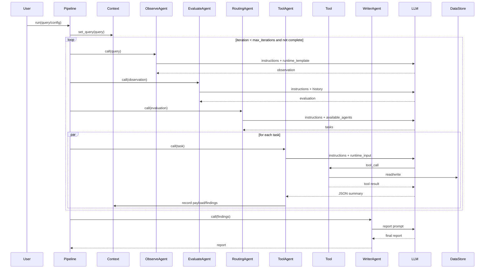

# ContextAgent 大模型应用分析报告

## 1. 项目概述
- 项目名称: ContextAgent
- 项目描述: 轻量级、以上下文为中心的多代理系统框架，强调统一的上下文管理与简化的代理编排，提供类 PyTorch 的管线 API。
- 主要功能:
  - Profile 驱动的多代理系统
  - 统一上下文管理与迭代状态记录
  - 结构化输出与工具调用
  - 多模型提供商支持（OpenAI/Claude/Gemini/DeepSeek 等）
- 技术栈:
  - Python 3.11
  - openai-agents / litellm
  - Pydantic
  - Flask（前端提交与监控）
  - pandas / scikit-learn / matplotlib / seaborn（数据工具）

## 2. 项目逻辑或数据流分析

## 3. 提示词分类统计
| 类别 | 数量 | 用途说明 |
|------|------|----------|
| 系统提示词 | 18 | 代理角色与职责定义（Profile.instructions） |
| 运行时/上下文模板 | 22 | 运行时模板 + 上下文拼接 + Query 格式化 |
| 用户默认/示例提示词 | 15 | 管线默认 prompt、示例与文档示例 |
| 工具内部提示词 | 1 | 工具内默认提示（image_qa） |

## 4. 大模型应用场景分析
### 场景 1: 数据科学多代理工作流
- 触发条件: 运行 `DataScientistPipeline` 或读取 `pipelines/configs/data_science*.yaml`
- 使用的提示词:
  - `translated_prompts/contextagent/profiles/data/data_loader.py_profile_prompt_bundle_prompt_zh.md`
  - `translated_prompts/contextagent/profiles/data/data_analysis.py_profile_prompt_bundle_prompt_zh.md`
  - `translated_prompts/contextagent/profiles/data/preprocessing.py_profile_prompt_bundle_prompt_zh.md`
  - `translated_prompts/contextagent/profiles/data/model_training.py_profile_prompt_bundle_prompt_zh.md`
  - `translated_prompts/contextagent/profiles/data/evaluation.py_profile_prompt_bundle_prompt_zh.md`
  - `translated_prompts/contextagent/profiles/data/visualization.py_profile_prompt_bundle_prompt_zh.md`
  - `translated_prompts/contextagent/profiles/manager/routing.py_profile_prompt_bundle_prompt_zh.md`
  - `translated_prompts/contextagent/profiles/manager/observe.py_profile_prompt_bundle_prompt_zh.md`
  - `translated_prompts/contextagent/profiles/manager/evaluate.py_profile_prompt_bundle_prompt_zh.md`
  - `translated_prompts/contextagent/profiles/manager/writer.py_profile_prompt_bundle_prompt_zh.md`
- 代码位置: `pipelines/data_scientist.py:26`
- 输入输出:
  - 输入: `DataScienceQuery(prompt, data_path)`
  - 输出: 结构化工具结果 + 最终报告
- 作用: 通过多轮迭代实现“观察-评估-路由-工具-汇总”的完整数据科学流程

### 场景 2: Web 研究任务分解 + 搜索/爬取
- 触发条件: 运行 `WebSearcherPipeline` 或读取 `pipelines/configs/web_searcher.yaml`
- 使用的提示词:
  - `translated_prompts/contextagent/profiles/web/web_planning.py_profile_prompt_bundle_prompt_zh.md`
  - `translated_prompts/contextagent/profiles/web/web_searcher.py_profile_prompt_bundle_prompt_zh.md`
  - `translated_prompts/contextagent/profiles/web/web_crawler.py_profile_prompt_bundle_prompt_zh.md`
  - `translated_prompts/contextagent/profiles/manager/observe.py_profile_prompt_bundle_prompt_zh.md`
  - `translated_prompts/contextagent/profiles/manager/evaluate.py_profile_prompt_bundle_prompt_zh.md`
  - `translated_prompts/contextagent/profiles/manager/writer.py_profile_prompt_bundle_prompt_zh.md`
- 代码位置: `pipelines/web_researcher.py:26`
- 输入输出:
  - 输入: `WebSearchQuery(prompt)`
  - 输出: 搜索/爬取结果 + 汇总报告
- 作用: 规划代理生成任务列表，工具代理执行搜索/爬取并输出结构化结果

### 场景 3: 单代理聊天
- 触发条件: 运行 `VanillaChatPipeline` 或读取 `pipelines/configs/vanilla_chat.yaml`
- 使用的提示词:
  - `translated_prompts/contextagent/profiles/debug/vanilla_chat.py_profile_prompt_bundle_prompt_zh.md`
- 代码位置: `pipelines/vanilla_chat.py:20`
- 输入输出:
  - 输入: 用户消息
  - 输出: 对话回复
- 作用: 提供最简对话能力，便于快速验证模型接入

### 场景 4: MCP 浏览器工具
- 触发条件: 运行 `BrowserMCPPipeline` 或使用 `simple_browser.yaml`
- 使用的提示词:
  - `translated_prompts/contextagent/profiles/mcp/browser.py_profile_prompt_bundle_prompt_zh.md`
  - `translated_prompts/pipelines/configs/simple_browser.yaml_default_prompt_prompt_zh.md`
- 代码位置: `pipelines/browser_mcp.py:21`
- 输入输出:
  - 输入: 浏览器任务 prompt
  - 输出: MCP 工具执行结果
- 作用: 通过 MCP 服务器提供的浏览器工具实现页面操作

## 5. 提示词工程技术
- 角色扮演: 所有 Profile 以 “You are …” 形式定义角色
- 结构化输出: 多数工具代理要求“Only output JSON”，并注入 Pydantic Schema
- 工具调用指令化: 提示词明确指定工具名称与调用步骤
- 运行时模板: 使用 `runtime_template` 注入 query/history/findings 等动态上下文
- 约束型提示: 约束输出长度、词数、操作次数（如“最多 3 个代理”“不要额外搜索”）

## 6. 上下文构建

### Agent 循环与上下文拼接
- `ContextAgent.build_contextual_instructions()` 将 `instructions` 与 `runtime_template` 合成最终输入
- `runtime_template` 从 `ConversationState` 取值（如 `query/history/iteration` 等），不足时填空字符串
- 未配置 `runtime_template` 时，回退到 `format_context_prompt()` 拼接 `[ORIGINAL QUERY] / [PREVIOUS ITERATIONS] / [CURRENT INPUT]`
- 多代理循环由 Pipeline 控制，典型顺序为 Observe → Evaluate → Routing/Planning → Tool Agents → Writer

### 工具与调用 Scheme
以下工具使用 `@function_tool` 暴露给模型（参数即函数签名）：
- `load_dataset(ctx, file_path)`：读取数据并缓存到 DataStore
- `analyze_data(ctx, file_path=None, target_column=None)`：EDA 与相关性/离群分析
- `preprocess_data(ctx, operations, file_path=None, target_column=None, output_path=None)`：执行预处理
- `train_model(ctx, target_column, file_path=None, model_type="auto", test_size=0.2, random_state=42)`：训练模型
- `evaluate_model(ctx, target_column, file_path=None, model_type="random_forest", test_size=0.2, random_state=42)`：评估模型
- `create_visualization(ctx, plot_type, file_path=None, columns=None, target_column=None, output_path=None)`：生成图表
- `image_qa(ctx, image_path, question=None)`：图像理解与问答
- `video_qa(ctx, video_url, question)`：视频理解与问答
- `web_search(query)`：网络搜索并抓取内容
- `crawl_website(starting_url)`：网站爬取与内容抓取
- `web_search_tool(query, num_results=5, region=None, banned_sites=None)`：DuckDuckGo 搜索（旧实现）

MCP 工具：
- Browser MCP (`contextagent/mcp/servers/browser/server.py`) 通过 `npx @browsermcp/mcp@latest` 提供浏览器工具集
- Chrome DevTools MCP (`contextagent/mcp/servers/chrome_devtools/server.py`) 通过 `npx chrome-devtools-mcp@latest` 提供调试工具集
- MCP 工具清单由服务器动态提供，Profile 中通过 `mcp_servers` 注入

## 7. 关键发现与洞察
- Profile 统一管理 system prompt 与 runtime_template，减少不同管线间的提示词重复
- 工具代理提示词普遍要求 JSON 输出并注入 Schema，提高了结构化解析稳定性
- 管线层显式分离“观察/评估/路由/执行/写作”，便于扩展多代理协作
- [待确认] `pipelines/configs/data_science*.yaml` 引用 `code_generation_agent`，仓库中未发现对应 Profile
- [待确认] `pipelines/configs/simple_chrome.yaml` 使用 `chrome_agent` Profile 名称，当前 Profile key 为 `chrome`，需确认映射逻辑
- `data_loader` 提示词中包含 `f{ToolAgentOutput.model_json_schema()}` 字面前缀，可能是格式拼接误差
- 管线使用 `context.state.complete` 作为停止条件，但未找到触发 `mark_research_complete()` 的调用点

## 8. 类似系统实现步骤
1. 设计配置模型: 定义 YAML/JSON 配置格式（provider、agents、tools、pipeline settings、prompt）
2. 实现 Profile: 用 `instructions + runtime_template + tools + output_schema` 定义可复用模板
3. 构建上下文状态: 维护 query、iteration、history、findings，并提供统一的 prompt 拼接函数
4. 包装 LLM Agent: 使用 openai-agents 或等价 SDK，支持工具调用与结构化输出
5. 构建工具层: 以 `@function_tool` 暴露函数，统一输入输出协议与上下文数据缓存
6. 实现管线循环: Observe/Evaluate/Route/Execute/Write 的迭代控制与停止条件
7. 接入 MCP/外部工具: 用 MCPServerStdio 连接外部工具并缓存工具列表
8. 增加可观测性: 日志、追踪、输出归档（reporter/printer）
9. 提供示例与文档: 给出 YAML 示例、Profile 示例与管线模板
