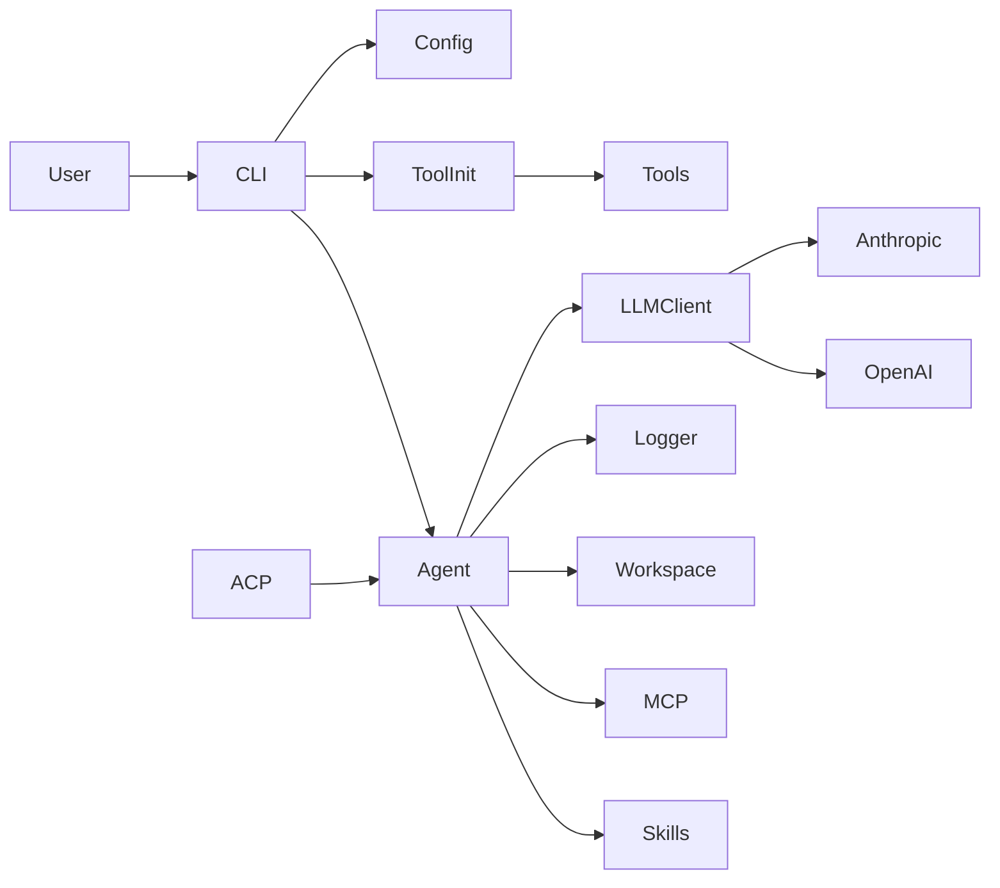
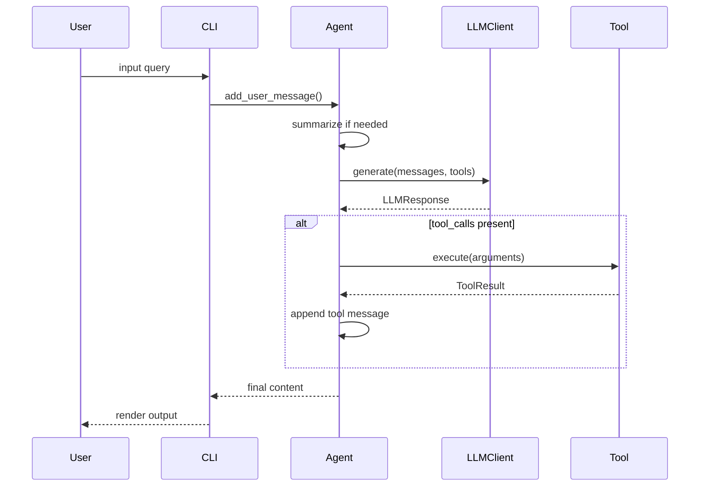

# 架构设计

## 组件关系图


## 设计动机与收益
- **分层与复用**：CLI/ACP 只负责输入与会话管理，Agent 负责执行循环，LLM/Tool 负责能力扩展，有利于复用 Agent 核心逻辑并降低交互层耦合。
- **上下文可控**：Agent 在每一步执行前先进行摘要判定，避免长对话导致上下文溢出。
- **Skills 按需加载**：仅注入技能元信息，具体内容通过工具按需获取，降低初始上下文成本。
- **结构化日志**：请求/响应/工具结果统一写入日志，保证可追溯性与调试效率。

### 关键证据（与上文设计点对应）
```python
# File: mini_agent/cli.py | Lines: 497-557 | Description: CLI input loop delegates to Agent
# 10. Interactive loop
while True:
    try:
        # Get user input using prompt_toolkit
        # Use styled list for robust coloring
        user_input = await session.prompt_async(
            [
                ("class:prompt", "You"),
                ("", " › "),
            ],
            multiline=False,
            enable_history_search=True,
        )
        user_input = user_input.strip()

        if not user_input:
            continue

        # Handle commands
        if user_input.startswith("/"):
            command = user_input.lower()

            if command in ["/exit", "/quit", "/q"]:
                print(f"\n{Colors.BRIGHT_YELLOW}👋 Goodbye! Thanks for using Mini Agent{Colors.RESET}\n")
                print_stats(agent, session_start)
                break
            elif command == "/help":
                print_help()
                continue
            elif command == "/clear":
                # Clear message history but keep system prompt
                old_count = len(agent.messages)
                agent.messages = [agent.messages[0]]  # Keep only system message
                print(f"{Colors.GREEN}✅ Cleared {old_count - 1} messages, starting new session{Colors.RESET}\n")
                continue
            elif command == "/history":
                print(f"\n{Colors.BRIGHT_CYAN}Current session message count: {len(agent.messages)}{Colors.RESET}\n")
                continue
            elif command == "/stats":
                print_stats(agent, session_start)
                continue
            else:
                print(f"{Colors.RED}❌ Unknown command: {user_input}{Colors.RESET}")
                print(f"{Colors.DIM}Type /help to see available commands{Colors.RESET}\n")
                continue

        # Normal conversation - exit check
        if user_input.lower() in ["exit", "quit", "q"]:
            print(f"\n{Colors.BRIGHT_YELLOW}👋 Goodbye! Thanks for using Mini Agent{Colors.RESET}\n")
            print_stats(agent, session_start)
            break

        # Run Agent
        print(f"\n{Colors.BRIGHT_BLUE}Agent{Colors.RESET} {Colors.DIM}›{Colors.RESET} {Colors.DIM}Thinking...{Colors.RESET}\n")
        agent.add_user_message(user_input)
        _ = await agent.run()
```

```python
# File: mini_agent/agent.py | Lines: 142-154 | Description: Summarization trigger rules
async def _summarize_messages(self):
    """Message history summarization: summarize conversations between user messages when tokens exceed limit

    Strategy (Agent mode):
    - Keep all user messages (these are user intents)
    - Summarize content between each user-user pair (agent execution process)
    - If last round is still executing (has agent/tool messages but no next user), also summarize
    - Structure: system -> user1 -> summary1 -> user2 -> summary2 -> user3 -> summary3 (if executing)

    Summary is triggered when EITHER:
    - Local token estimation exceeds limit
    - API reported total_tokens exceeds limit
    """
```

```python
# File: mini_agent/tools/skill_tool.py | Lines: 57-83 | Description: Progressive Disclosure entry point
def create_skill_tools(
    skills_dir: str = "./skills",
) -> tuple[List[Tool], Optional[SkillLoader]]:
    """
    Create skill tool for Progressive Disclosure

    Only provides get_skill tool - the agent uses metadata in system prompt
    to know what skills are available, then loads them on-demand.

    Args:
        skills_dir: Skills directory path

    Returns:
        Tuple of (list of tools, skill loader)
    """
    # Create skill loader
    loader = SkillLoader(skills_dir)

    # Discover and load skills
    skills = loader.discover_skills()
    print(f"✅ Discovered {len(skills)} Claude Skills")

    # Create only the get_skill tool (Progressive Disclosure Level 2)
    tools = [
        GetSkillTool(loader),
    ]

    return tools, loader
```

```python
# File: mini_agent/tools/skill_loader.py | Lines: 229-247 | Description: Metadata-only prompt
def get_skills_metadata_prompt(self) -> str:
    """
    Generate prompt containing ONLY metadata (name + description) for all skills.
    This implements Progressive Disclosure - Level 1.

    Returns:
        Metadata-only prompt string
    """
    if not self.loaded_skills:
        return ""

    prompt_parts = ["## Available Skills\n"]
    prompt_parts.append("You have access to specialized skills. Each skill provides expert guidance for specific tasks.\n")
    prompt_parts.append("Load a skill's full content using the appropriate skill tool when needed.\n")

    # List all skills with their descriptions
    for skill in self.loaded_skills.values():
        prompt_parts.append(f"- `{skill.name}`: {skill.description}")
```

## 端到端数据流概览
从用户输入到最终输出的核心路径如下（详见 `11-end-to-end-flow.md`）。


## 组件职责

### CLI Runtime
- 负责解析参数、加载配置、初始化工具、创建 Agent 并进入交互循环。

```python
# File: mini_agent/cli.py | Lines: 333-352 | Description: Config loading flow
# 1. Load configuration from package directory
config_path = Config.get_default_config_path()

if not config_path.exists():
    print(f"{Colors.RED}❌ Configuration file not found{Colors.RESET}")
    print()
    print(f"{Colors.BRIGHT_CYAN}📦 Configuration Search Path:{Colors.RESET}")
    print(f"  {Colors.DIM}1) mini_agent/config/config.yaml{Colors.RESET} (development)")
    print(f"  {Colors.DIM}2) ~/.mini-agent/config/config.yaml{Colors.RESET} (user)")
    print(f"  {Colors.DIM}3) <package>/config/config.yaml{Colors.RESET} (installed)")
    print()
    print(f"{Colors.BRIGHT_YELLOW}🚀 Quick Setup (Recommended):{Colors.RESET}")
    print(f"  {Colors.BRIGHT_GREEN}curl -fsSL https://raw.githubusercontent.com/MiniMax-AI/Mini-Agent/main/scripts/setup-config.sh | bash{Colors.RESET}")
    print()
    print(f"{Colors.DIM}  This will automatically:{Colors.RESET}")
    print(f"{Colors.DIM}    • Create ~/.mini-agent/config/{Colors.RESET}")
```

### Agent Core
- 负责消息历史、LLM 调用、工具执行与结果写回。

```python
# File: mini_agent/agent.py | Lines: 289-310 | Description: Agent loop with summarize and LLM call
while step < self.max_steps:
    # Check and summarize message history to prevent context overflow
    await self._summarize_messages()

    # Step header with proper width calculation
    BOX_WIDTH = 58
    step_text = f"{Colors.BOLD}{Colors.BRIGHT_CYAN}💭 Step {step + 1}/{self.max_steps}{Colors.RESET}"
    step_display_width = calculate_display_width(step_text)
    padding = max(0, BOX_WIDTH - 1 - step_display_width)  # -1 for leading space

    print(f"
{Colors.DIM}╭{'─' * BOX_WIDTH}╮{Colors.RESET}")
    print(f"{Colors.DIM}│{Colors.RESET} {step_text}{' ' * padding}{Colors.DIM}│{Colors.RESET}")
    print(f"{Colors.DIM}╰{'─' * BOX_WIDTH}╯{Colors.RESET}")

    # Get tool list for LLM call
    tool_list = list(self.tools.values())

    # Log LLM request and call LLM with Tool objects directly
    self.logger.log_request(messages=self.messages, tools=tool_list)

    try:
        response = await self.llm.generate(messages=self.messages, tools=tool_list)
```

### LLM Layer
- 统一封装 Anthropic/OpenAI 兼容协议，并根据 provider 拼接 api_base。

```python
# File: mini_agent/llm/llm_wrapper.py | Lines: 30-60 | Description: Provider-based endpoint selection
def __init__(
    self,
    api_key: str,
    provider: LLMProvider = LLMProvider.ANTHROPIC,
    api_base: str = "https://api.minimaxi.com",
    model: str = "MiniMax-M2",
    retry_config: RetryConfig | None = None,
):
    self.provider = provider
    self.api_key = api_key
    self.model = model
    self.retry_config = retry_config or RetryConfig()

    # for backward compatibility
    api_base = api_base.replace("/anthropic", "")

    # Append provider-specific suffix to api_base
    if provider == LLMProvider.ANTHROPIC:
        full_api_base = f"{api_base.rstrip('/')}/anthropic"
    elif provider == LLMProvider.OPENAI:
        full_api_base = f"{api_base.rstrip('/')}/v1"
```

### Tools Subsystem
工具系统以“配置开关 + 分层加载 + Schema 契约”为核心。配置控制能力边界，CLI 负责组装工具集合，Tool 定义接口并交由 LLM client 进行 provider 适配。

#### 工具开关与加载分层
```python
# File: mini_agent/config.py | Lines: 40-54 | Description: Tool flags in configuration
class ToolsConfig(BaseModel):
    """Tools configuration"""

    # Basic tools (file operations, bash)
    enable_file_tools: bool = True
    enable_bash: bool = True
    enable_note: bool = True

    # Skills
    enable_skills: bool = True
    skills_dir: str = "./skills"

    # MCP tools
    enable_mcp: bool = True
    mcp_config_path: str = "mcp.json"
```

```python
# File: mini_agent/cli.py | Lines: 211-239 | Description: Base tool loading (bash)
async def initialize_base_tools(config: Config):
    """Initialize base tools (independent of workspace)

    These tools are loaded from package configuration and don't depend on workspace.
    Note: File tools are now workspace-dependent and initialized in add_workspace_tools()

    Args:
        config: Configuration object

    Returns:
        Tuple of (list of tools, skill loader if skills enabled)
    """

    tools = []
    skill_loader = None

    # 1. Bash tool and Bash Output tool
    if config.tools.enable_bash:
        bash_tool = BashTool()
        tools.append(bash_tool)
        print(f"{Colors.GREEN}✅ Loaded Bash tool{Colors.RESET}")

        bash_output_tool = BashOutputTool()
        tools.append(bash_output_tool)
        print(f"{Colors.GREEN}✅ Loaded Bash Output tool{Colors.RESET}")

        bash_kill_tool = BashKillTool()
        tools.append(bash_kill_tool)
        print(f"{Colors.GREEN}✅ Loaded Bash Kill tool{Colors.RESET}")
```

```python
# File: mini_agent/cli.py | Lines: 241-270 | Description: Skills tool loading
    # 3. Claude Skills (loaded from package directory)
    if config.tools.enable_skills:
        print(f"{Colors.BRIGHT_CYAN}Loading Claude Skills...{Colors.RESET}")
        try:
            # Resolve skills directory with priority search
            skills_dir = config.tools.skills_dir
            if not Path(skills_dir).is_absolute():
                # Search in priority order:
                # 1. Current directory (dev mode: ./skills or ./mini_agent/skills)
                # 2. Package directory (installed: site-packages/mini_agent/skills)
                search_paths = [
                    Path(skills_dir),  # ./skills for backward compatibility
                    Path("mini_agent") / skills_dir,  # ./mini_agent/skills
                    Config.get_package_dir() / skills_dir,  # site-packages/mini_agent/skills
                ]

                # Find first existing path
                for path in search_paths:
                    if path.exists():
                        skills_dir = str(path.resolve())
                        break

            skill_tools, skill_loader = create_skill_tools(skills_dir)
            if skill_tools:
                tools.extend(skill_tools)
                print(f"{Colors.GREEN}✅ Loaded Skill tool (get_skill){Colors.RESET}")
            else:
                print(f"{Colors.YELLOW}⚠️  No available Skills found{Colors.RESET}")
        except Exception as e:
            print(f"{Colors.YELLOW}⚠️  Failed to load Skills: {e}{Colors.RESET}")
```

```python
# File: mini_agent/cli.py | Lines: 272-288 | Description: MCP tool loading
    # 4. MCP tools (loaded with priority search)
    if config.tools.enable_mcp:
        print(f"{Colors.BRIGHT_CYAN}Loading MCP tools...{Colors.RESET}")
        try:
            # Use priority search for mcp.json
            mcp_config_path = Config.find_config_file(config.tools.mcp_config_path)
            if mcp_config_path:
                mcp_tools = await load_mcp_tools_async(str(mcp_config_path))
                if mcp_tools:
                    tools.extend(mcp_tools)
                    print(f"{Colors.GREEN}✅ Loaded {len(mcp_tools)} MCP tools (from: {mcp_config_path}){Colors.RESET}")
                else:
                    print(f"{Colors.YELLOW}⚠️  No available MCP tools found{Colors.RESET}")
            else:
                print(f"{Colors.YELLOW}⚠️  MCP config file not found: {config.tools.mcp_config_path}{Colors.RESET}")
        except Exception as e:
            print(f"{Colors.YELLOW}⚠️  Failed to load MCP tools: {e}{Colors.RESET}")
```

```python
# File: mini_agent/cli.py | Lines: 294-321 | Description: Workspace-dependent tools
def add_workspace_tools(tools: List[Tool], config: Config, workspace_dir: Path):
    """Add workspace-dependent tools

    These tools need to know the workspace directory.

    Args:
        tools: Existing tools list to add to
        config: Configuration object
        workspace_dir: Workspace directory path
    """
    # Ensure workspace directory exists
    workspace_dir.mkdir(parents=True, exist_ok=True)

    # File tools - need workspace to resolve relative paths
    if config.tools.enable_file_tools:
        tools.extend(
            [
                ReadTool(workspace_dir=str(workspace_dir)),
                WriteTool(workspace_dir=str(workspace_dir)),
                EditTool(workspace_dir=str(workspace_dir)),
            ]
        )
        print(f"{Colors.GREEN}✅ Loaded file operation tools (workspace: {workspace_dir}){Colors.RESET}")

    # Session note tool - needs workspace to store memory file
    if config.tools.enable_note:
        tools.append(SessionNoteTool(memory_file=str(workspace_dir / ".agent_memory.json")))
        print(f"{Colors.GREEN}✅ Loaded session note tool{Colors.RESET}")
```

#### Schema 契约与 provider 适配
```python
# File: mini_agent/tools/base.py | Lines: 8-55 | Description: Tool interface and schema conversion
class ToolResult(BaseModel):
    """Tool execution result."""

    success: bool
    content: str = ""
    error: str | None = None


class Tool:
    """Base class for all tools."""

    @property
    def name(self) -> str:
        """Tool name."""
        raise NotImplementedError

    @property
    def description(self) -> str:
        """Tool description."""
        raise NotImplementedError

    @property
    def parameters(self) -> dict[str, Any]:
        """Tool parameters schema (JSON Schema format)."""
        raise NotImplementedError

    async def execute(self, *args, **kwargs) -> ToolResult:  # type: ignore
        """Execute the tool with arbitrary arguments."""
        raise NotImplementedError

    def to_schema(self) -> dict[str, Any]:
        """Convert tool to Anthropic tool schema."""
        return {
            "name": self.name,
            "description": self.description,
            "input_schema": self.parameters,
        }

    def to_openai_schema(self) -> dict[str, Any]:
        """Convert tool to OpenAI tool schema."""
        return {
            "type": "function",
            "function": {
                "name": self.name,
                "description": self.description,
                "parameters": self.parameters,
            },
        }
```

```python
# File: mini_agent/llm/anthropic_client.py | Lines: 83-110 | Description: Tool schema conversion for Anthropic
def _convert_tools(self, tools: list[Any]) -> list[dict[str, Any]]:
    """Convert tools to Anthropic format.

    Anthropic tool format:
    {
        "name": "tool_name",
        "description": "Tool description",
        "input_schema": {
            "type": "object",
            "properties": {...},
            "required": [...]
        }
    }

    Args:
        tools: List of Tool objects or dicts

    Returns:
        List of tools in Anthropic dict format
    """
    result = []
    for tool in tools:
        if isinstance(tool, dict):
            result.append(tool)
        elif hasattr(tool, "to_schema"):
            # Tool object with to_schema method
            result.append(tool.to_schema())
        else:
            raise TypeError(f"Unsupported tool type: {type(tool)}")
    return result
```

```python
# File: mini_agent/llm/openai_client.py | Lines: 80-110 | Description: Tool schema conversion for OpenAI
def _convert_tools(self, tools: list[Any]) -> list[dict[str, Any]]:
    """Convert tools to OpenAI format.

    Args:
        tools: List of Tool objects or dicts

    Returns:
        List of tools in OpenAI dict format
    """
    result = []
    for tool in tools:
        if isinstance(tool, dict):
            # If already a dict, check if it's in OpenAI format
            if "type" in tool and tool["type"] == "function":
                result.append(tool)
            else:
                # Assume it's in Anthropic format, convert to OpenAI
                result.append(
                    {
                        "type": "function",
                        "function": {
                            "name": tool["name"],
                            "description": tool["description"],
                            "parameters": tool["input_schema"],
                        },
                    }
                )
        elif hasattr(tool, "to_openai_schema"):
            # Tool object with to_openai_schema method
            result.append(tool.to_openai_schema())
        else:
            raise TypeError(f"Unsupported tool type: {type(tool)}")
    return result
```

#### 设计动机与收益
- **能力裁剪**：通过配置开关控制工具集，便于在不同场景下快速收缩权限与依赖。
- **路径安全**：workspace 相关工具统一以 workspace 为根解析相对路径，减少误操作范围。
- **协议适配**：Tool 只负责表达能力，LLM client 负责协议适配，避免工具散落在多处实现。

详细工具行为与约束可参考备份文档 `12-tools-design.md`。

### Skills Subsystem
- 通过 get_skill 工具按需加载 SKILL.md 内容，避免一次性注入大量上下文。

```python
# File: mini_agent/tools/skill_tool.py | Lines: 57-83 | Description: Skill tool creation
def create_skill_tools(
    skills_dir: str = "./skills",
) -> tuple[List[Tool], Optional[SkillLoader]]:
    """
    Create skill tool for Progressive Disclosure

    Only provides get_skill tool - the agent uses metadata in system prompt
    to know what skills are available, then loads them on-demand.
    """
    # Create skill loader
    loader = SkillLoader(skills_dir)

    # Discover and load skills
    skills = loader.discover_skills()
    print(f"✅ Discovered {len(skills)} Claude Skills")

    # Create only the get_skill tool (Progressive Disclosure Level 2)
    tools = [
        GetSkillTool(loader),
    ]

    return tools, loader
```

### MCP Integration
- 读取 mcp.json，启动 MCP server，注册其工具到 Agent。

```python
# File: mini_agent/tools/mcp_loader.py | Lines: 154-170 | Description: MCP tools loading entry
async def load_mcp_tools_async(config_path: str = "mcp.json") -> list[Tool]:
    """
    Load MCP tools from config file.

    This function:
    1. Reads the MCP config file
    2. Starts MCP server processes
    3. Connects to each server
    4. Fetches tool definitions
    5. Wraps them as Tool objects
    """
    global _mcp_connections

    config_file = Path(config_path)

    if not config_file.exists():
        print(f"MCP config not found: {config_path}")
        return []
```

### ACP Adapter
- 通过 ACP 协议接入，复用 Agent 执行逻辑。

```python
# File: mini_agent/acp/__init__.py | Lines: 121-159 | Description: ACP turn loop bridging tools
async def _run_turn(self, state: SessionState, session_id: str) -> str:
    agent = state.agent
    for _ in range(agent.max_steps):
        if state.cancelled:
            return "cancelled"
        tool_schemas = [tool.to_schema() for tool in agent.tools.values()]
        try:
            response = await agent.llm.generate(messages=agent.messages, tools=tool_schemas)
        except Exception as exc:
            logger.exception("LLM error")
            await self._send(session_id, update_agent_message(text_block(f"Error: {exc}")))
            return "refusal"
        if response.thinking:
            await self._send(session_id, update_agent_thought(text_block(response.thinking)))
        if response.content:
            await self._send(session_id, update_agent_message(text_block(response.content)))
        agent.messages.append(Message(role="assistant", content=response.content, thinking=response.thinking, tool_calls=response.tool_calls))
        if not response.tool_calls:
            return "end_turn"
        for call in response.tool_calls:
            name, args = call.function.name, call.function.arguments
            # Show tool name with key arguments for better visibility
            args_preview = ", ".join(f"{k}={repr(v)[:50]}" for k, v in list(args.items())[:2]) if isinstance(args, dict) else ""
            label = f"🔧 {name}({args_preview})" if args_preview else f"🔧 {name}()"
```

### Persistent Memory
- SessionNoteTool 将记忆持久化到 workspace 下的 JSON 文件。

```python
# File: mini_agent/tools/note_tool.py | Lines: 82-114 | Description: Persist notes to memory file
def _save_to_file(self, notes: list):
    """Save notes to file.
    
    Creates parent directory and file if they don't exist (lazy initialization).
    """
    # Ensure parent directory exists when actually saving
    self.memory_file.parent.mkdir(parents=True, exist_ok=True)
    self.memory_file.write_text(json.dumps(notes, indent=2, ensure_ascii=False))

async def execute(self, content: str, category: str = "general") -> ToolResult:
    """Record a session note.

    Args:
        content: The information to record
        category: Category/tag for this note

    Returns:
        ToolResult with success status
    """
    try:
        # Load existing notes
        notes = self._load_from_file()

        # Add new note with timestamp
        note = {
            "timestamp": datetime.now().isoformat(),
            "category": category,
            "content": content,
        }
        notes.append(note)

        # Save back to file
        self._save_to_file(notes)
```

### Logging
- 运行日志写入用户目录 `~/.mini-agent/log/`。

```python
# File: mini_agent/logger.py | Lines: 19-41 | Description: Log directory initialization
def __init__(self):
    """Initialize logger

    Logs are stored in ~/.mini-agent/log/ directory
    """
    # Use ~/.mini-agent/log/ directory for logs
    self.log_dir = Path.home() / ".mini-agent" / "log"
    self.log_dir.mkdir(parents=True, exist_ok=True)
    self.log_file = None
    self.log_index = 0

def start_new_run(self):
    """Start new run, create new log file"""
    timestamp = datetime.now().strftime("%Y%m%d_%H%M%S")
    log_filename = f"agent_run_{timestamp}.log"
    self.log_file = self.log_dir / log_filename
    self.log_index = 0

    # Write log header
    with open(self.log_file, "w", encoding="utf-8") as f:
        f.write("=" * 80 + "
")
```
