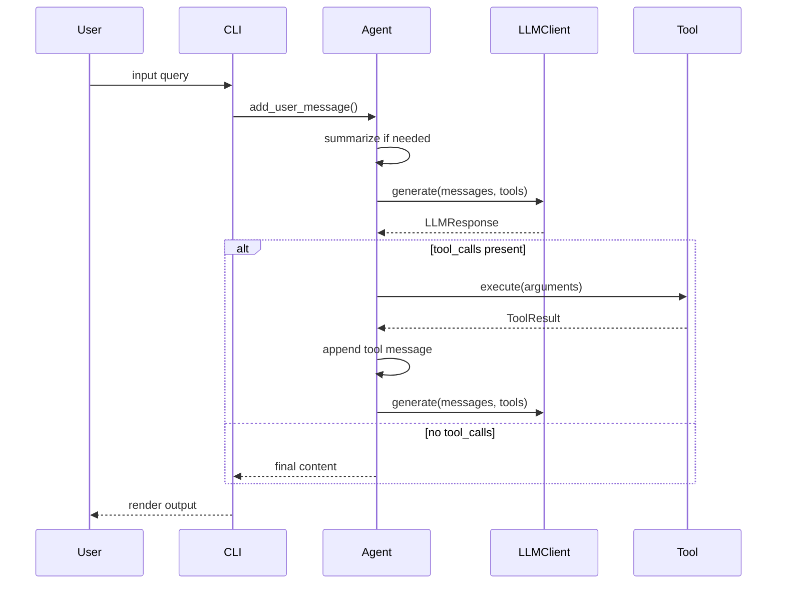
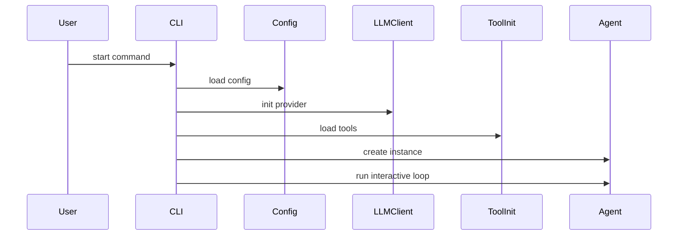
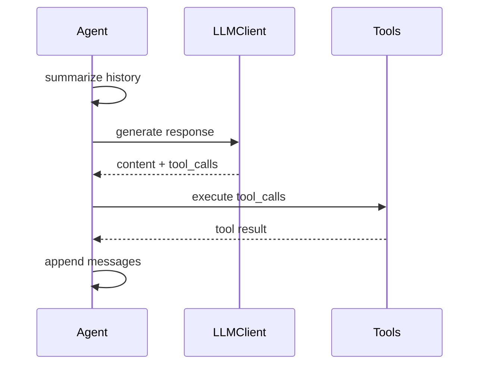
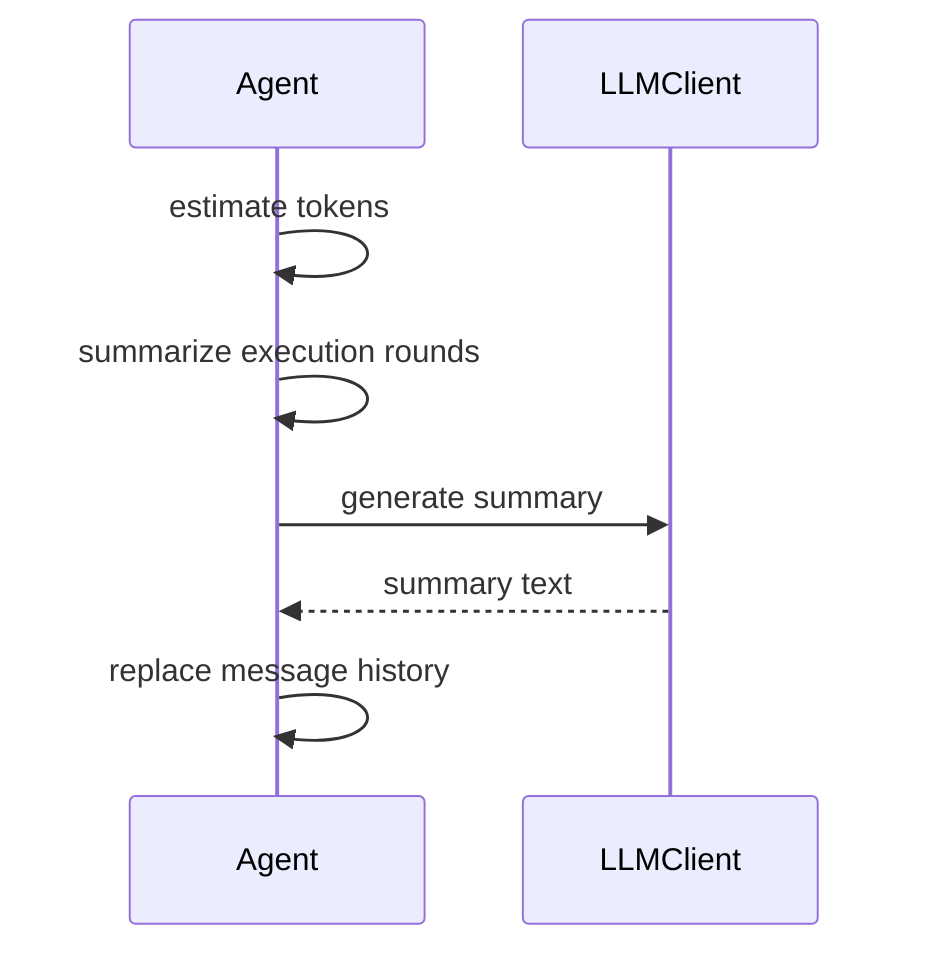
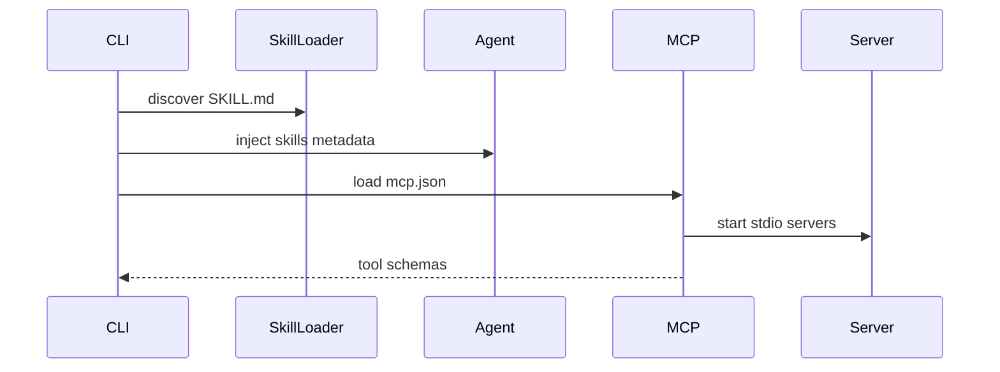
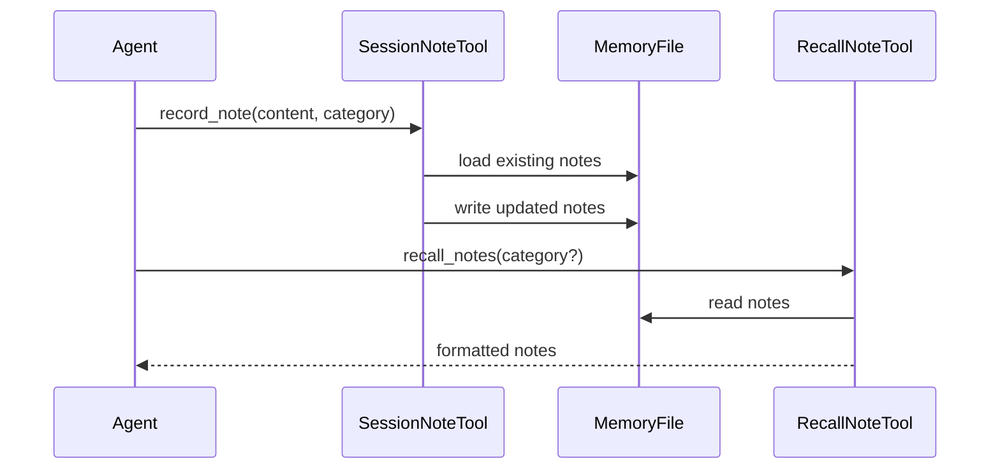

# 核心工作机制

## 端到端执行链路（从 Query 到结果）

### 概述
整体链路由 CLI 输入驱动，Agent 负责维护消息列表、触发摘要、调用 LLM、分发工具并回写工具结果，直到无工具调用为止。

### 时序图


### 详细步骤

#### 步骤1: 获取用户输入
**触发条件**: 交互式 CLI 读取输入

**核心代码**:
```python
# File: mini_agent/cli.py | Lines: 497-509 | Description: Read user input
# 10. Interactive loop
while True:
    try:
        # Get user input using prompt_toolkit
        # Use styled list for robust coloring
        user_input = await session.prompt_async(
            [
                ("class:prompt", "You"),
                ("", " › "),
            ],
            multiline=False,
            enable_history_search=True,
        )
        user_input = user_input.strip()
```

**数据流**: terminal input → user_input
**设计动机**: 使用 prompt_toolkit 并开启 history search，提升交互可用性与输入效率。

#### 步骤2: 交给 Agent 执行
**触发条件**: 非命令输入，进入正常对话

**核心代码**:
```python
# File: mini_agent/cli.py | Lines: 554-557 | Description: Delegate to Agent
# Run Agent
print(f"\n{Colors.BRIGHT_BLUE}Agent{Colors.RESET} {Colors.DIM}›{Colors.RESET} {Colors.DIM}Thinking...{Colors.RESET}\n")
agent.add_user_message(user_input)
_ = await agent.run()
```

**数据流**: user_input → messages[] → Agent.run()
**设计动机**: CLI 仅负责输入与委托，Agent 统一负责执行循环，降低交互层与核心逻辑的耦合。

#### 步骤3: 执行循环与摘要判定
**触发条件**: Agent.run() 每一步执行前

**核心代码**:
```python
# File: mini_agent/agent.py | Lines: 281-291 | Description: Run loop start and summarization
async def run(self) -> str:
    """Execute agent loop until task is complete or max steps reached."""
    # Start new run, initialize log file
    self.logger.start_new_run()
    print(f"{Colors.DIM}📝 Log file: {self.logger.get_log_file_path()}{Colors.RESET}")

    step = 0

    while step < self.max_steps:
        # Check and summarize message history to prevent context overflow
        await self._summarize_messages()
```

**数据流**: messages[] → summarize check → messages[] (可能被压缩)
**设计动机**: 在每步开始执行摘要判定，优先保证上下文不溢出，同时保留用户意图。

#### 步骤4: LLM 调用与响应写回
**触发条件**: 进入每一轮执行

**核心代码**:
```python
# File: mini_agent/agent.py | Lines: 303-310 | Description: LLM request
# Get tool list for LLM call
tool_list = list(self.tools.values())

# Log LLM request and call LLM with Tool objects directly
self.logger.log_request(messages=self.messages, tools=tool_list)

try:
    response = await self.llm.generate(messages=self.messages, tools=tool_list)
```

```python
# File: mini_agent/agent.py | Lines: 335-356 | Description: Append response and finish check
# Add assistant message
assistant_msg = Message(
    role="assistant",
    content=response.content,
    thinking=response.thinking,
    tool_calls=response.tool_calls,
)
self.messages.append(assistant_msg)

# Print assistant response
if response.content:
    print(f"\n{Colors.BOLD}{Colors.BRIGHT_BLUE}🤖 Assistant:{Colors.RESET}")
    print(f"{response.content}")

# Check if task is complete (no tool calls)
if not response.tool_calls:
    return response.content
```

**数据流**: messages + tools → LLMResponse → messages[]（assistant appended）
**设计动机**: 先记录请求再调用 LLM，形成可追溯请求链路；响应写回 messages 作为下一轮执行上下文。

#### 步骤5: 工具调用与结果回写
**触发条件**: response.tool_calls 非空

**核心代码**:
```python
# File: mini_agent/agent.py | Lines: 359-378 | Description: Tool call extraction
# Execute tool calls
for tool_call in response.tool_calls:
    tool_call_id = tool_call.id
    function_name = tool_call.function.name
    arguments = tool_call.function.arguments

    # Tool call header
    print(f"\n{Colors.BRIGHT_YELLOW}🔧 Tool Call:{Colors.RESET} {Colors.BOLD}{Colors.CYAN}{function_name}{Colors.RESET}")

    # Arguments (formatted display)
    print(f"{Colors.DIM}   Arguments:{Colors.RESET}")
    # Truncate each argument value to avoid overly long output
    truncated_args = {}
    for key, value in arguments.items():
        value_str = str(value)
        if len(value_str) > 200:
            truncated_args[key] = value_str[:200] + "..."
        else:
            truncated_args[key] = value
```

```python
# File: mini_agent/agent.py | Lines: 404-429 | Description: Tool result append
# Log tool execution result
self.logger.log_tool_result(
    tool_name=function_name,
    arguments=arguments,
    result_success=result.success,
    result_content=result.content if result.success else None,
    result_error=result.error if not result.success else None,
)

# Print result
if result.success:
    result_text = result.content
    if len(result_text) > 300:
        result_text = result_text[:300] + f"{Colors.DIM}...{Colors.RESET}"
    print(f"{Colors.BRIGHT_GREEN}✓ Result:{Colors.RESET} {result_text}")
else:
    print(f"{Colors.BRIGHT_RED}✗ Error:{Colors.RESET} {Colors.RED}{result.error}{Colors.RESET}")

# Add tool result message
tool_msg = Message(
    role="tool",
    content=result.content if result.success else f"Error: {result.error}",
    tool_call_id=tool_call_id,
    name=function_name,
)
self.messages.append(tool_msg)
```

**数据流**: ToolResult → messages[]（tool appended）→ 下一轮 LLM 调用
**设计动机**: 将工具输出以 `role=\"tool\"` 写回消息列表，确保 LLM 在下一轮可使用工具结果。

## 核心流程 #1: CLI 启动与运行时组装

### 概述
CLI 负责解析参数、确定工作目录、加载配置、初始化 LLM 与工具、注入系统提示词并创建 Agent，随后进入交互循环。

### 时序图


### 详细步骤

#### 步骤1: 解析 CLI 参数
**触发条件**: 运行 `mini-agent` 或 `python -m mini_agent.cli`

**核心代码**:
```python
# File: mini_agent/cli.py | Lines: 179-197 | Description: CLI argument parsing
def parse_args() -> argparse.Namespace:
    """Parse command line arguments

    Returns:
        Parsed arguments
    """
    parser = argparse.ArgumentParser(
        description="Mini Agent - AI assistant with file tools and MCP support",
        formatter_class=argparse.RawDescriptionHelpFormatter,
        epilog="""
Examples:
  mini-agent                              # Use current directory as workspace
  mini-agent --workspace /path/to/dir     # Use specific workspace directory
        """,
    )
    parser.add_argument(
        "--workspace",
        "-w",
        type=str,
        default=None,
        help="Workspace directory (default: current directory)",
    )
```

**数据流**: CLI 参数 → workspace_dir

**关键点**: 支持 `--workspace` 指定工作目录。

#### 步骤2: 加载配置
**触发条件**: 进入 `run_agent`

**核心代码**:
```python
# File: mini_agent/cli.py | Lines: 333-352 | Description: Config loading flow
# 1. Load configuration from package directory
config_path = Config.get_default_config_path()

if not config_path.exists():
    print(f"{Colors.RED}❌ Configuration file not found{Colors.RESET}")
    print()
    print(f"{Colors.BRIGHT_CYAN}📦 Configuration Search Path:{Colors.RESET}")
    print(f"  {Colors.DIM}1) mini_agent/config/config.yaml{Colors.RESET} (development)")
    print(f"  {Colors.DIM}2) ~/.mini-agent/config/config.yaml{Colors.RESET} (user)")
    print(f"  {Colors.DIM}3) <package>/config/config.yaml{Colors.RESET} (installed)")
    print()
    print(f"{Colors.BRIGHT_YELLOW}🚀 Quick Setup (Recommended):{Colors.RESET}")
    print(f"  {Colors.BRIGHT_GREEN}curl -fsSL https://raw.githubusercontent.com/MiniMax-AI/Mini-Agent/main/scripts/setup-config.sh | bash{Colors.RESET}")
    print()
    print(f"{Colors.DIM}  This will automatically:{Colors.RESET}")
    print(f"{Colors.DIM}    • Create ~/.mini-agent/config/{Colors.RESET}")
```

**数据流**: config.yaml → Config 对象

**关键点**: 缺失配置时直接返回并提示快速配置脚本。

#### 步骤3: 初始化 LLM 客户端
**触发条件**: 配置加载成功

**核心代码**:
```python
# File: mini_agent/cli.py | Lines: 373-402 | Description: LLM client initialization
# 2. Initialize LLM client
from mini_agent.retry import RetryConfig as RetryConfigBase

# Convert configuration format
retry_config = RetryConfigBase(
    enabled=config.llm.retry.enabled,
    max_retries=config.llm.retry.max_retries,
    initial_delay=config.llm.retry.initial_delay,
    max_delay=config.llm.retry.max_delay,
    exponential_base=config.llm.retry.exponential_base,
    retryable_exceptions=(Exception,),
)

# Convert provider string to LLMProvider enum
provider = LLMProvider.ANTHROPIC if config.llm.provider.lower() == "anthropic" else LLMProvider.OPENAI

llm_client = LLMClient(
    api_key=config.llm.api_key,
    provider=provider,
    api_base=config.llm.api_base,
    model=config.llm.model,
    retry_config=retry_config if config.llm.retry.enabled else None,
)
```

**数据流**: Config.llm → LLMClient

**关键点**: provider 决定 API 路径后缀。

#### 步骤4: 初始化工具与系统提示词
**触发条件**: LLM 初始化完成

**核心代码**:
```python
# File: mini_agent/cli.py | Lines: 409-430 | Description: Tool init and system prompt
# 3. Initialize base tools (independent of workspace)
tools, skill_loader = await initialize_base_tools(config)

# 4. Add workspace-dependent tools
add_workspace_tools(tools, config, workspace_dir)

# 5. Load System Prompt (with priority search)
system_prompt_path = Config.find_config_file(config.agent.system_prompt_path)
if system_prompt_path and system_prompt_path.exists():
    system_prompt = system_prompt_path.read_text(encoding="utf-8")
    print(f"{Colors.GREEN}✅ Loaded system prompt (from: {system_prompt_path}){Colors.RESET}")
else:
    system_prompt = "You are Mini-Agent, an intelligent assistant powered by MiniMax M2 that can help users complete various tasks."
    print(f"{Colors.YELLOW}⚠️  System prompt not found, using default{Colors.RESET}")

# 6. Inject Skills Metadata into System Prompt (Progressive Disclosure - Level 1)
if skill_loader:
    skills_metadata = skill_loader.get_skills_metadata_prompt()
    if skills_metadata:
        # Replace placeholder with actual metadata
        system_prompt = system_prompt.replace("{SKILLS_METADATA}", skills_metadata)
        print(f"{Colors.GREEN}✅ Injected {len(skill_loader.loaded_skills)} skills metadata into system prompt{Colors.RESET}")
```

**数据流**: Config.tools → Tools 列表；system_prompt.md → system_prompt

**关键点**: 技能元信息按需注入，避免全量加载。

### 异常处理
- 配置文件缺失：直接返回并提示脚本（见步骤2）。
- 配置解析失败：输出错误并退出。

### 设计亮点
- 工具分为 workspace 无关与相关两类，初始化顺序清晰。
- system prompt 支持按优先级搜索，便于本地/用户/安装包切换。

---

## 核心流程 #2: Agent 执行循环与工具调用

### 概述
Agent 在每步循环中进行消息摘要检查、调用 LLM 生成响应，并根据 tool_calls 执行工具与回写结果。

### 时序图


### 详细步骤

#### 步骤1: 摘要检查与 LLM 调用
**触发条件**: 每个 step 开始

**核心代码**:
```python
# File: mini_agent/agent.py | Lines: 289-321 | Description: Summarize and LLM call
while step < self.max_steps:
    # Check and summarize message history to prevent context overflow
    await self._summarize_messages()

    # Get tool list for LLM call
    tool_list = list(self.tools.values())

    # Log LLM request and call LLM with Tool objects directly
    self.logger.log_request(messages=self.messages, tools=tool_list)

    try:
        response = await self.llm.generate(messages=self.messages, tools=tool_list)
    except Exception as e:
        # Check if it's a retry exhausted error
        from .retry import RetryExhaustedError

        if isinstance(e, RetryExhaustedError):
            error_msg = f"LLM call failed after {e.attempts} retries
Last error: {str(e.last_exception)}"
            print(f"
{Colors.BRIGHT_RED}❌ Retry failed:{Colors.RESET} {error_msg}")
        else:
            error_msg = f"LLM call failed: {str(e)}"
            print(f"
{Colors.BRIGHT_RED}❌ Error:{Colors.RESET} {error_msg}")
        return error_msg
```

**数据流**: messages + tools → LLMResponse

**关键点**: LLM 调用失败直接返回错误字符串并结束循环。

#### 步骤2: 工具执行
**触发条件**: response.tool_calls 非空

**核心代码**:
```python
# File: mini_agent/agent.py | Lines: 359-378 | Description: Tool call execution and argument formatting
for tool_call in response.tool_calls:
    tool_call_id = tool_call.id
    function_name = tool_call.function.name
    arguments = tool_call.function.arguments

    # Tool call header
    print(f"
{Colors.BRIGHT_YELLOW}🔧 Tool Call:{Colors.RESET} {Colors.BOLD}{Colors.CYAN}{function_name}{Colors.RESET}")

    # Arguments (formatted display)
    print(f"{Colors.DIM}   Arguments:{Colors.RESET}")
    # Truncate each argument value to avoid overly long output
    truncated_args = {}
    for key, value in arguments.items():
        value_str = str(value)
        if len(value_str) > 200:
            truncated_args[key] = value_str[:200] + "..."
        else:
            truncated_args[key] = value
    args_json = json.dumps(truncated_args, indent=2, ensure_ascii=False)
```

**数据流**: tool_calls → ToolResult → Message(role="tool")

**关键点**: ToolResult 会被记录到日志并写入消息历史。

### 异常处理
- 工具不存在：返回 `Unknown tool` 错误。
- 工具执行异常：捕获 traceback 并包装为 ToolResult.error。

### 设计亮点
- 工具参数截断避免终端输出过长。
- ToolResult 成功/失败路径统一记录。

---

## 关键机制补充: 工具系统

### 概述
工具系统将 LLM 的意图落地为可执行动作，并通过 workspace 边界、行号输出和 ToolResult 约束保证操作可控与可追踪。

### 机制 #1: 文件读取（行号 + 截断 + workspace 解析）
**触发条件**: LLM 调用 read_file

**核心代码**:
```python
# File: mini_agent/tools/file_tools.py | Lines: 108-148 | Description: Read file with workspace resolution and line numbers
async def execute(self, path: str, offset: int | None = None, limit: int | None = None) -> ToolResult:
    """Execute read file."""
    try:
        file_path = Path(path)
        # Resolve relative paths relative to workspace_dir
        if not file_path.is_absolute():
            file_path = self.workspace_dir / file_path

        if not file_path.exists():
            return ToolResult(
                success=False,
                content="",
                error=f"File not found: {path}",
            )

        # Read file content with line numbers
        with open(file_path, encoding="utf-8") as f:
            lines = f.readlines()

        # Apply offset and limit
        start = (offset - 1) if offset else 0
        end = (start + limit) if limit else len(lines)
        if start < 0:
            start = 0
        if end > len(lines):
            end = len(lines)

        selected_lines = lines[start:end]

        # Format with line numbers (1-indexed)
        numbered_lines = []
        for i, line in enumerate(selected_lines, start=start + 1):
            # Remove trailing newline for formatting
            line_content = line.rstrip("\n")
            numbered_lines.append(f"{i:6d}|{line_content}")

        content = "\n".join(numbered_lines)

        # Apply token truncation if needed
        max_tokens = 32000
        content = truncate_text_by_tokens(content, max_tokens)
```

**数据流**: path → workspace resolve → lines[] → numbered content → token truncation

**设计动机**: 行号输出支持精确引用与后续编辑；workspace 统一解析相对路径，降低误读与越界风险；截断控制输出规模，避免上下文膨胀。

### 机制 #2: 文件写入与编辑（目录创建 + 精确替换）
**触发条件**: LLM 调用 write_file / edit_file

**核心代码**:
```python
# File: mini_agent/tools/file_tools.py | Lines: 195-207 | Description: Write file with workspace resolution and mkdir
async def execute(self, path: str, content: str) -> ToolResult:
    """Execute write file."""
    try:
        file_path = Path(path)
        # Resolve relative paths relative to workspace_dir
        if not file_path.is_absolute():
            file_path = self.workspace_dir / file_path

        # Create parent directories if they don't exist
        file_path.parent.mkdir(parents=True, exist_ok=True)

        file_path.write_text(content, encoding="utf-8")
        return ToolResult(success=True, content=f"Successfully wrote to {file_path}")
```

```python
# File: mini_agent/tools/file_tools.py | Lines: 256-281 | Description: Edit file with exact match replacement
async def execute(self, path: str, old_str: str, new_str: str) -> ToolResult:
    """Execute edit file."""
    try:
        file_path = Path(path)
        # Resolve relative paths relative to workspace_dir
        if not file_path.is_absolute():
            file_path = self.workspace_dir / file_path

        if not file_path.exists():
            return ToolResult(
                success=False,
                content="",
                error=f"File not found: {path}",
            )

        content = file_path.read_text(encoding="utf-8")

        if old_str not in content:
            return ToolResult(
                success=False,
                content="",
                error=f"Text not found in file: {old_str}",
            )

        new_content = content.replace(old_str, new_str)
        file_path.write_text(new_content, encoding="utf-8")
```

**数据流**: path + content → mkdir parents → write; path + old_str → exact match → replace → write

**设计动机**: 写入时自动创建目录，降低前置操作复杂度；编辑要求精确匹配，避免模糊替换带来的不可控改动。

### 机制 #3: Bash 长任务的后台执行与回收
**触发条件**: LLM 调用 bash(run_in_background=true) / bash_output / bash_kill

**核心代码**:
```python
# File: mini_agent/tools/bash_tool.py | Lines: 302-370 | Description: Background bash execution with bash_id
async def execute(
    self,
    command: str,
    timeout: int = 120,
    run_in_background: bool = False,
) -> ToolResult:
    """Execute shell command with optional background execution.

    Args:
        command: The shell command to execute
        timeout: Timeout in seconds (default: 120, max: 600)
        run_in_background: Set true to run command in background

    Returns:
        BashExecutionResult with command output and status
    """

    try:
        # Validate timeout
        if timeout > 600:
            timeout = 600
        elif timeout < 1:
            timeout = 120

        # Prepare shell-specific command execution
        if self.is_windows:
            # Windows: Use PowerShell with appropriate encoding
            shell_cmd = ["powershell.exe", "-NoProfile", "-Command", command]
        else:
            # Unix/Linux/macOS: Use bash
            shell_cmd = command

        if run_in_background:
            # Background execution: Create isolated process
            bash_id = str(uuid.uuid4())[:8]

            # Start background process with combined stdout/stderr
            if self.is_windows:
                process = await asyncio.create_subprocess_exec(
                    *shell_cmd,
                    stdout=asyncio.subprocess.PIPE,
                    stderr=asyncio.subprocess.STDOUT,
                )
            else:
                process = await asyncio.create_subprocess_shell(
                    shell_cmd,
                    stdout=asyncio.subprocess.PIPE,
                    stderr=asyncio.subprocess.STDOUT,
                )

            # Create background shell and add to manager
            bg_shell = BackgroundShell(bash_id=bash_id, command=command, process=process, start_time=time.time())
            BackgroundShellManager.add(bg_shell)

            # Start monitoring task
            await BackgroundShellManager.start_monitor(bash_id)

            # Return immediately with bash_id
            message = f"Command started in background. Use bash_output to monitor (bash_id='{bash_id}')."
            formatted_content = f"{message}

Command: {command}
Bash ID: {bash_id}"

            return BashOutputResult(
                success=True,
                content=formatted_content,
                stdout=f"Background command started with ID: {bash_id}",
                stderr="",
                exit_code=0,
                bash_id=bash_id,
            )
```

```python
# File: mini_agent/tools/bash_tool.py | Lines: 489-512 | Description: Read incremental output by bash_id
try:
    # Get background shell from manager
    bg_shell = BackgroundShellManager.get(bash_id)
    if not bg_shell:
        available_ids = BackgroundShellManager.get_available_ids()
        return BashOutputResult(
            success=False,
            error=f"Shell not found: {bash_id}. Available: {available_ids or 'none'}",
            stdout="",
            stderr="",
            exit_code=-1,
        )

    # Get new output
    new_lines = bg_shell.get_new_output(filter_pattern=filter_str)
    stdout = "
".join(new_lines) if new_lines else ""

    return BashOutputResult(
        success=True,
        stdout=stdout,
        stderr="",  # Background shells combine stdout/stderr
        exit_code=bg_shell.exit_code if bg_shell.exit_code is not None else 0,
        bash_id=bash_id,
    )
```

```python
# File: mini_agent/tools/bash_tool.py | Lines: 567-586 | Description: Terminate background bash by bash_id
try:
    # Get remaining output before termination
    bg_shell = BackgroundShellManager.get(bash_id)
    if bg_shell:
        remaining_lines = bg_shell.get_new_output()
    else:
        remaining_lines = []

    # Terminate through manager (handles all cleanup)
    bg_shell = await BackgroundShellManager.terminate(bash_id)

    # Get remaining output
    stdout = "
".join(remaining_lines) if remaining_lines else ""

    return BashOutputResult(
        success=True,
        stdout=stdout,
        stderr="",
        exit_code=bg_shell.exit_code if bg_shell.exit_code is not None else 0,
        bash_id=bash_id,
    )
```

**数据流**: command → bash_id → BackgroundShell → bash_output/kill → ToolResult

**设计动机**: 后台执行避免阻塞主对话；bash_output 返回增量输出，便于监控长任务；bash_kill 统一回收资源，避免僵尸进程。

### 设计亮点
- **一致性**: 工具统一以 ToolResult 返回结果，便于在消息循环中处理成功/失败路径。
- **可控性**: workspace 作为边界、bash_id 作为关联键，增强工具调用的可追踪性。
- **可维护性**: 工具职责清晰、约束显式，便于扩展与替换实现。

更多工具清单与行为备份见 `12-tools-design.md`。

---

## 核心流程 #3: 消息摘要机制

### 概述
当消息 token 数超过限制时，Agent 自动将用户之间的执行过程进行摘要，保留用户意图并压缩上下文。

### 时序图


### 详细步骤

#### 步骤1: Token 阈值与 workspace 注入
**触发条件**: Agent 初始化

**核心代码**:
```python
# File: mini_agent/agent.py | Lines: 45-67 | Description: Token limit and workspace injection
def __init__(
    self,
    llm_client: LLMClient,
    system_prompt: str,
    tools: list[Tool],
    max_steps: int = 50,
    workspace_dir: str = "./workspace",
    token_limit: int = 80000,  # Summary triggered when tokens exceed this value
):
    self.llm = llm_client
    self.tools = {tool.name: tool for tool in tools}
    self.max_steps = max_steps
    self.token_limit = token_limit
    self.workspace_dir = Path(workspace_dir)

    # Ensure workspace exists
    self.workspace_dir.mkdir(parents=True, exist_ok=True)

    # Inject workspace information into system prompt if not already present
    if "Current Workspace" not in system_prompt:
        workspace_info = f"

## Current Workspace
You are currently working in: `{self.workspace_dir.absolute()}`
All relative paths will be resolved relative to this directory."
        system_prompt = system_prompt + workspace_info
```

#### 步骤2: 触发摘要与消息重构
**触发条件**: token 超过阈值

**核心代码**:
```python
# File: mini_agent/agent.py | Lines: 142-160 | Description: Summarization trigger check
async def _summarize_messages(self):
    """Message history summarization: summarize conversations between user messages when tokens exceed limit

    Strategy (Agent mode):
    - Keep all user messages (these are user intents)
    - Summarize content between each user-user pair (agent execution process)
    - If last round is still executing (has agent/tool messages but no next user), also summarize
    - Structure: system -> user1 -> summary1 -> user2 -> summary2 -> user3 -> summary3 (if executing)
    """
    # Skip check if we just completed a summary (wait for next LLM call to update api_total_tokens)
    if self._skip_next_token_check:
        self._skip_next_token_check = False
        return

    estimated_tokens = self._estimate_tokens()
```

#### 步骤3: 生成摘要文本
**触发条件**: 需要为执行过程生成摘要

**核心代码**:
```python
# File: mini_agent/agent.py | Lines: 261-270 | Description: Summary generation call
summary_msg = Message(role="user", content=summary_prompt)
response = await self.llm.generate(
    messages=[
        Message(
            role="system",
            content="You are an assistant skilled at summarizing Agent execution processes.",
        ),
        summary_msg,
    ]
)
```

### 异常处理
- 摘要生成失败：回退为简单文本摘要（见 `_create_summary` 异常处理分支）。

### 设计亮点
- 摘要只替换执行过程，不丢失用户输入。
- token 估算与 API usage 双重触发。

---

## 核心流程 #4: Skills 与 MCP 加载

### 概述
Skills 与 MCP 工具在启动时被加载为可用工具集合，Skills 采用 Progressive Disclosure，MCP 通过 stdio 启动外部服务器。

### 时序图


### 详细步骤

#### 步骤1: Skills 发现与工具注入
**触发条件**: initialize_base_tools

**核心代码**:
```python
# File: mini_agent/tools/skill_tool.py | Lines: 57-83 | Description: Skill tool creation
def create_skill_tools(
    skills_dir: str = "./skills",
) -> tuple[List[Tool], Optional[SkillLoader]]:
    """
    Create skill tool for Progressive Disclosure

    Only provides get_skill tool - the agent uses metadata in system prompt
    to know what skills are available, then loads them on-demand.
    """
    # Create skill loader
    loader = SkillLoader(skills_dir)

    # Discover and load skills
    skills = loader.discover_skills()
    print(f"✅ Discovered {len(skills)} Claude Skills")

    # Create only the get_skill tool (Progressive Disclosure Level 2)
    tools = [
        GetSkillTool(loader),
    ]

    return tools, loader
```

#### 步骤2: Skills 元信息注入
**触发条件**: skill_loader 不为空

**核心代码**:
```python
# File: mini_agent/cli.py | Lines: 424-430 | Description: Skills metadata injection
if skill_loader:
    skills_metadata = skill_loader.get_skills_metadata_prompt()
    if skills_metadata:
        # Replace placeholder with actual metadata
        system_prompt = system_prompt.replace("{SKILLS_METADATA}", skills_metadata)
        print(f"{Colors.GREEN}✅ Injected {len(skill_loader.loaded_skills)} skills metadata into system prompt{Colors.RESET}")
```

#### 步骤3: MCP 工具加载
**触发条件**: enable_mcp 为 true

**核心代码**:
```python
# File: mini_agent/tools/mcp_loader.py | Lines: 154-170 | Description: MCP tools loading entry
async def load_mcp_tools_async(config_path: str = "mcp.json") -> list[Tool]:
    """
    Load MCP tools from config file.

    This function:
    1. Reads the MCP config file
    2. Starts MCP server processes
    3. Connects to each server
    4. Fetches tool definitions
    5. Wraps them as Tool objects
    """
    global _mcp_connections

    config_file = Path(config_path)

    if not config_file.exists():
        print(f"MCP config not found: {config_path}")
        return []
```

```python
# File: mini_agent/tools/mcp_loader.py | Lines: 192-210 | Description: MCP server connection loop
for server_name, server_config in mcp_servers.items():
    if server_config.get("disabled", False):
        print(f"Skipping disabled server: {server_name}")
        continue

    command = server_config.get("command")
    args = server_config.get("args", [])
    env = server_config.get("env", {})

    if not command:
        print(f"No command specified for server: {server_name}")
        continue

    connection = MCPServerConnection(server_name, command, args, env)
    success = await connection.connect()

    if success:
        _mcp_connections.append(connection)
        all_tools.extend(connection.tools)
```

### 异常处理
- Skills 加载失败：打印警告并继续启动。
- MCP 连接失败：捕获异常并继续加载其他 server。

### 设计亮点
- Skills 与 MCP 均可在配置中开关，方便裁剪能力。
- MCP 使用 AsyncExitStack 保证连接生命周期可控。

---

## 核心流程 #5: Session Note 记忆持久化

### 概述
SessionNoteTool 将记忆以 JSON 形式写入 workspace，RecallNoteTool 负责读取与格式化展示。

### 时序图


### 详细步骤

#### 步骤1: 记录记忆
**触发条件**: LLM 调用 record_note

**核心代码**:
```python
# File: mini_agent/tools/note_tool.py | Lines: 91-119 | Description: Record session note
async def execute(self, content: str, category: str = "general") -> ToolResult:
    """Record a session note.

    Args:
        content: The information to record
        category: Category/tag for this note

    Returns:
        ToolResult with success status
    """
    try:
        # Load existing notes
        notes = self._load_from_file()

        # Add new note with timestamp
        note = {
            "timestamp": datetime.now().isoformat(),
            "category": category,
            "content": content,
        }
        notes.append(note)

        # Save back to file
        self._save_to_file(notes)

        return ToolResult(
            success=True,
            content=f"Recorded note: {content} (category: {category})",
        )
```

**数据流**: content/category → notes[] → .agent_memory.json

**关键点**: 仅在需要记录时写入文件，避免无谓 IO。

#### 步骤2: 召回记忆
**触发条件**: LLM 调用 recall_notes

**核心代码**:
```python
# File: mini_agent/tools/note_tool.py | Lines: 163-206 | Description: Recall session notes
async def execute(self, category: str = None) -> ToolResult:
    """Recall session notes.

    Args:
        category: Optional category filter

    Returns:
        ToolResult with notes content
    """
    try:
        if not self.memory_file.exists():
            return ToolResult(
                success=True,
                content="No notes recorded yet.",
            )

        notes = json.loads(self.memory_file.read_text())

        if not notes:
            return ToolResult(
                success=True,
                content="No notes recorded yet.",
            )

        # Filter by category if specified
        if category:
            notes = [n for n in notes if n.get("category") == category]
            if not notes:
                return ToolResult(
                    success=True,
                    content=f"No notes found in category: {category}",
                )

        # Format notes for display
        formatted = []
        for idx, note in enumerate(notes, 1):
            timestamp = note.get("timestamp", "unknown time")
            cat = note.get("category", "general")
            content = note.get("content", "")
            formatted.append(f"{idx}. [{cat}] {content}\n   (recorded at {timestamp})")

        result = "Recorded Notes:\n" + "\n".join(formatted)

        return ToolResult(success=True, content=result)
```

**数据流**: .agent_memory.json → filter(category) → formatted string

### 异常处理
- 文件不存在或解析失败时返回空结果提示，不中断主流程。

### 设计亮点
- lazy loading 与延迟创建文件，避免无用文件占用。
- 通过 category 支持简单分类检索。
