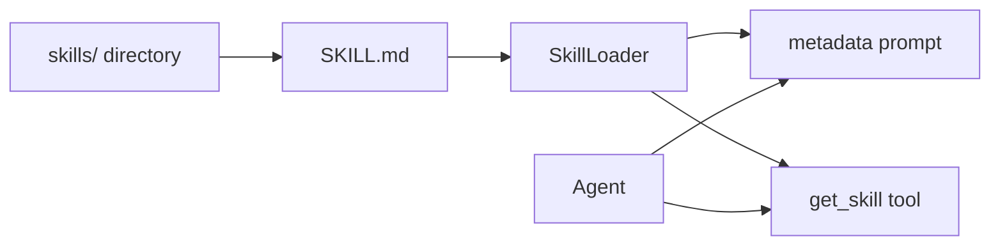

# Skills 子模块与加载机制

## 子模块定位
Skills 来自 git submodule，并作为 `mini_agent/skills` 目录被加载。

```ini
# File: .gitmodules | Lines: 1-3 | Description: Skills submodule definition
[submodule "mini_agent/skills"]
	path = mini_agent/skills
	url = https://github.com/anthropics/skills.git
```

## Skills 仓库说明（子模块 README）
子模块 README 说明了该仓库用途与许可范围，尤其强调 document-skills 的来源与维护状态。

```markdown
# File: mini_agent/skills/README.md | Lines: 10-18 | Description: Skills repository scope
# About This Repository

This repository contains example skills that demonstrate what's possible with Claude's skills system. These examples range from creative applications (art, music, design) to technical tasks (testing web apps, MCP server generation) to enterprise workflows (communications, branding, etc.).

Each skill is self-contained in its own directory with a `SKILL.md` file containing the instructions and metadata that Claude uses. Browse through these examples to get inspiration for your own skills or to understand different patterns and approaches.

The example skills in this repo are open source (Apache 2.0). We've also included the document creation & editing skills that power [Claude's document capabilities](https://www.anthropic.com/news/create-files) under the hood in the [`document-skills/`](./document-skills/) folder. These are source-available, not open source, but we wanted to share these with developers as a reference for more complex skills that are actively used in a production AI application.
```

```markdown
# File: mini_agent/skills/README.md | Lines: 26-45 | Description: Example skill categories
# Example Skills

This repository includes a diverse collection of example skills demonstrating different capabilities:

## Creative & Design
- **algorithmic-art** - Create generative art using p5.js with seeded randomness, flow fields, and particle systems
- **canvas-design** - Design beautiful visual art in .png and .pdf formats using design philosophies
- **slack-gif-creator** - Create animated GIFs optimized for Slack's size constraints

## Development & Technical
- **artifacts-builder** - Build complex claude.ai HTML artifacts using React, Tailwind CSS, and shadcn/ui components
- **mcp-server** - Guide for creating high-quality MCP servers to integrate external APIs and services
- **webapp-testing** - Test local web applications using Playwright for UI verification and debugging

## Enterprise & Communication
- **brand-guidelines** - Apply Anthropic's official brand colors and typography to artifacts
- **internal-comms** - Write internal communications like status reports, newsletters, and FAQs
- **theme-factory** - Style artifacts with 10 pre-set professional themes or generate custom themes on-the-fly

## Meta Skills
- **skill-creator** - Guide for creating effective skills that extend Claude's capabilities
- **template-skill** - A basic template to use as a starting point for new skills
```

```markdown
# File: mini_agent/skills/README.md | Lines: 47-56 | Description: Document skills and disclaimer
# Document Skills

The `document-skills/` subdirectory contains skills that Anthropic developed to help Claude create various document file formats. These skills demonstrate advanced patterns for working with complex file formats and binary data:

- **docx** - Create, edit, and analyze Word documents with support for tracked changes, comments, formatting preservation, and text extraction
- **pdf** - Comprehensive PDF manipulation toolkit for extracting text and tables, creating new PDFs, merging/splitting documents, and handling forms
- **pptx** - Create, edit, and analyze PowerPoint presentations with support for layouts, templates, charts, and automated slide generation
- **xlsx** - Create, edit, and analyze Excel spreadsheets with support for formulas, formatting, data analysis, and visualization

**Important Disclaimer:** These document skills are point-in-time snapshots and are not actively maintained or updated. Versions of these skills ship pre-included with Claude. They are primarily intended as reference examples to illustrate how Anthropic approaches developing more complex skills that work with binary file formats and document structures.
```

## Skill 结构与 SKILL.md 规范
Skill 规范定义在 `agent_skills_spec.md`，并以 `SKILL.md` 为唯一入口。

```markdown
# File: mini_agent/skills/agent_skills_spec.md | Lines: 1-39 | Description: Skill structure and YAML frontmatter rules
# Agent Skills Spec

A skill is a folder of instructions, scripts, and resources that agents can discover and load dynamically to perform better at specific tasks. In order for the folder to be recognized as a skill, it must contain a `SKILL.md` file. 

# Skill Folder Layout

A minimal skill folder looks like this: 

```
my-skill/
  - SKILL.md
```

More complex skills can add additional directories and files as needed.


# The SKILL.md file

The skill's "entrypoint" is the `SKILL.md` file. It is the only file required to exist. The file must start with a YAML frontmatter followed by regular Markdown. 

## YAML Frontmatter

The YAML frontmatter has 2 required properties:

- `name`
    - The name of the skill in hyphen-case
    - Restricted to lowercase Unicode alphanumeric + hyphen
    - Must match the name of the directory containing the SKILL.md
- `description` 
    - Description of what the skill does and when Claude should use it

There are 3 optional properties:

- `license`
    - The license applied to the skill
    - We recommend keeping it short (either the name of a license or the name of a bundled license file)
- `allowed-tools` 
    - A list of tools that are pre-approved to run
    - Currently only supported in Claude Code
```

SKILL.md 的最小示例如下：

```markdown
# File: mini_agent/skills/template-skill/SKILL.md | Lines: 1-6 | Description: Minimal SKILL.md example
---
name: template-skill
description: Replace with description of the skill and when Claude should use it.
---

# Insert instructions below
```

## 加载流程与 Progressive Disclosure
Mini-Agent 通过 `create_skill_tools` 和 `SkillLoader` 完成技能发现与按需加载。

```python
# File: mini_agent/tools/skill_tool.py | Lines: 57-83 | Description: Skill tool creation
def create_skill_tools(
    skills_dir: str = "./skills",
) -> tuple[List[Tool], Optional[SkillLoader]]:
    """
    Create skill tool for Progressive Disclosure

    Only provides get_skill tool - the agent uses metadata in system prompt
    to know what skills are available, then loads them on-demand.

    Args:
        skills_dir: Skills directory path

    Returns:
        Tuple of (list of tools, skill loader)
    """
    # Create skill loader
    loader = SkillLoader(skills_dir)

    # Discover and load skills
    skills = loader.discover_skills()
    print(f"✅ Discovered {len(skills)} Claude Skills")

    # Create only the get_skill tool (Progressive Disclosure Level 2)
    tools = [
        GetSkillTool(loader),
    ]

    return tools, loader
```

```python
# File: mini_agent/tools/skill_loader.py | Lines: 63-104 | Description: SKILL.md parsing and Skill creation
try:
    content = skill_path.read_text(encoding="utf-8")

    # Parse YAML frontmatter
    frontmatter_match = re.match(r"^---\n(.*?)\n---\n(.*)$", content, re.DOTALL)

    if not frontmatter_match:
        print(f"⚠️  {skill_path} missing YAML frontmatter")
        return None

    frontmatter_text = frontmatter_match.group(1)
    skill_content = frontmatter_match.group(2).strip()

    # Parse YAML
    try:
        frontmatter = yaml.safe_load(frontmatter_text)
    except yaml.YAMLError as e:
        print(f"❌ Failed to parse YAML frontmatter: {e}")
        return None

    # Required fields
    if "name" not in frontmatter or "description" not in frontmatter:
        print(f"⚠️  {skill_path} missing required fields (name or description)")
        return None

    # Get skill directory (parent of SKILL.md)
    skill_dir = skill_path.parent

    # Replace relative paths in content with absolute paths
    # This ensures scripts and resources can be found from any working directory
    processed_content = self._process_skill_paths(skill_content, skill_dir)

    # Create Skill object
    skill = Skill(
        name=frontmatter["name"],
        description=frontmatter["description"],
        content=processed_content,
        license=frontmatter.get("license"),
        allowed_tools=frontmatter.get("allowed-tools"),
        metadata=frontmatter.get("metadata"),
        skill_path=skill_path,
    )
```

```python
# File: mini_agent/tools/skill_loader.py | Lines: 186-206 | Description: Discover all SKILL.md files
skills = []

if not self.skills_dir.exists():
    print(f"⚠️  Skills directory does not exist: {self.skills_dir}")
    return skills

# Recursively find all SKILL.md files
for skill_file in self.skills_dir.rglob("SKILL.md"):
    skill = self.load_skill(skill_file)
    if skill:
        skills.append(skill)
        self.loaded_skills[skill.name] = skill

return skills
```

```python
# File: mini_agent/tools/skill_loader.py | Lines: 229-247 | Description: Metadata-only prompt generation
def get_skills_metadata_prompt(self) -> str:
    """
    Generate prompt containing ONLY metadata (name + description) for all skills.
    This implements Progressive Disclosure - Level 1.

    Returns:
        Metadata-only prompt string
    """
    if not self.loaded_skills:
        return ""

    prompt_parts = ["## Available Skills\n"]
    prompt_parts.append("You have access to specialized skills. Each skill provides expert guidance for specific tasks.\n")
    prompt_parts.append("Load a skill's full content using the appropriate skill tool when needed.\n")

    # List all skills with their descriptions
    for skill in self.loaded_skills.values():
        prompt_parts.append(f"- `{skill.name}`: {skill.description}")
```

## 设计动机与收益
- **Progressive Disclosure 减少初始上下文**：仅注入技能元信息，完整内容由 `get_skill` 按需加载，降低一次性 prompt 负担。
- **元数据规范化**：通过 YAML frontmatter 强制 `name/description`，保证可检索与可展示性。
- **资源路径可解析**：将相对路径替换为绝对路径，确保脚本/模板在任意工作目录下可被读取。

## 关键证据
```python
# File: mini_agent/tools/skill_loader.py | Lines: 63-104 | Description: Required YAML frontmatter and Skill creation
try:
    content = skill_path.read_text(encoding="utf-8")

    # Parse YAML frontmatter
    frontmatter_match = re.match(r"^---\n(.*?)\n---\n(.*)$", content, re.DOTALL)

    if not frontmatter_match:
        print(f"⚠️  {skill_path} missing YAML frontmatter")
        return None

    frontmatter_text = frontmatter_match.group(1)
    skill_content = frontmatter_match.group(2).strip()

    # Parse YAML
    try:
        frontmatter = yaml.safe_load(frontmatter_text)
    except yaml.YAMLError as e:
        print(f"❌ Failed to parse YAML frontmatter: {e}")
        return None

    # Required fields
    if "name" not in frontmatter or "description" not in frontmatter:
        print(f"⚠️  {skill_path} missing required fields (name or description)")
        return None
```

```python
# File: mini_agent/tools/skill_loader.py | Lines: 112-139 | Description: Path processing for resources
def _process_skill_paths(self, content: str, skill_dir: Path) -> str:
    """
    Process skill content to replace relative paths with absolute paths.

    Supports Progressive Disclosure Level 3+: converts relative file references
    to absolute paths so Agent can easily read nested resources.

    Args:
        content: Original skill content
        skill_dir: Skill directory path

    Returns:
        Processed content with absolute paths
    """
    import re

    # Pattern 1: Directory-based paths (scripts/, examples/, templates/, reference/)
    def replace_dir_path(match):
        prefix = match.group(1)  # e.g., "python " or "`"
        rel_path = match.group(2)  # e.g., "scripts/with_server.py"

        abs_path = skill_dir / rel_path
        if abs_path.exists():
            return f"{prefix}{abs_path}"
        return match.group(0)
```

## 路径处理与资源引用
SkillLoader 会将技能内容中引用的相对路径转换为绝对路径，便于加载 scripts/templates 等资源。

```python
# File: mini_agent/tools/skill_loader.py | Lines: 112-139 | Description: Replace relative skill paths
def _process_skill_paths(self, content: str, skill_dir: Path) -> str:
    """
    Process skill content to replace relative paths with absolute paths.

    Supports Progressive Disclosure Level 3+: converts relative file references
    to absolute paths so Agent can easily read nested resources.

    Args:
        content: Original skill content
        skill_dir: Skill directory path

    Returns:
        Processed content with absolute paths
    """
    import re

    # Pattern 1: Directory-based paths (scripts/, examples/, templates/, reference/)
    def replace_dir_path(match):
        prefix = match.group(1)  # e.g., "python " or "`"
        rel_path = match.group(2)  # e.g., "scripts/with_server.py"

        abs_path = skill_dir / rel_path
        if abs_path.exists():
            return f"{prefix}{abs_path}"
        return match.group(0)

    pattern_dirs = r"(python\s+|`)((?:scripts|examples|templates|reference)/[^\s`\)]+)"
    content = re.sub(pattern_dirs, replace_dir_path, content)
```

## 加载流程示意


## 注意事项
- Skills 子模块内容属于外部仓库，更新需同步 submodule。
- document-skills 标注为 snapshot，可能存在维护与版本差异，需谨慎依赖。
