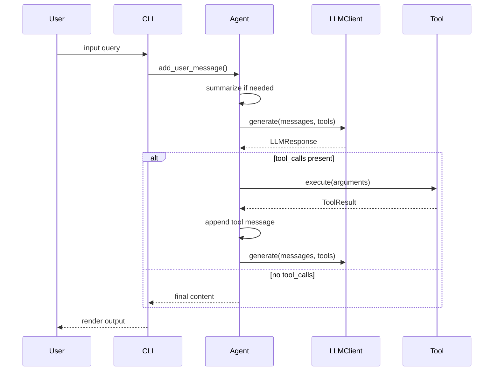

# 端到端数据流与执行链路

## 文档目标
本文件聚焦“从用户输入 query 到最终输出”的完整链路，给出数据流走向、核心数据结构与关键设计动机，便于快速理解整体运行机制。

## 宏观数据流（全景）


## 核心数据结构与角色
### Message / ToolCall / LLMResponse
消息与工具调用是 LLM 交互的统一载体，包含 role、content、thinking 与 tool_calls 等字段。

```python
# File: mini_agent/schema/schema.py | Lines: 14-55 | Description: Message and response models
class FunctionCall(BaseModel):
    """Function call details."""

    name: str
    arguments: dict[str, Any]  # Function arguments as dict


class ToolCall(BaseModel):
    """Tool call structure."""

    id: str
    type: str  # "function"
    function: FunctionCall


class Message(BaseModel):
    """Chat message."""

    role: str  # "system", "user", "assistant", "tool"
    content: str | list[dict[str, Any]]  # Can be string or list of content blocks
    thinking: str | None = None  # Extended thinking content for assistant messages
    tool_calls: list[ToolCall] | None = None
    tool_call_id: str | None = None
    name: str | None = None  # For tool role


class LLMResponse(BaseModel):
    """LLM response."""

    content: str
    thinking: str | None = None  # Extended thinking blocks
    tool_calls: list[ToolCall] | None = None
    finish_reason: str
    usage: TokenUsage | None = None  # Token usage from API response
```

### Tool / ToolResult
工具调用返回统一的结构，便于日志与消息回写。

```python
# File: mini_agent/tools/base.py | Lines: 8-44 | Description: Tool and ToolResult
class ToolResult(BaseModel):
    """Tool execution result."""

    success: bool
    content: str = ""
    error: str | None = None


class Tool:
    """Base class for all tools."""

    @property
    def name(self) -> str:
        """Tool name."""
        raise NotImplementedError

    @property
    def description(self) -> str:
        """Tool description."""
        raise NotImplementedError

    @property
    def parameters(self) -> dict[str, Any]:
        """Tool parameters schema (JSON Schema format)."""
        raise NotImplementedError

    async def execute(self, *args, **kwargs) -> ToolResult:  # type: ignore
        """Execute the tool with arbitrary arguments."""
        raise NotImplementedError

    def to_schema(self) -> dict[str, Any]:
        """Convert tool to Anthropic tool schema."""
        return {
            "name": self.name,
            "description": self.description,
            "input_schema": self.parameters,
        }
```

## 端到端执行步骤（从输入到输出）

### 步骤1：CLI 获取用户输入
**数据流**: terminal → user_input

```python
# File: mini_agent/cli.py | Lines: 497-509 | Description: Read user input
# 10. Interactive loop
while True:
    try:
        # Get user input using prompt_toolkit
        # Use styled list for robust coloring
        user_input = await session.prompt_async(
            [
                ("class:prompt", "You"),
                ("", " › "),
            ],
            multiline=False,
            enable_history_search=True,
        )
        user_input = user_input.strip()
```

### 步骤2：写入消息并触发 Agent
**数据流**: user_input → messages[] → Agent.run()

```python
# File: mini_agent/cli.py | Lines: 554-557 | Description: Delegate to Agent
# Run Agent
print(f"\n{Colors.BRIGHT_BLUE}Agent{Colors.RESET} {Colors.DIM}›{Colors.RESET} {Colors.DIM}Thinking...{Colors.RESET}\n")
agent.add_user_message(user_input)
_ = await agent.run()
```

```python
# File: mini_agent/agent.py | Lines: 81-83 | Description: Add user message
def add_user_message(self, content: str):
    """Add a user message to history."""
    self.messages.append(Message(role="user", content=content))
```

### 步骤3：Agent 初始化与工作区注入
**数据流**: config → system_prompt + workspace info → messages[]

```python
# File: mini_agent/agent.py | Lines: 45-71 | Description: Workspace injection
def __init__(
    self,
    llm_client: LLMClient,
    system_prompt: str,
    tools: list[Tool],
    max_steps: int = 50,
    workspace_dir: str = "./workspace",
    token_limit: int = 80000,  # Summary triggered when tokens exceed this value
):
    self.llm = llm_client
    self.tools = {tool.name: tool for tool in tools}
    self.max_steps = max_steps
    self.token_limit = token_limit
    self.workspace_dir = Path(workspace_dir)

    # Ensure workspace exists
    self.workspace_dir.mkdir(parents=True, exist_ok=True)

    # Inject workspace information into system prompt if not already present
    if "Current Workspace" not in system_prompt:
        workspace_info = f"\n\n## Current Workspace\nYou are currently working in: `{self.workspace_dir.absolute()}`\nAll relative paths will be resolved relative to this directory."
        system_prompt = system_prompt + workspace_info

    self.system_prompt = system_prompt

    # Initialize message history
    self.messages: list[Message] = [Message(role="system", content=system_prompt)]
```

### 步骤4：执行循环与摘要判定
**数据流**: messages[] → summarize check → messages[]（可能被压缩）

```python
# File: mini_agent/agent.py | Lines: 281-291 | Description: Run loop start and summarization
async def run(self) -> str:
    """Execute agent loop until task is complete or max steps reached."""
    # Start new run, initialize log file
    self.logger.start_new_run()
    print(f"{Colors.DIM}📝 Log file: {self.logger.get_log_file_path()}{Colors.RESET}")

    step = 0

    while step < self.max_steps:
        # Check and summarize message history to prevent context overflow
        await self._summarize_messages()
```

```python
# File: mini_agent/agent.py | Lines: 142-154 | Description: Summarization trigger rules
async def _summarize_messages(self):
    """Message history summarization: summarize conversations between user messages when tokens exceed limit

    Strategy (Agent mode):
    - Keep all user messages (these are user intents)
    - Summarize content between each user-user pair (agent execution process)
    - If last round is still executing (has agent/tool messages but no next user), also summarize
    - Structure: system -> user1 -> summary1 -> user2 -> summary2 -> user3 -> summary3 (if executing)

    Summary is triggered when EITHER:
    - Local token estimation exceeds limit
    - API reported total_tokens exceeds limit
    """
```

### 步骤5：LLM 调用与响应写回
**数据流**: messages + tools → LLMResponse → messages[]

```python
# File: mini_agent/agent.py | Lines: 303-310 | Description: LLM request
# Get tool list for LLM call
tool_list = list(self.tools.values())

# Log LLM request and call LLM with Tool objects directly
self.logger.log_request(messages=self.messages, tools=tool_list)

try:
    response = await self.llm.generate(messages=self.messages, tools=tool_list)
```

```python
# File: mini_agent/agent.py | Lines: 335-356 | Description: Append response and finish check
# Add assistant message
assistant_msg = Message(
    role="assistant",
    content=response.content,
    thinking=response.thinking,
    tool_calls=response.tool_calls,
)
self.messages.append(assistant_msg)

# Print assistant response
if response.content:
    print(f"\n{Colors.BOLD}{Colors.BRIGHT_BLUE}🤖 Assistant:{Colors.RESET}")
    print(f"{response.content}")

# Check if task is complete (no tool calls)
if not response.tool_calls:
    return response.content
```

### 步骤6：工具调用与结果回写
**数据流**: ToolResult → messages[]（tool appended）→ 下一轮 LLM 调用

```python
# File: mini_agent/agent.py | Lines: 404-429 | Description: Tool result append
# Log tool execution result
self.logger.log_tool_result(
    tool_name=function_name,
    arguments=arguments,
    result_success=result.success,
    result_content=result.content if result.success else None,
    result_error=result.error if not result.success else None,
)

# Print result
if result.success:
    result_text = result.content
    if len(result_text) > 300:
        result_text = result_text[:300] + f"{Colors.DIM}...{Colors.RESET}"
    print(f"{Colors.BRIGHT_GREEN}✓ Result:{Colors.RESET} {result_text}")
else:
    print(f"{Colors.BRIGHT_RED}✗ Error:{Colors.RESET} {Colors.RED}{result.error}{Colors.RESET}")

# Add tool result message
tool_msg = Message(
    role="tool",
    content=result.content if result.success else f"Error: {result.error}",
    tool_call_id=tool_call_id,
    name=function_name,
)
self.messages.append(tool_msg)
```

### 步骤7：终止条件
**数据流**: response.content → CLI output；或 max_steps 触发终止

```python
# File: mini_agent/agent.py | Lines: 433-435 | Description: Max steps reached
# Max steps reached
error_msg = f"Task couldn't be completed after {self.max_steps} steps."
print(f"\n{Colors.BRIGHT_YELLOW}⚠️  {error_msg}{Colors.RESET}")
```

## 关键设计选择与收益
- **消息列表作为唯一上下文载体**：`messages` 统一承载用户输入、LLM 输出、工具结果，确保每轮调用的上下文可追溯。
- **摘要与 token 双重触发**：既使用本地估算，也使用 API 统计，减少上下文溢出的偶发性。
- **工具结果回写**：ToolResult 作为 `role="tool"` 消息写回，保证下一轮 LLM 能“看到”工具输出。
- **workspace 注入**：系统提示词显式写入工作目录，降低 LLM 路径歧义。
- **结构化日志**：请求/响应/工具结果统一落盘，便于复盘与调试（详见 `docs/03-architecture.md` 与 `docs/07-development-guide.md`）。

## 全链路数据流摘要表
| 阶段 | 输入 | 输出 | 关键结构 |
| --- | --- | --- | --- |
| CLI 输入 | terminal text | user_input | str |
| 入队消息 | user_input | messages[] | Message(role="user") |
| LLM 调用 | messages + tools | LLMResponse | Message/ToolCall |
| 工具执行 | tool_calls | ToolResult | ToolResult |
| 结果回写 | ToolResult | messages[] | Message(role="tool") |
| 终止输出 | response.content | CLI print | str |
